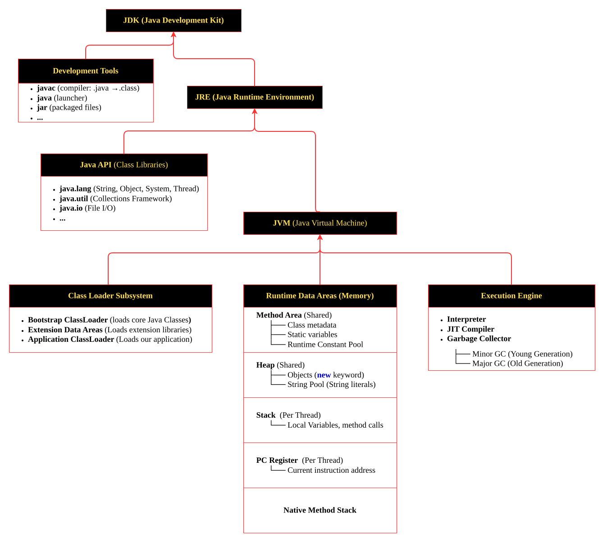
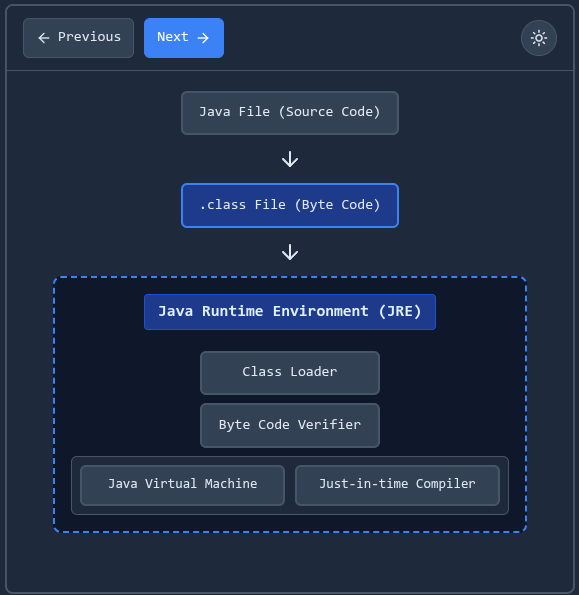

# Basic Definitions
# 1. Full Stack Development
**Full Stack Development** means developing a complete software application by working on **both Frontend and Backend**, along with **Database handling**.
A full stack developer can design the **user interface (Frontend)**, build the **server-side logic and APIs (Backend)**, and manage **data storage using database**, so they can build an application end-to-end.
# 2. Frontend Development
**Frontend Development** means building the **user interface (UI)** part of a website or application that users can **see and interact with** in the browser or app.  
It focuses on designing pages, layouts, buttons, forms, and overall user experience using technologies like **HTML, CSS, and JavaScript** (and frameworks like React), so the application looks good and works smoothly for the user.
**Frontend Examples-**
- **HTML, CSS, JavaScript**
- Frameworks: **React, Angular, Vue**
# 3. Backend Development
Backend Development means building the **server-side** part of  a website or application that works behind the scenes.
It handles **logic**, **data processing**, **authentication/authorization**, and creates **APIs** that connect the frontend with the database, so the application can work properly and securely.
**Backend Examples-**
- **Java (Spring Boot)**
- **JavaScript (Node.js / Express)**
- **Python (Django / Flask)**
- **C# (.NET)**
# 4. Database
A **Database** is a place where an application stores and manages data, and we can perform **CRUD operations** on it:
- **C → Create** (Insert)
- **R → Read** (Fetch / Select)
- **U → Update** (Modify)
- **D → Delete** (Remove)

**Database Examples-**
- SQL Databases: **MySQL, PostgreSQL, Oracle**
- NoSQL Databases: **MongoDB**

---
# 1. JDK (Java Development Kit)
**JDK (Java Development Kit)** is a software package provided by Oracle/OpenJDK.
It contains everything which is required to **write, compile, debug, and execute** a Java application. It is structured into two main parts — Development Tools and JRE.
#### JDK Hierarchy

```java
JDK (Java Development Kit)
│
├── Development Tools
│   ├── javac        (compiler - .java → .class)
│   ├── java         (launcher)
│   └── jar          (create JAR files)
│
└── JRE (Java Runtime Environment)
    │
    ├── Java API (Class Libraries)
    │   ├── java.lang     (String, Object, System, Thread)
    │   ├── java.util     (Collections Framework)
    │   └── java.io       (File I/O)
    │
    └── JVM (Java Virtual Machine)
        │
        ├── Class Loader Subsystem
        │   ├── Bootstrap ClassLoader    (loads core Java classes)
        │   ├── Extension ClassLoader    (loads extension libraries)
        │   └── Application ClassLoader  (loads your application)
        │
        ├── Runtime Data Areas (Memory)
        │   │
        │   ├── Method Area (Shared)
        │   │   ├── Class metadata
        │   │   ├── Static variables
        │   │   └── Runtime Constant Pool
        │   │
        │   ├── Heap (Shared)
        │   │   ├── Objects (new keyword)
        │   │   └── String Pool (String literals)
        │   │
        │   ├── Stack (Per Thread)
        │   │   └── Local variables, method calls
        │   │
        │   ├── PC Register (Per Thread)
        │   │   └── Current instruction address
        │   │
        │   └── Native Method Stack
        │
        └── Execution Engine
            ├── Interpreter
            ├── JIT Compiler
            └── Garbage Collector
                ├── Minor GC (Young Generation)
                └── Major GC (Old Generation)
```
### 1.1 JRE (Java Runtime Environment)
**JRE** is the environment required to **run Java applications**.  
It provides **JVM + core Java libraries + supporting files**, so that a compiled Java program can execute smoothly.
### 1.2 JAVAC (Java Compiler)
**JAVAC** is the Java compiler that converts **Java source code (.java)** into **bytecode (.class)**.
### 1.3 JVM (Java Virtual Machine)
**JVM** is the virtual machine that **runs Java bytecode (.class files)** by converting it into machine-level instructions for the operating system.

## Java Program Journey: Source Code → Machine Code
In Java, first we write the program in a **.java file**, which is called **source code**.  
Then the **Java compiler (javac)** compiles this source code and converts it into **bytecode**, which is stored in a **.class file**.  
This bytecode is not directly understood by the operating system, so it is executed by the **JVM (Java Virtual Machine)**.  
The JVM uses an internal component like **JIT (Just-In-Time compiler)** to convert bytecode into **machine code**, and then the CPU runs that machine code.  
This is the reason Java is **platform independent**, because the same bytecode can run on any OS as long as that system has a JVM.



---
#### Complete picture of JDK
```java
JDK (Java Development Kit)
│
├── Development Tools
│   ├── javac           (Java Compiler: .java → .class)
│   ├── java            (Java Application Launcher)
│   ├── javap           (Class File Disassembler)
│   ├── javadoc         (Documentation Generator)
│   ├── jar             (Archive Tool)
│   ├── jdb             (Java Debugger)
│   ├── jconsole        (Monitoring Tool)
│   ├── jvisualvm       (Performance Monitoring)
│   ├── jps             (Java Process Status)
│   ├── jstat           (JVM Statistics)
│   ├── jmap            (Memory Map)
│   ├── jstack          (Stack Trace)
│   ├── keytool         (Key and Certificate Management)
│   └── jlink           (Custom Runtime Image Tool - Java 9+)
│
└── JRE (Java Runtime Environment)
    │
    ├── Java Class Libraries (Java API)
    │   ├── java.lang       (Core - String, Object, System, etc.)
    │   ├── java.util       (Collections, Date, etc.)
    │   ├── java.io         (Input/Output)
    │   ├── java.nio        (New I/O)
    │   ├── java.net        (Networking)
    │   ├── java.sql        (Database)
    │   ├── javax.swing     (GUI)
    │   ├── java.awt        (GUI)
    │   └── ... (many more packages)
    │
    └── JVM (Java Virtual Machine)
        │
        ├── Class Loader Subsystem
        │   ├── Loading
        │   │   ├── Bootstrap ClassLoader (loads rt.jar - core classes)
        │   │   ├── Extension ClassLoader (loads jre/lib/ext)
        │   │   └── Application ClassLoader (loads CLASSPATH)
        │   │
        │   ├── Linking
        │   │   ├── Verification (Bytecode Verifier)
        │   │   ├── Preparation (Allocate memory for static variables)
        │   │   └── Resolution (Symbolic references → Direct references)
        │   │
        │   └── Initialization (Execute static blocks & initialize variables)
        │
        ├── Runtime Data Areas (Memory Areas)
        │   │
        │   ├── Method Area (Shared across all threads)
        │   │   ├── Class Metadata
        │   │   │   ├── Class structure
        │   │   │   ├── Method bytecode
        │   │   │   ├── Field definitions
        │   │   │   └── Constructors
        │   │   │
        │   │   ├── Runtime Constant Pool
        │   │   │   ├── Numeric literals
        │   │   │   ├── String literals
        │   │   │   ├── Class references
        │   │   │   ├── Field references
        │   │   │   └── Method references
        │   │   │
        │   │   └── Static Variables
        │   │
        │   ├── Heap Area (Shared across all threads)
        │   │   ├── Young Generation
        │   │   │   ├── Eden Space
        │   │   │   ├── Survivor Space 0 (S0)
        │   │   │   └── Survivor Space 1 (S1)
        │   │   │
        │   │   ├── Old Generation (Tenured)
        │   │   │
        │   │   └── String Pool (Java 7+, moved from Method Area)
        │   │       ├── String literals
        │   │       └── Interned strings (via .intern())
        │   │
        │   ├── Stack Area (Per Thread)
        │   │   └── Stack Frames (per method call)
        │   │       ├── Local Variable Array
        │   │       ├── Operand Stack
        │   │       └── Frame Data (return address, exception handling)
        │   │
        │   ├── PC Register (Program Counter - Per Thread)
        │   │   └── Address of current instruction being executed
        │   │
        │   └── Native Method Stack (Per Thread)
        │       └── Native method execution (C/C++ via JNI)
        │
        └── Execution Engine
            │
            ├── Interpreter
            │   └── Executes bytecode line by line
            │
            ├── JIT Compiler (Just-In-Time)
            │   ├── Client Compiler (C1) - Fast compilation
            │   ├── Server Compiler (C2) - Optimized compilation
            │   └── Tiered Compilation (combines C1 + C2)
            │
            ├── Garbage Collector
            │   ├── Serial GC
            │   ├── Parallel GC
            │   ├── CMS (Concurrent Mark Sweep)
            │   ├── G1 GC (Garbage First)
            │   ├── ZGC (Low latency)
            │   └── Shenandoah GC
            │
            └── Java Native Interface (JNI)
                └── Interface for native code interaction
```

[**PTO**](30-FEATURES-OF-JAVA.md)