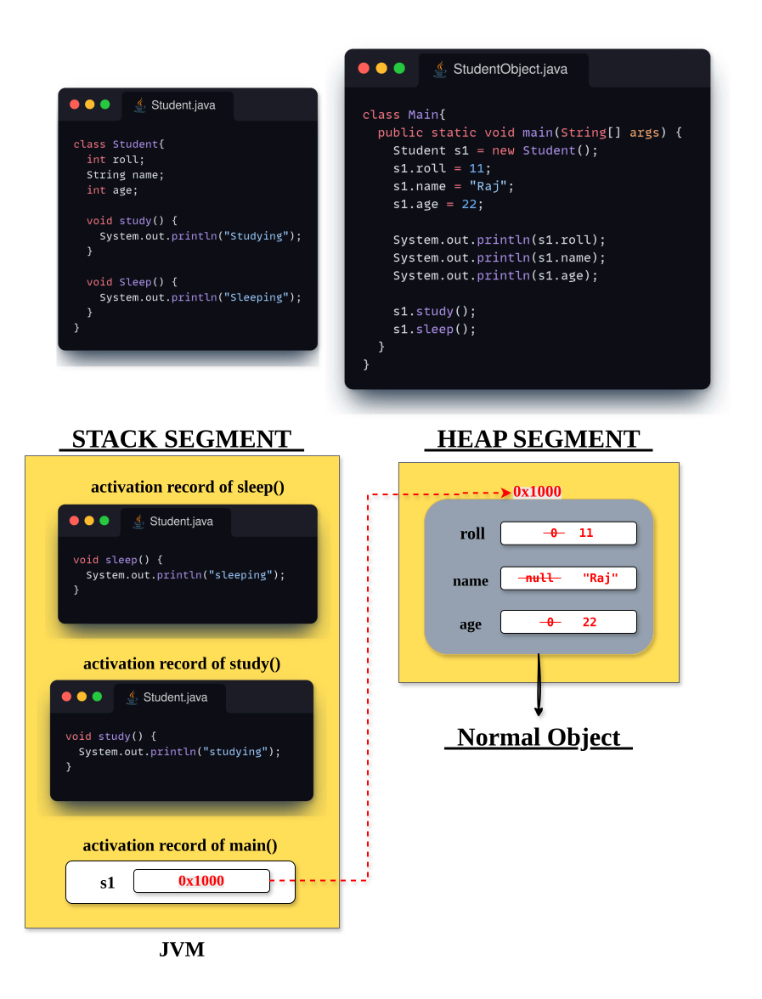
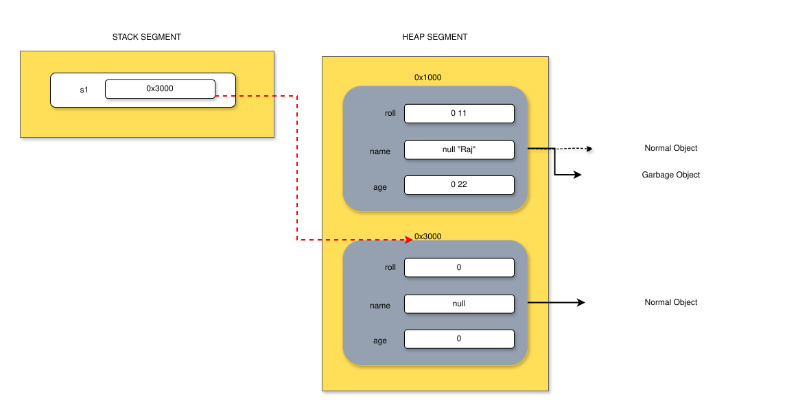
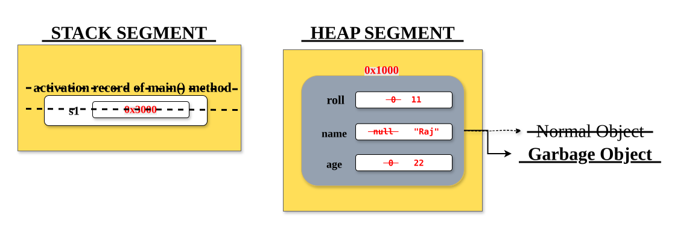

# 1. Normal Object
> A **Normal Object** is an object which is created by using the `new` keyword and has a **reference variable** pointing to it.
# 2. Garbage Object
> A **Garbage Object** is an object which was once created in the heap segment but **no reference variable is pointing to it anymore**.
# 3. Anonymous Object
> An **Anonymous Object** is an object which is created by using `new` keyword **but does not have any reference variable** pointing to it.

## 1. Normal Object- Example:
###### Student Class
```java
class Student{
	int roll;
	String name;
	int age;
	
	void study() {
		System.out.println("studying");
	}
	
	void Sleep() {
		System.out.println("sleeping");
	}
}
```
###### Student Objects
```java
class Main{
	public static void main(String[] args) {
		Student s1 = new Student();
		s1.roll = 11;
		s1.name = "Raj";
		s1.age = 22;
		System.out.println(s1.roll);
		System.out.println(s1.name);
		System.out.println(s1.age);
		
		s1.study();
		s1.sleep();
	}
}
```
##### Explanation


As soon as we run the program that has the `main()` method, JVM sends its control to the `main()` method.

Now, inside `main()`, the very first statement is:
```java
Student s1 = new Student();
```
The statement has an `=` sign, so JVM first moves to the **RHS**.  
The very first word there is `new`. As soon as JVM gets the `new` keyword, it creates a **block of memory inside the heap** for the `Student` object and assigns it an address, let’s say **0x1000**.

Now JVM sends its control to the **Student class**.

As soon as JVM enters the `Student` class:

- **First line** – it has `int roll`. JVM allocates memory inside address **0x1000** for `roll` and initializes it with the default value **0**.
- **Next line** – `String name`. JVM allocates memory inside address **0x1000** for `name` and initializes it with **null**.
- **Next line** – `int age`. JVM allocates memory inside address **0x1000** for `age` and initializes it with **0**.

Next, `study()` and `sleep()` behaviors are defined. The **method code** for both these methods is stored in the **Method Area** (not inside the object). All Student objects will share the same method code.

Now, JVM reaches the end of the `Student` class and returns back to where it came from — the `main()` method.

Now, JVM comes to the **LHS** of `=` and gives the address **0x1000** to the variable `s1`, which is of type `Student`.  
This variable `s1` is created inside the **stack segment** and holds the reference (address) **0x1000**, pointing to the object in the heap.

---

**Next line:**

`s1.roll = 11;`

Object `s1` is pointing to address **0x1000**. JVM goes to the heap memory location and updates `roll` from **0 → 11**.

**Next line:**

`s1.name = "Raj";`

The string `"Raj"` is created in the **String Pool** (say at address **5000**). JVM goes to the heap memory at **0x1000** and updates the value of `name` from **null → 5000** (the reference to "Raj").

**Next line:**

`s1.age = 22;`

JVM goes to the same heap location and updates `age` from **0 → 22**.

**Next line:**

`s1.study();`

JVM invokes the `study()` method. An **activation record** (stack frame) is created for `study()` inside the stack.  
The method executes (prints "studying"), and once it completes, JVM removes this activation record from the stack.

**Next line:**

`s1.sleep();`

JVM invokes the `sleep()` method. An **activation record** (stack frame) is created for `sleep()` inside the stack.  
The method executes (prints "sleeping"), and once it completes, JVM removes this activation record from the stack.

Hence, this is a **Normal Object**, because it has a **reference variable (`s1`)** that can be reused anywhere inside the method.

## 2.Garbage Object- Example:
Objects can become garbage in two ways:
1. When reference is reassigned
2. When the reference goes out of scope
#### 2.1 When reference is reassigned
```java
Student s1 = new Student();   // object created at 0x1000
s1 = new Student();           // new object created at 0x3000
```
When JVM executes the second line, `s1` now starts pointing to the new object at **0x3000**.  
The old object at **0x1000** loses its reference — no one is pointing to it.  
So that old object becomes a **Garbage Object**.


#### 2.2 When the reference goes out of scope
As soon as we run the program, JVM sends its control to the `main()` method.  
Inside it, a **reference variable `s1`** is created under the **activation record of `main()`** method (inside the stack segment).

As the program runs, `s1` keeps referring to the heap object (say, at address `0x1000`) and uses it to access fields and methods.

When JVM finishes executing the `main()` method, the **activation record of `main()`** is removed from the **stack**.  
Once that happens, the reference variable `s1` is also deleted.

Now, the object that was connected to it (the one at `0x1000` in the heap) has **no active reference** pointing to it.  
That means it’s now **unreachable** — and such objects are known as **Garbage Objects**.

JVM’s **Garbage Collector (GC)** automatically identifies these unreachable objects.  
It runs in the background and frees up their memory from the heap whenever needed, keeping memory usage efficient.

## 3. Anonymous Object- Example:
As soon as we run the program that has the `main()` method, JVM sends its control to the `main()` method.

Now, inside `main()`, the very first statement is:
```java
new Student().study();
```
As soon as JVM gets the `new` keyword, it creates a **block of memory inside the heap** for the `Student` object and assigns it an address, let’s say **0x2000**.

Now JVM sends its control to the **Student class**.

As soon as JVM enters the `Student` class:

- **First line** – it has `int roll`. JVM allocates memory inside address **0x2000** for `roll` and initializes it with the default value **0**.
- **Next line** – `String name`. JVM allocates memory inside address **0x2000** for `name` and initializes it with **null**.
- **Next line** – `int age`. JVM allocates memory inside address **0x2000** for `age` and initializes it with **0**.
    

Next, `study()` and `sleep()` behaviors are defined. The **method code** for both these methods is stored in the **Method Area** (not inside the object). All Student objects will share the same method code.

Now, JVM reaches the end of the `Student` class and returns back to where it came from — the `main()` method.

---
At this point, the newly created object (at **0x2000**) exists in the **heap**,  
but **no reference variable** in the **stack** is holding its address.

Immediately after object creation, JVM sees `.study()` —  
so it **invokes the `study()` method** on this anonymous object.

An **activation record** (stack frame) is created for `study()` inside the stack.  
The method executes (prints `"Studying"`), and once it completes, JVM removes this activation record from the stack.

Now, the control leaves that line of code.

Since there was **no reference variable** ever pointing to **0x2000**,  
the object in the heap is now **unreachable** — meaning **no one can access it anymore**.

Hence, this object becomes a **Garbage Object** immediately after the statement executes.

---
So,
> An **Anonymous Object** is an object that does not have any reference variable.  
> It is created, used only once, and becomes garbage as soon as that line of code finishes execution.

 