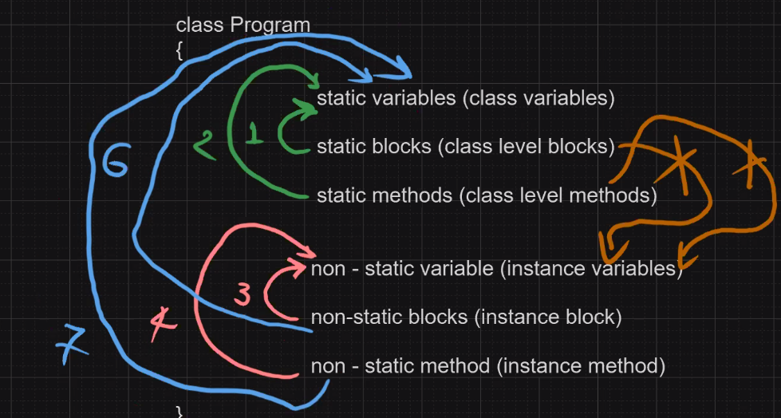

# Static vs Non-Static Rules

| Rule # | Rule Description                                                                                                                     |
| ------ | ------------------------------------------------------------------------------------------------------------------------------------ |
| 1      | **STATIC METHODS** can access **STATIC VARIABLES**                                                                                   |
| 2      | **STATIC BLOCKS** can access **STATIC VARIABLES**                                                                                    |
| 3      | **NON-STATIC METHODS** can access **NON-STATIC VARIABLES**                                                                           |
| 4      | **NON-STATIC BLOCKS** can access **NON-STATIC VARIABLES**                                                                            |
| 5      | **NON-STATIC METHODS** can access **STATIC VARIABLES**                                                                               |
| 6      | **NON-STATIC BLOCKS** can access **STATIC VARIABLES**                                                                                |
| 7      | **STATIC METHODS** cannot access **NON-STATIC VARIABLES** directly                                                                   |
| 8      | **STATIC BLOCKS** cannot access **NON-STATIC VARIABLES** directly                                                                    |
| 9      | **STATIC METHODS** cannot call **NON-STATIC METHODS** directly                                                                       |
| 10     | **STATIC METHODS/BLOCKS** can access **NON-STATIC MEMBERS** if done through an object reference (e.g. `new ClassName().instanceVar`) |
| 11     | **NON-STATIC METHODS** can call **STATIC METHODS** directly (no object needed)                                                       |

**One-liner to remember it by:** _"Static world doesn't know about the instance world unless you hand it a reference to that instance."_

# Execution Behavior
```java
class Program {
	static int a; // Static Variable
	static int b; // Static Variable
	
	int p; // Non-Static Variable
	int q; // // Non-Static Variable
	
	static // Static Block
	{ 
		System.out.println("Inside static block");
		a = 10;
		b = 20;
	}
	
	// Non-Static Block
	{
		System.out.println("Inside Non-Static block");
		p = 100;
		q = 200;
	}
	
	// Static Method
	static void staticDisplay1() {
		System.out.println("Inside Static method");
		System.out.println("a: " + a);
		System.out.println("b: " + b);
	}
	
	// Non-Static Method
	void nonStaticDisplay1() {
		System.out.println("Inside Non-Static method");
		System.out.println("p: " + p);
		System.out.println("q: " + q);
	}
	
	// Static Method
	public static void main(String[] args) {
	
		Program p = new Program();
		p.staticDisplay1();
		p.nonStaticDisplay1();
	}
}
```
##### Output: 
```output
Inside static block
Inside Non-Static block
Inside Static method
a: 10
b: 20
Inside Non-Static method
p: 100
q: 200
```
