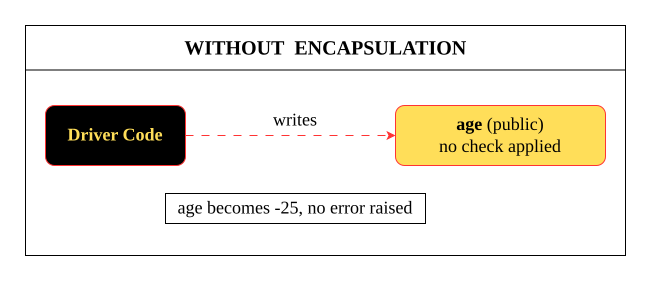
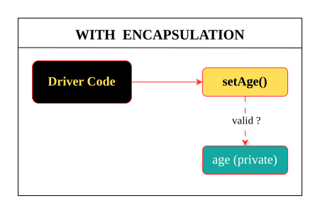
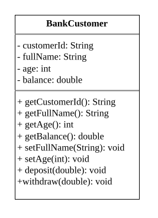

# Encapsulation

## The problem without encapsulation
Consider a banking application where every customer's information is stored in a class.
```java
public class BankCustomer {
	String customerId;
	String fullName;
	byte age;
	double balance;
}
```

Now anyone can create objects of this class and directly access or modify its data.
```java
public class Driver {
	public static void main(String[] args) {
	
		// CUSTOMER-1
		BankCustomer customer1 = new BankCustomer();
		customer1.Id = "CUST-1001";
		customer1.fullName = "Alpha";
		customer1.age = 23;
		customer1.balance = 1000.0;
		
		// CUSTOMER-2
		BankCustomer customer2 = new BankCustomer();
		customer2.Id = "CUST-1002";
		customer2.fullName = "Beta";
		customer2.age = -25; // INVALID age (age can't be negative)
		customer2.balance = 1500.0;
	}
}
```
Now the real problem is-
Since every data member is directly accessible, **any code can modify them without any restriction.**
for example:
```text
customer1.age = -25;
customer1.balance = -5000;
customer1.customerId = null;
customer1.fullName = "";
```
As a result, the object can enter an **invalid or inconsistent state**.


| Field      | Invalid Value | Why is it a problem?                                |
| ---------- | ------------- | --------------------------------------------------- |
| age        | -25           | Age cannot be negative.                             |
| balance    | -5000         | Bank balance cannot become negative in this system. |
| customerId | null          | Every customer must have a valid ID.                |
| fullName   | ""            | Customer name should not be empty.                  |

**Conclusion**
The class is unable to protect its own data.
It cannot:
- prevent invalid values,
- validate user input,
- control how its data is modified,
- maintain a valid state of the object.
So, instead of allowing anyone to change the data directly, we need a way to control how the data is accessed and updated.

## What is Encapsulation ?
> Encapsulation is the process of binding data members and the methods that operate on them into a single unit, called a class. It allows the class to control how its data is accessed and modified so that the object always remains in a valid state.

## How encapsulation is achieved in Java
In Java, Encapsulation is commonly achieved by-
- Declare all Data members as private.
- Provide public methods to access those data members or update the data whenever needed but Validate the data before assigning it to the data members.


### Example
#### BankCustomer
```java
package com.practice;

public class BankCustomer {
	
	// Fields are private so no outside code can access or change them directly.
	private final String customerId; // never changes after creation
	private String fullName;
	private int age;
	private double balance;
	
	// Constructor validates every field before creating the object,
    // so a BankCustomer can never exist in an invalid state.
	public BankCustomer(
		String customerId,
		String fullName,
		int age,
		double balance
	) {
		this.customerId = validateCustomerId(customerId);
		this.fullName = validateFullName(fullName);
		this.age = validateAge(age);
		this.balance = validateBalance(balance);
	}
	
	
	// ---- Validation helpers ----
    // Each check lives in one place so the constructor and setters
    // stay consistent and there's no duplicated logic.
	private String validateCustomerId(String customerId) {
		if (customerId == null || customerId.isBlank()) {
			throw new IllegalArgumentException("Customer ID cannot be null or empty");
		}
		return customerId;
	}
	
	private String validateFullName(String fullName) {
		if (fullName == null || fullName.isBlank()) {
			throw new IllegalArgumentException("Full name cannot be null or empty");
		}
		return fullName;
	}
	
	private int validateAge(int age) {
		if (age < 18 || age > 100) {
			throw new IllegalArgumentException("Age must be between 18 and 100, got: " + age);
		}
		return age;
	}
	
	
	private double validateBalance(double balance) {
		if (balance < 0) {
			throw new IllegalArgumentException("Balance cannot be negative, got: " + balance);
		}
		return balance;
	}
	
	// ---- Getters ----
    // Read-only access to the data — safe to expose freely.
	public String getCustomerId() {
		return customerId;
	}
	
	public String getFullName() {
		return fullName;
	}
	
	public int getAge() {
		return age;
	}
	
	public double getBalance() {
		return balance;
	}
	
	// ---- Setters ----
    // Update the field only after validating the new value.
	public void setFullName(String fullName) {
		this.fullName = validateFullName(fullName);
	}
	
	public void setAge(int age) {
		this.age = validateAge(age);
	}
	
	// No setBalance(). Balance can only change through deposit() or withdraw()
    // below, so it always moves through a validated transaction.
	
	public void deposit(double amount) {
		if (amount <=0) {
			throw new IllegalArgumentException("Deposit amount must be positive, got: " + amount);
		}
		balance += amount;
	}
	
	public void withdraw(double amount) {
		if (amount <= 0) {
			throw new IllegalArgumentException("Withdrawal amount must be positive, got: " + amount);
		}
		if (amount > balance) {
			throw new IllegalStateException("Insufficient balance: tried to withdraw " + amount + " from " + balance);
		}
		balance -= amount;
	}
	
	public void displayCustomerDetails() {
        System.out.println("\nCustomer Details");
        System.out.println("------------------------");
        System.out.println("Customer ID : " + customerId);
        System.out.println("Name        : " + fullName);
        System.out.println("Age         : " + age);
        System.out.println("Balance     : ₹" + balance);
	}
}
```

#### Driver
```java
package com.practice;


public class Driver {
    public static void main(String[] args) {

        // Creating a valid customer — constructor validates all fields internally.
        BankCustomer customer1 = new BankCustomer(
            "CUST-1001",
            "Alpha",
            25,
            5_000.00
        );

        customer1.displayCustomerDetails();

        // setAge() throws if the value is invalid, so we must catch it here —
        // otherwise the exception would crash main() and stop execution.
        System.out.println("\nTrying to set invalid age (-20)...");
        try {
            customer1.setAge(-20);
        } catch (IllegalArgumentException e) {
            System.out.println("Failed: " + e.getMessage());
        }

        // deposit() rejects non-positive amounts the same way.
        System.out.println("\nTrying to deposit a negative amount...");
        try {
            customer1.deposit(-500);
        } catch (IllegalArgumentException e) {
            System.out.println("Failed: " + e.getMessage());
        }

        // A valid deposit — no exception, balance updates normally.
        System.out.println("\nDepositing 2500...");
        customer1.deposit(2500);
        System.out.println("New balance: ₹" + customer1.getBalance());

        // withdraw() throws IllegalStateException here because the amount
        // itself is valid — it's the account's current balance that makes
        // this specific withdrawal impossible.
        System.out.println("\nTrying to withdraw more than available balance...");
        try {
            customer1.withdraw(10_000);
        } catch (IllegalStateException e) {
            System.out.println("Failed: " + e.getMessage());
        }

        // A valid withdrawal — goes through since funds are sufficient.
        System.out.println("\nWithdrawing 3000...");
        customer1.withdraw(3000);
        System.out.println("New balance: ₹" + customer1.getBalance());

        // Even object creation can fail now, since the constructor validates
        // fullName too — so we wrap it in try-catch just like any other method.
        System.out.println("\nTrying to create a customer with a null full name...");
        try {
            BankCustomer badCustomer = new BankCustomer("CUST-1002", null, 30, 1000);
        } catch (IllegalArgumentException e) {
            System.out.println("Failed to create customer: " + e.getMessage());
        }

        customer1.displayCustomerDetails();
    }
}
```
#### Output
```text


Customer Details
------------------------
Customer ID : CUST-1001
Name        : Alpha
Age         : 25
Balance     : ₹5000.0

Trying to set invalid age (-20)...
Failed: Age must be between 18 and 100, got: -20

Trying to deposit a negative amount...
Failed: Deposit amount must be positive, got: -500.0

Depositing 2500...
New balance: ₹7500.0

Trying to withdraw more than available balance...
Failed: Insufficient balance: tried to withdraw 10000.0 from 7500.0

Withdrawing 3000...
New balance: ₹4500.0

Trying to create a customer with a null full name...
Failed to create customer: Full name cannot be null or empty

Customer Details
------------------------
Customer ID : CUST-1001
Name        : Alpha
Age         : 25
Balance     : ₹4500.0

```
## Why do we need encapsulation
- It prevents direct access to the data from outside the class.
- It allows the class to validate data before storing or updating it.
- It keeps the object in a valid and consistent state.
- It makes the code easier to maintain and extend.
## Why Data-Hiding & Encapsulation often confused?
> Data Hiding and Encapsulation are closely related concepts, and they are commonly used together in Java. Data Hiding is the process of preventing direct access to the data members of a class from outside the class, whereas Encapsulation uses that restriction to control how the data is accessed and modified.
