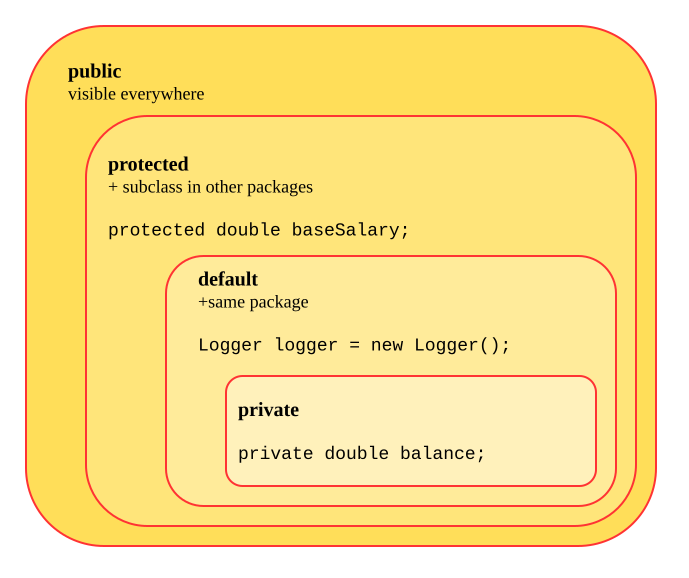

# Access modifiers in Java
## Modifier Definitions
1. **`public`**— members are accessible from anywhere in the application.
2. **`protected`** — members are accessible within the same package and in subclasses, even if the subclass is in a different package (through inheritance).
3. **default (no modifier)** — members are accessible only within the same package.
4. **`private`** — members are accessible only within the class in which they are declared.
## Quick Reference Table

|Modifier|Same class|Same package|Subclass (different package)|Everywhere (different package, non-subclass)|
|---|---|---|---|---|
|`private`|✅|❌|❌|❌|
|default (no modifier)|✅|✅|❌|❌|
|`protected`|✅|✅|✅|❌|
|`public`|✅|✅|✅|✅|

## Diagram Explanation
- The **`private`** ring is the innermost and smallest — `balance` sits here because it should only ever be touched by code inside `BankCustomer` itself.
- The **`default`** ring wraps around it — anything with no modifier, like a `Logger` instantiated in the same package, is visible to every class in that package, but not beyond it.
- The **`protected`** ring wraps around that — `baseSalary` sits here specifically because it's meant to be inherited and used by subclasses like `Manager` or `Developer`, even if those subclasses live in a different package.
- The **`public`** ring is the outermost — anything placed here has no boundary at all.