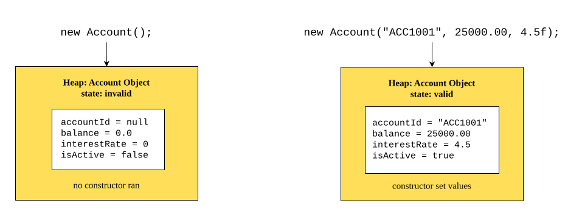

## The Problem : Initializing an Object's State
```java
package com.publicBank;

public class Account {
	private String accountId;
	private double balance;
	private float interestRate;
	private boolean isActive;
	
	void showProfile() {
		System.out.println(
			"Account ID        : " + accountId +
			"\nBalance           : " + balance +
			"\nInterest Rate     : " + interestRate +
			"\nIs Account Active : " + isActive
		);
	}
}
```
Creating a Customer Account
When a customer walks into a bank and opens an account, we (developer) will create an instance:
```java
Account customerAccount = new Account();
customerAccount.showProfile();
```
What we (developer) Expect (Business Requirement)
When a new customer account is created, we should see:
- **accountId** — System-generated value like "ACC001", "ACC002", etc. (every account must have a unique ID)
- **balance** — The initial deposit the customer made (let's say 1000.0 rupees)
- **interestRate** — A reasonable rate, perhaps 8.5% (within the 5-15% range for savings accounts)
- **isActive** — `true` (a brand-new account should be active immediately; inactive doesn't make sense)
What We Actually Get (Reality)
```text
Account ID        : null
Balance           : 0.0
Interest Rate     : 0.0
Is Account Active : false
```

### The Gap: Expectation vs Reality

| Field            | Expected                    | Actual  | Problem                                                           |
| ---------------- | --------------------------- | ------- | ----------------------------------------------------------------- |
| **accountId**    | "ACC001" (system-generated) | `null`  | Can't look up the account; <br>no ID means no identity            |
| **balance**      | 1000.0                      | 0.0     | Customer thinks account has no money — misleading and wrong       |
| **interestRate** | 8.5                         | 0.0     | 0 interest; <br>the account is useless for savings.               |
| **isActive**     | `true`                      | `false` | Account appears inactive to the system; <br>customer can't use it |
**From a customer's perspective:** "I just opened an account and gave the bank 1000 rupees. Why does the system say I have zero balance and my account is inactive?"

## Invalid State
> An object is said to be in an invalid state when its field values fail to represent a valid real-world entity according to the business rules and constraints of that class.

So what is the solution?
Constructor
## What is Constructor?
> **Constructor** is a _special method_ which gets called automatically during the **construction of an object**. The main purpose of using constructor is to initialize the object's fields so that object starts in a valid state.

## Rules for constructor
1. The **name** of a constructor must be *the same* as the class name.
2. A constructor does **not** have any return type — not even `void`.
3. A constructor can have **any access modifier** (`public`, `protected`, *default*, `private`);
   if none is specified, it gets default (package-private) access — same as methods.
4. A constructor **cannot** be:
   - `static`
   - `final`
   - `abstract`
   - `synchronized`
   - `native`
   - `strictfp`
5. A constructor *may or may not* have parameters.
6. Constructors can be **overloaded**, but **cannot** be overridden.
7. A constructor **can throw exceptions**.
8. The first statement of a constructor can be `this()` or `super()`.
   - If neither is written, the compiler inserts `super()` **automatically**.
9. If no constructor is written, the compiler (`javac`) provides a **default constructor**.
10. If a user writes *any* constructor, the compiler does **not** generate the default constructor.
## Example of a constructor
#### `Account.java`
```java
package com.publicBank;

public class Account {

    private String accountId;
    private double balance;
    private float interestRate;
    private boolean isActive;
    
    // PARAMETERIZED CONSTRUCTOR
    public Account(
	    String accountId,
	    double balance,
	    float interestRate
	) {
        this.accountId = accountId;
        this.balance = balance;
        this.interestRate = interestRate;
        this.isActive = true;
    }

    void showProfile() {
        System.out.println(
            "Account ID        : " + accountId +
            "\nBalance           : " + balance +
            "\nInterest Rate     : " + interestRate +
            "\nIs Account Active : " + isActive
        );
    }
}
```

```java
Account account = new Account("ACC1001", 25000.00, 4.5f);
account.showProfile();
```

#### Output
```text
Account ID        : ACC001
Balance           : 1000.0
Interest Rate     : 8.5
Is Account Active : true
```
> [!tip] Notice
> `isActive` is **not** a parameter — it's hardcoded to `true` inside the constructor.
> Not every field needs external input; some are business-rule-driven defaults.
> This is exactly why the earlier definition said "initial state" and not just "parameters."

