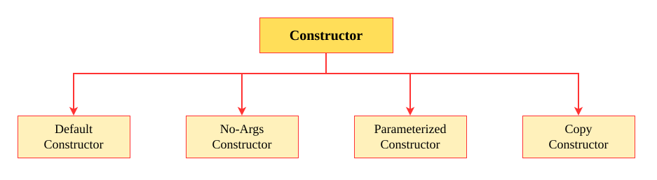

# Types of Constructor

1. [**Default-Constructor**](20-DEFAULT-CONSTRUCTOR.md)
2. [**No-Args Constructor**](./30-NO-ARGUMENT-CONSTRUCTOR.md)
3. [**Parameterized Constructor**](./40-PARAMETERIZED-CONSTRUCTOR.md)
4. [**Copy Constructor**](./50-COPY-CONSTRUCTOR.md)