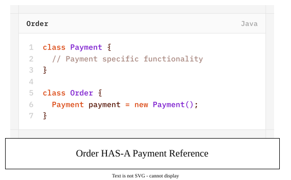
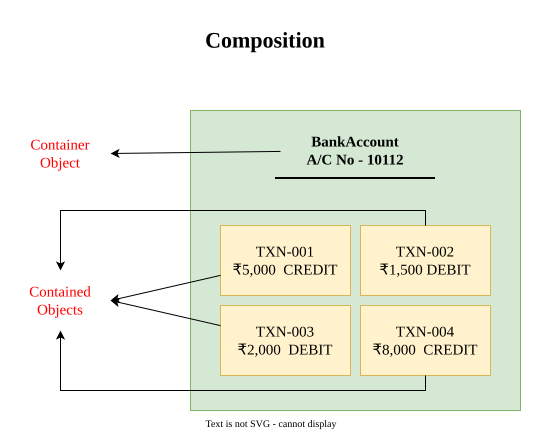
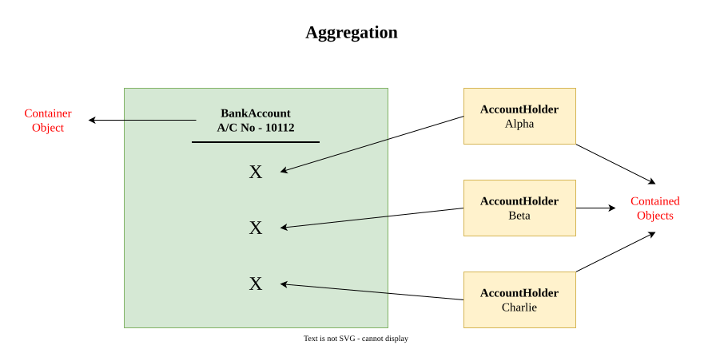
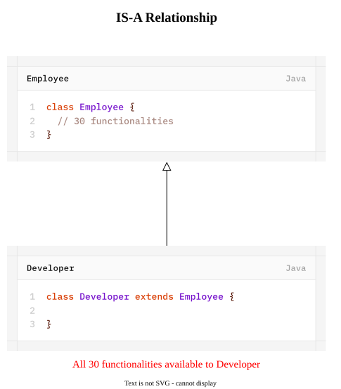
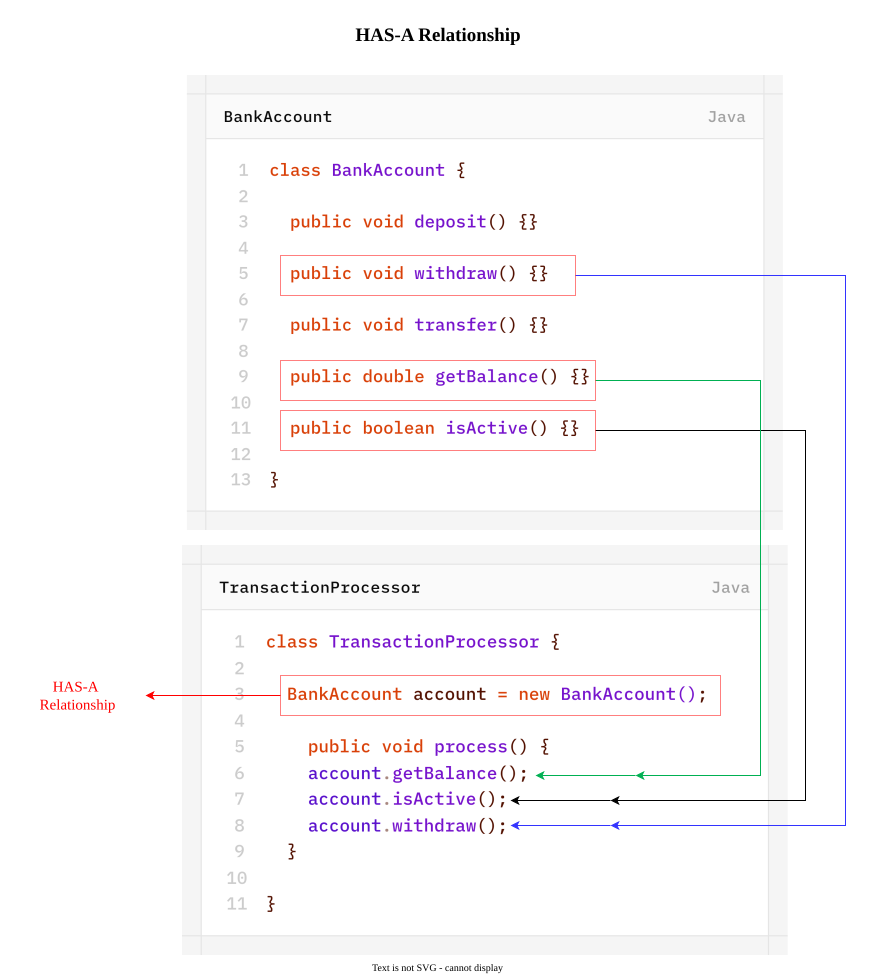

# HAS-A Relationship
- Has-A relationahip is also known as **Composition (or) Aggregation**.
- There is no specific keyword to implement Has-A relationship but most of the time we are depending on `new` keyword.
- The main advantage of Has-A relationship is **reusability** of the code.

## Difference between **Composition** and **Aggregation**
#### Composition
Without existing container object, if there is no chance of existing contained objects then container and contained objects are strongly associated and this strong association is know as **Composition**.

**Example:**

A BankAccount consists of several TransactionEntries. Without existing BankAccount, there is no chance of existing TransactionEntries. Hence, BankAccount and TransactionEntry are strongly associated, and this strong association is known as **Composition**.

#### Aggregation
Without existing container object if there is a chance of existing contained object then container and contained objects are weakly associated and this weak association is known as **Aggregation**.

**Example**

BankAccount consists of several AccountHolders. without existing BankAccount, there may be a chance of existing AccountHolder objects. Hence, BankAccount and AccountHolder objects are weakly associated and this weak association is known as **Aggregation**.

>[!NOTE]
>- in Composition, objects are strongly associated whereas in Aggregation, objects are weakly associated.
>- in Composition, container object holds directly contained objects whereas in Aggregation, Container object holds just refernces of contained objects.

## **IS-A** vs **HAS-A**
- If we want total functionality of a class automatically then, we should go for IS-A relationship.
	

- If we want part of the functionalities then we should go for HAS-A relationship.
	
