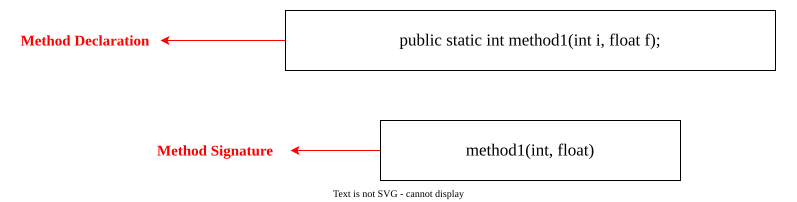
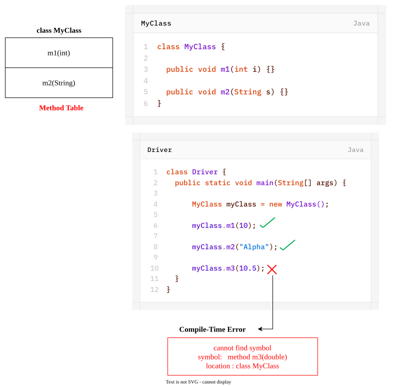
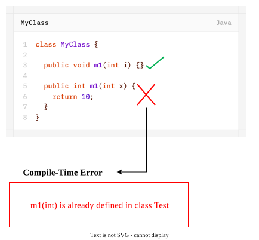

- In Java, Method Signature consists of **method name** followed by **argument types**.
	
- Return Types is not part of Method Signature in Java.
- Compiler will use Method Signature to resolve method calls.
	

- Within a class, two methods with the same signature is not allowed.
	
