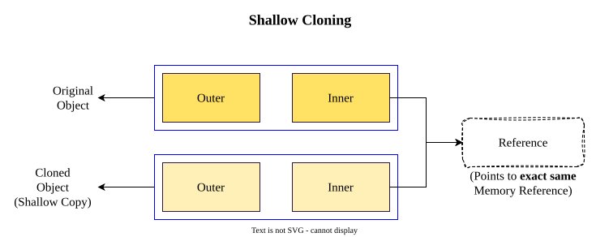
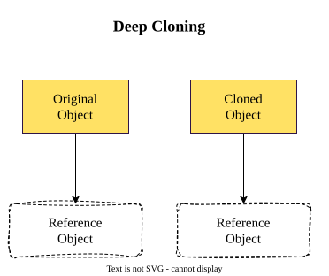
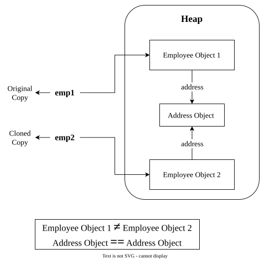
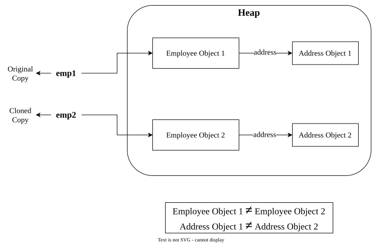

# `Clone`
 In Java, cloning is the process of creating a new object by copying the state of an existing object.
- The **`clone()`** method is present inside Object class which is responsible for cloning.
---
1. What is the condition of using **`clone()`**?
	Object which is being cloned, its class must implement `Cloneable` otherwise calling **`clone()`** throws **`CloneNotSupportedException`**.
	>[!NOTE]
	>**`Cloneable`** is a **Marker Interface**.

---
2. Why do we implement `Cloneable` in a class?
	In a class we implement `Cloneable` which gives permission for objects of that class to be cloned in a controlled way.
---
## Types of Cloning
1. Shallow Cloning
2. Deep Cloning
### 1. Shallow Cloning
Shallow Cloning is the process of creating a shallow copy of an object using the **`clone()`** method. It duplicates the object itself but does not create separate copies of the referenced objects.
In Shallow Cloning:
- Primitives are cloned (copied) by value means changing the values of original object does not effect on cloned and vice-versa.
- Non-Primitives are cloned (copied) by reference means if we change the values of original object then the values of cloned object will also change.

### 2. Deep Cloning
Deep Cloning is the process of creating a deep copy of an object using the **`clone()`** method. It duplicates the object itself and create a separate copy of the referenced objects.
In Deep Cloning:
- Primitives are cloned (copied) by value.
- Non-Primitives are cloned by creating new objects.


### Example-Shallow Cloning
**`Address.java`**
```java
package clone;

public class Address {
	String line1;
	String line2;
	
	public Address (String line1, String line2) {
		this.line1 = line1;
		this.line2 = line2;
	}
}
```
**`Employee.java`**
```java
package clone;

public class Employee impleme Cloneable {
	
	int id;
	String name;
	Address address;
	
	public Employee (
		int id,
		String name,
		Address address
	) {
		this.id = id;
		this.name = name;
		this.address = address;
	}
	
	@Override
	public Employee clone() throws CloneNotSupportedException {
		return (Employee)super.clone();
	}
	
}
```
**`Driver.java`**
```java
package clone;

public class Driver {

	public static void main(String[] args) throws CloneNotSupportedException {
		
		Address address = new Address("Alpha Street", "Alpha City");
		Employee emp1 = new Employee (91, "Alpha", address);
		
		Employee emp2 = (Employee)emp1.clone();
		
		System.out.println(
			"ID: " + emp2.id +
			"\nName: " + emp2.name +
			"\nAddress: " +
			"\n\tLine1: " + emp2.address.line1 +
			"\n\tLine2: " + emp2.address.line2
		);
	}

}
```
**Output**
```text
ID: 91
Name: Alpha
Address: 
	Line1: Alpha Street
	Line2: Alpha City
```
If i modify:
```java
emp1.address.line1 = "Beta Street";
```
and try to print:
```java
System.out.println(emp2.address.line1 + ", " + emp2.address.line2); // Beta Street, Alpha City
		System.out.println(emp1.address.line1 + ", " + emp1.address.line2); // Beta Street, Alpha City
```
In both cases we get "**Beta Street, Alpha City**" because **emp1** and **emp2** both share the same reference of the object.

### Example-Deep Cloning
**`Address.java`**
```java
package clone;

public class Address implements Cloneable {
	String line1;
	String line2;
	
	public Address (String line1, String line2) {
		this.line1 = line1;
		this.line2 = line2;
	}
	
	@Override
	public Address clone() throws CloneNotSupportedException {
		return (Address)super.clone();
	}
}
```
**`Employee.java`**
```java
package clone;

public class Employee implements Cloneable {
	
	int id;
	String name;
	Address address;
	
	public Employee (
		int id,
		String name,
		Address address
	) {
		this.id = id;
		this.name = name;
		this.address = address;
	}
	
	@Override
	public Employee clone() throws CloneNotSupportedException {
		
		// cloning Employee
		Employee emp = (Employee)super.clone();
		
		// cloning address
		emp.address = this.address.clone();
		return emp;
	}
	
}
```
**`Driver.java`**
```java
package clone;

public class Driver {

	public static void main(String[] args) throws CloneNotSupportedException {
		
		Address address = new Address("Alpha Street", "Alpha City");
		Employee emp1 = new Employee (91, "Alpha", address);
		
		Employee emp2 = (Employee)emp1.clone();
		
		System.out.println(
			"ID: " + emp2.id +
			"\nName: " + emp2.name +
			"\nAddress: " +
			"\n\tLine1: " + emp2.address.line1 +
			"\n\tLine2: " + emp2.address.line2
		);
	}
}
```
If i modify:
```java
emp1.address.line1 = "Beta Street";
```
and try to print:
```java
emp2.address.line1 = "Beta Street";
		
		System.out.println(emp1.address.line1 + ", " + emp1.address.line2); // Alpha Street, Alpha City
		System.out.println(emp2.address.line1 + ", " + emp2.address.line2); // Beta Street, Alpha City
```
emp1 returns ➡ **Alpha Street, Alpha City**
emp2 returns ➡ **Beta Street, Alpha City**


### Application of Cloning
1. **"Send Again" option in UPI apps**  
    It can create a new object by copying eligible fields, such as `senderUpi`, from the existing object.
2. **"Buy Again" option in e-commerce apps**  
    It can create a new object by copying eligible fields from an existing object.