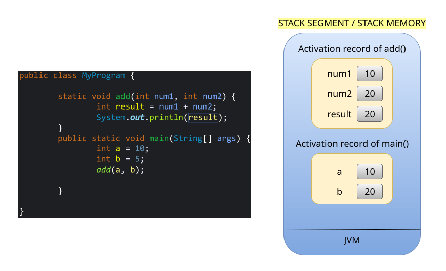

# JVM Memory Structure in JAVA

## 1. CODE SEGMENT / CODE MEMORY
- Code Segment stores the program code (compiled bytecode).

## 2. STACK SEGMENT
- Stack Segment stores <mark>Activation Record</mark> / <mark>Stack Frame</mark>.
- Memory is given for:

	i. Local Variables.
	
	ii. Method Arguments.
	
	iii. Reference Variables (Object references)
	
- Works in **LIFO** (**Last In, First Out**) order.
- 👉 Example: If method `A()` calls `B()`, then `B` goes on top of stack. When `B` finishes, it is removed.
## 3. STATIC SEGMENT
- Stores **static things** like:
    - `static` variables
    - `static` methods
    - `static` blocks
- Example: `static int count;` → only **one copy** exists for all objects.
## 4. HEAP SEGMENT
- Stores **objects and instance variables**.
- Memory here is shared by all threads.
- Garbage Collector (GC) removes unused objects from Heap automatically.
- 👉 Example: `Student s = new Student();` → Object `s` lives in Heap.

## Example-1:

## Example-2: 
