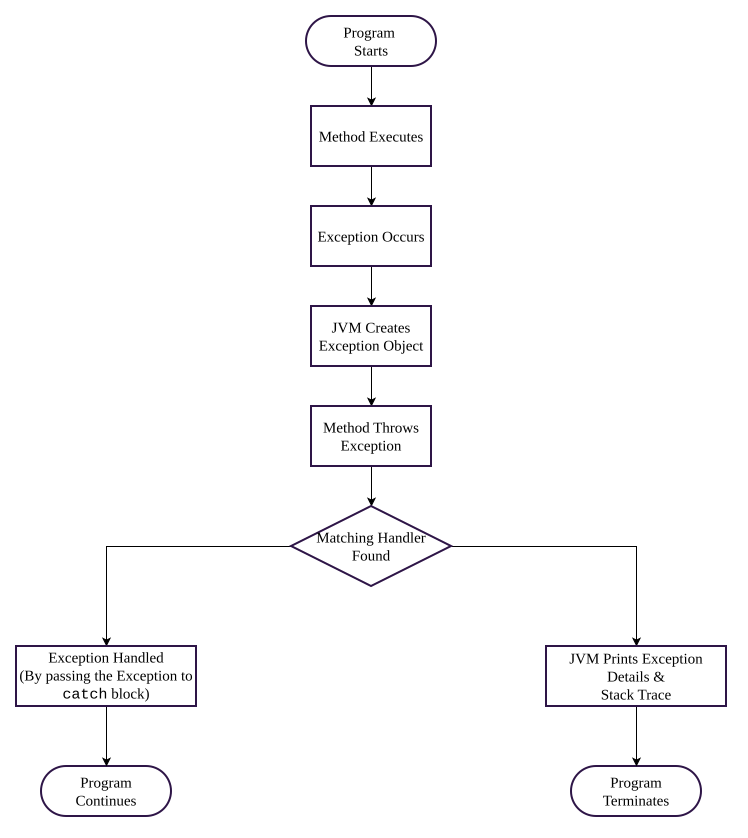

# Exception
> An _exception_ is an event, which occurs during the execution of a program and disrupts the normal flow of the program's instructions.

- When an error occurs within a method, the method creates an object and hands it off to the runtime system. This object is known as an **exception object**. 
- The exception Object contains three information:
	1. Exception Type
	2. Error Message
	3. Stack Trace (method names, file names, line numbers)
- The process of creating an exception object and handing it to the runtime system is called **throwing an exception**.
- After a method throws an exception, the runtime system attempts to find a matching exception handler. The ordered list of methods that were called to reach the method where the exception occurred is known as the **Call Stack**.
- The runtime system searches the Call Stack in reverse order, starting from the method where the exception occurred and moving back through each calling method. If it finds a matching exception handler (`catch` block), the exception is passed to that handler.
- If the runtime system searches the entire Call Stack without finding a matching exception handler, the exception remains uncaught. In this case, the JVM prints the **Stack Trace** and terminates the program.


#### Example
```java
package com.billing;

public class PricingService {

    public static void main(String[] args) {
        int totalAmount = 5000;
        int quantity = 0;
        calculateUnitPrice(totalAmount, quantity);
    }

    static void calculateUnitPrice(int totalAmount, int quantity) {
        int unitPrice = computeUnitPrice(totalAmount, quantity);
        System.out.println("Unit Price = " + unitPrice);
    }

    static int computeUnitPrice(int totalAmount, int quantity) {
        return totalAmount / quantity; // ArithmeticException here
    }
}
```


>[!NOTE] 
`quantity` is zero, so `divide()` triggers `ArithmeticException`. the call stack is four frames deep: 
`divide()` ← `calculateUnitPrice()` ← `processOrder()` ← `main()`

#### Solution Code
```java
package com.billing;

public class PricingService {

    public static void main(String[] args) {

        int totalAmount = 5000;
        int quantity = 0;
        processOrder(totalAmount, quantity);
    }

    static void processOrder(int totalAmount, int quantity) {
        int unitPrice = calculateUnitPrice(totalAmount, quantity);
        System.out.println("Unit Price = " + unitPrice);
    }

    static int calculateUnitPrice(int totalAmount, int quantity) {
        try {
            return divide(totalAmount, quantity);
        } catch (ArithmeticException e) {
            System.out.println("Exception Handled in calculateUnitPrice()");
            return 0;
        }
    }

    static int divide(int dividend, int divisor) {
        return dividend / divisor;      // Exception occurs here
    }
}
```
>[!Note]
>The `catch` sits in `calculationPrice()` because that's the lowest layer that knows how to recover meaningfully- Falling back to a zero unit price.
>`processOrder()` and `main()` have no business context to decide that. so the exception should