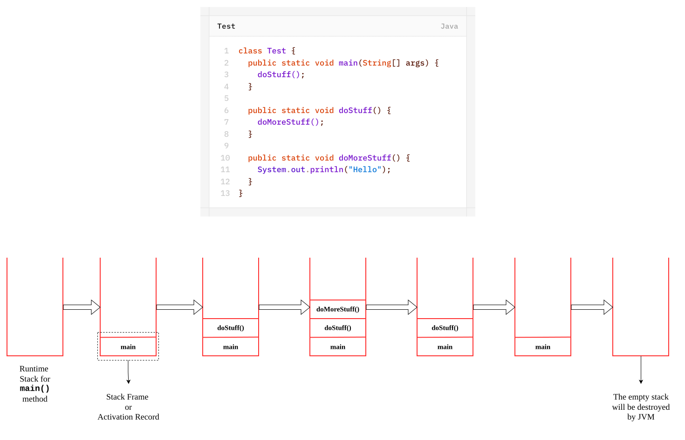

# Runtime Stack Mechanism
- For every thread JVM will create a runtime stack.
- Each and every method call performed by that thread will be stored in the corresponding stack.
- each entry in the stack is called- Stack frame / Activation record.
- After completing every method call the corresponding entry from the stack will be removed.
- after completed all method calls the stack will become empty and the empty stack will be destroyed by JVM just before terminating the thread.
```java
class Test {
	public static void main(String[] args) {
		doStuff();
	}
	
	public static void doStuff() {
		doMoreStuff();
	}
	
	public static void doMoreStuff() {
		System.out.println("Hello");
	}
}
```
