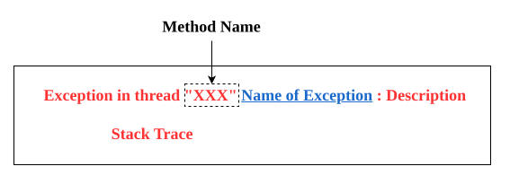
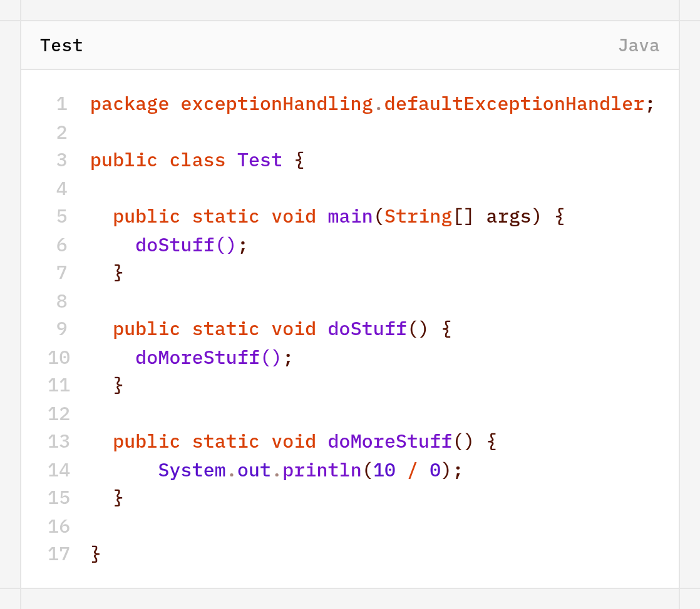
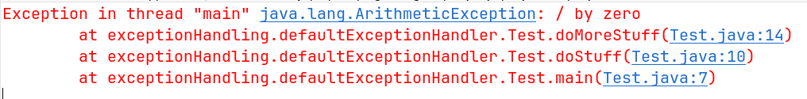
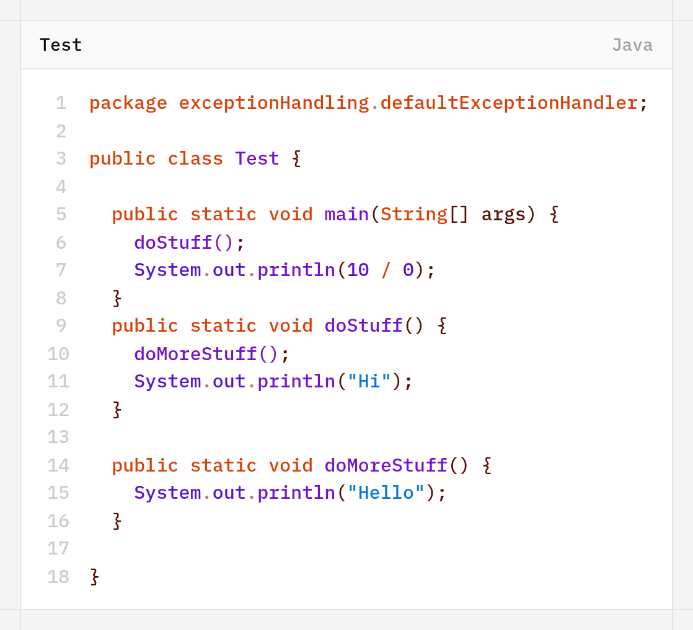
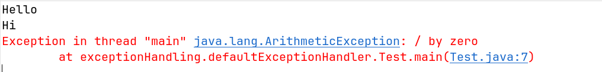

# Default Exception Handling
- Inside a method if any exception occurs, the method in which it is raised is responsible to create exception object by including the following information-
	1. Name of Exception
	2. Description of exception
	3. Location at which exception occurs
		[Stack Trace]
- After creating exception object method hands over that object to the JVM.
- JVM will check whether the method contains any exception handling code or not. if the method does not contain exception handling code then JVM terminates that method abnormally and removes corresponding entry from the stack.
- Then JVM identifies caller method and checks whether caller method contains any handling code or not. if caller method doesn't contain handling code then JVM terminates that caller method also abnormally and removes corresponding entry from the stack.
- This process will be continued until main method and if the main method also does not contain handling code then JVM main method also abnormally and removes corresponding entry from the stack.
- Then JVM hands over responsibility of exception handling to **Default Exception Handler**, which is the part of JVM.
- Default Exception Handler prints exception information in the following format and terminates program abnormally.
	

Example-1:

Example-2:

>[!NOTE]
>- In a program atleast one method terminates abnormally then the program termination is consider as **Abnormal Condition**.
>- If all methods terminates normally then only program termination is consider as **Normal Termination**.

