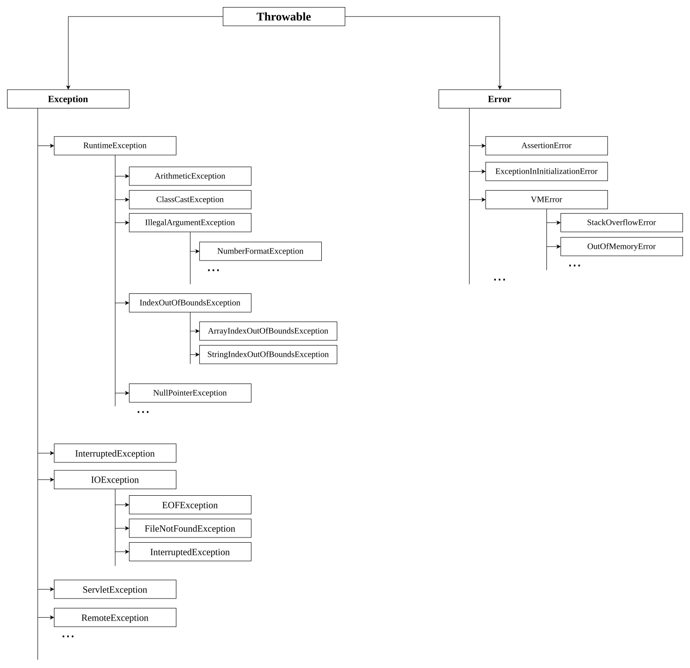

# Exception Hierarchy
## Throwable
- Throwable class access root for Java Exception Hierarchy.
- Throwable defines two child classes-
	1. Exception
	2. Error
### 1. Exception
Most of the times exceptions are caused by our program and these are recoverable.
Example: 
if our programming requirement is to read data from remote file locating at London. at runtime if remote file is not available then we will get runtime exception saying- `FileNotFoundException`.
If `FileNotFoundException` occurs we can provide local file and continue rest of the program normally.
```java
try {
	Read data from remote file 
	locating at London
} catch (FileNotFoundException e) {
	use local file & continue 
	rest of the program normally
}
```
### 2. Error
Most of the times errors are not caused by our program and these are due to lack of system resources.
Errors are non-recoverable.
Example:
If `OutOfMemeoryErroe` occurs, being a programmer we can't do anything and the program will be terminated abnormally.
System-Admin or Server-Admin is responsible to increase heap memory.

Q. Which class is root of Java Exception Hierarchy?
-> `Throwable`

Q. `Throwable` class contain how many child classes?
-> Two: Exception & Error

Q. What is the difference between Exception & Error?
-> 
