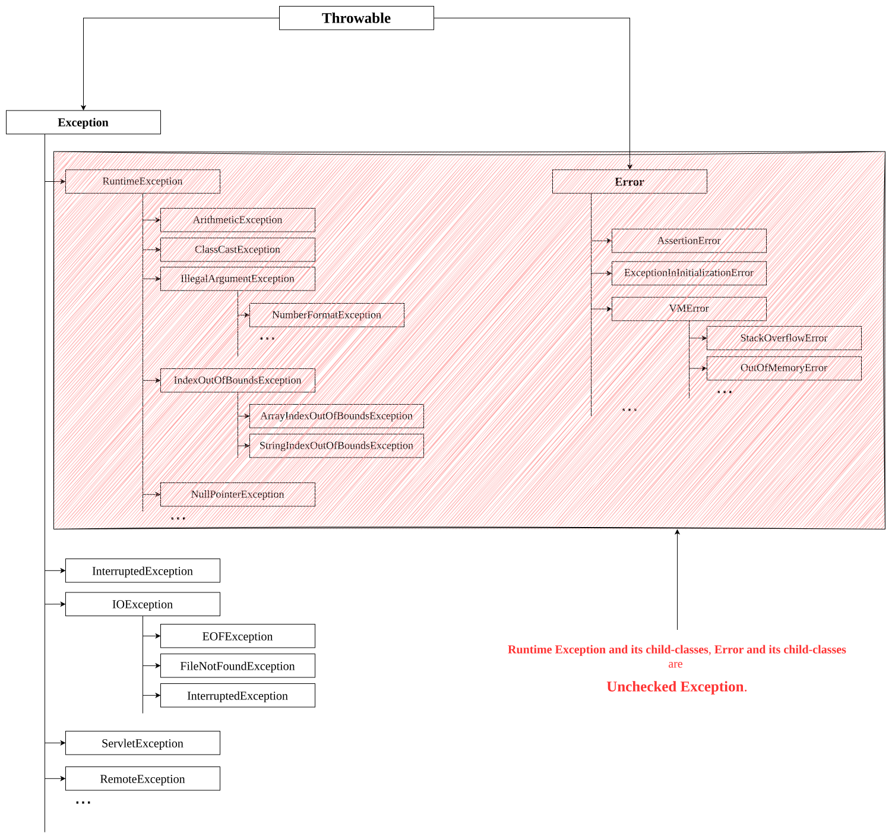
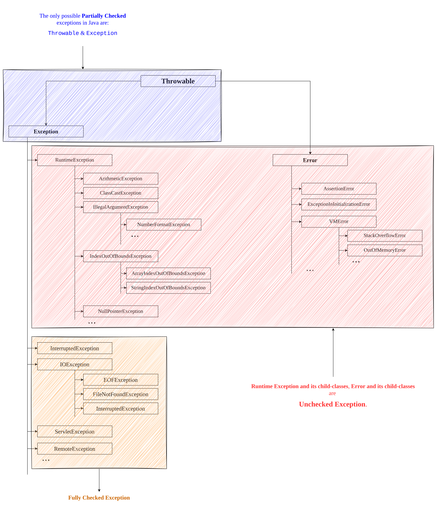

# Checked Exceptions
- The exceptions which are checked by compiler for smooth execution of the program at runtime are called Checked Exceptions.
- Example: `FileNotFoundException` etc.
- In our program if there is a chnace of raising checked exception then compulsory we should handle that check exception (either by try-catch or by `throws` keyword) otherwise we will get compile-time error.
# Unchecked Exceptions
- The exceptions which are not checked by compiler whether programmer handling or not, such types of exceptions are called Unchecked Exceptions.
- Example: `ArithmeticException` `NullPointerException` etc.

> [!NOTE]
> Whether it is Checked or Unchecked every exceptions occurs at runtime only. There is no chance of occuring any exception at compile-time.

- Runtime Exception and its child-classes, Error and its child-classes are Unchecked Exception.
	Except these remaining are Checked Exception.
	
## Fully Checked vs Partially Checked
- A Checked Exception is said to be fully checked if and only if all its child-classes also checked.
	Example: `IOException`, `InterruptedException`
- A Checked Exception is said to be partially checked if and only if some of its child-classes are unchecked.
	Example: `Exception`, `Throwable`
	
>[!NOTE]
>The only possible partially checked exceptions in Java are:
>1.  `Exceptions`
>2. `Throwable`

Describe the behavior of following exceptions:
1. `IOException` -> Checked (Fully Checked)
2. `RuntimeException` -> Unchecked
3. `InterruptedException` -> Checked (Fully Checked)
4. `Error` -> Unchecked
5. `Throwable` -> Checked (Partially Checked)
6. `ArithmeticException` -> Unchecked
7. `NullPointerException` -> Unchecked
8. `Exception` -> Checked (Partially Checked)
9. `FileNotFoundException` -> Checked (Fully Checked)

