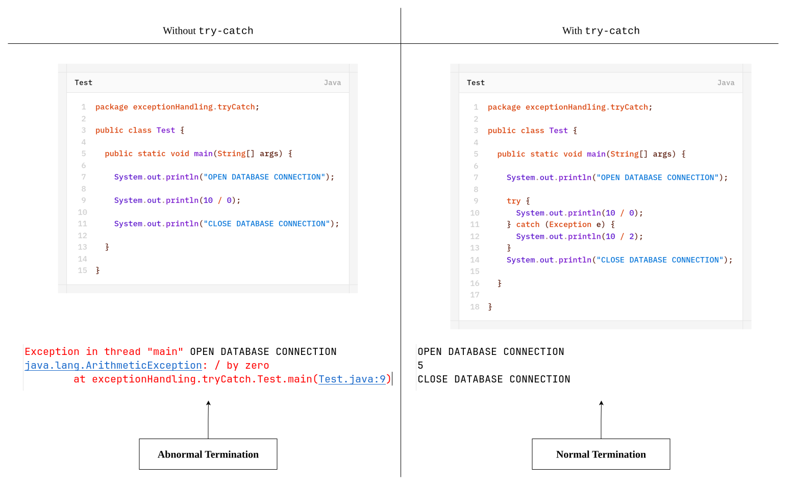
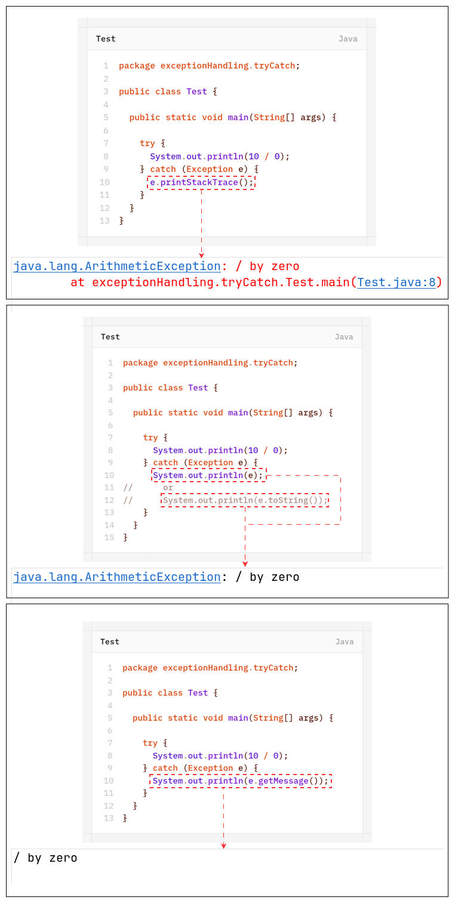
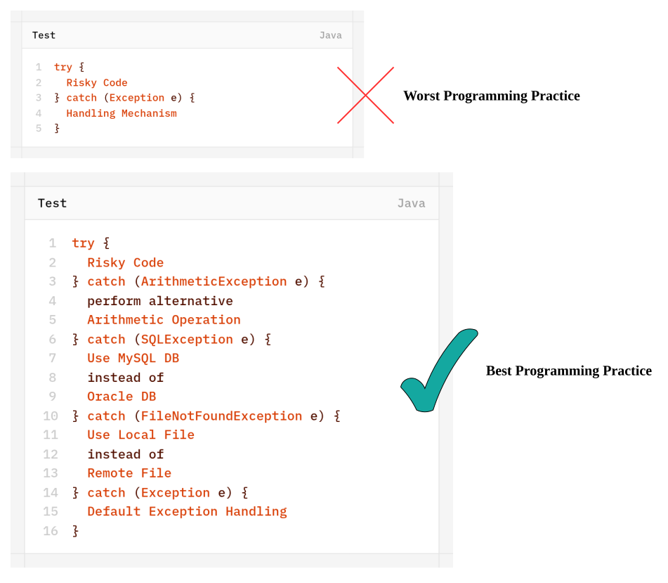
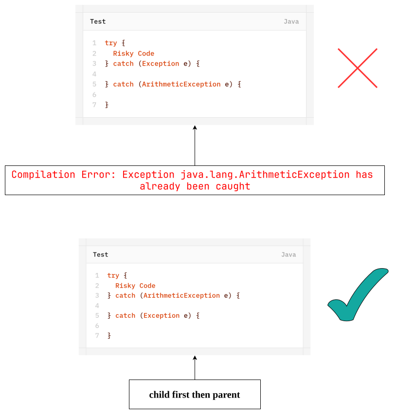
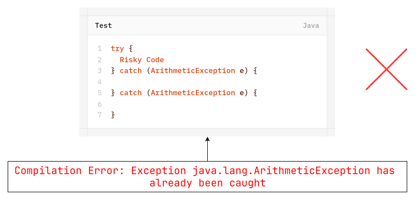

# Customized Exception Handling by using `try-catch`
- It is highly recommended to handle exceptions.
- The code which may raised exception is called **Risky Code** and we have define that code inside `try` block and corresponding handling code we have define inside `catch` block.

	```java
	try {
		Risky code
	} catch (Exception e) {
		Corresponding handling code
	}
	```
	


## Control-Flow in `try-catch`
```java
try {
	statement-1;
	statement-2;
	statement-3;
} catch(Exception e) {
	statement-4;
}
statement-5;
```

| #      | Exception in Statment-X                                                        | Statement which will be executed | Which Termination   |
| ------ | ------------------------------------------------------------------------------ | -------------------------------- | ------------------- |
| Case-1 | If there is no exception                                                       | 1 → 2 → 3 → 5                    | Normal Termination  |
| Case-2 | If an exception raised at statement-2 and corresponding catch block matched    | 1 → 4 → 5                        | Normal Termination  |
| Case-3 | If an exception raised at statement-2 and correspoding catch block not matched | 1                                | Abormal Termination |
| case-4 | If an exception raised at statement-4 or statement-5                           | -                                | Abormal Termination |

>[!NOTE]
>1. Within the `try` block if anywhere an exception raised then rest of the `try` block won't be executed even though we gandled that exception hence within the `try` block we have to take only risky code and length of `try` block should be as less possible.
> 2. In addition to `try` block there may be a chance of raising an exception inside `catch` and `finally` blocks.
> 3. If any statement which is not part of `try` block and raised an exception then it is always abnormal termination.

## Methods to Print Exception Information
`Throwable` class defines the following methods to exception information:

| #   | Method              | Printable Format                                       |
| --- | ------------------- | ------------------------------------------------------ |
| 1   | `printStackTrace()` | Name of Exception : Description<br>        Stack Trace |
| 2   | `toString()`        | Name of Exception : Description                        |
| 3   | `getMessage()`      | Description                                            |



>[!NOTE]
>Internally Default exception Handler will use `printStackTrace()` method to print exception information to console.

## `try` With Multiple `catch` Blocks
The way of handling an exception is varied from exception-to-exception hence for every exception type it is highly recommended to take separate `catch` block i.e. `try` with multiple `catch` block is always possible and recommended to use.


If `try` with multiple `catch` blocks present then order of `catch` blocks are very important. We have to take child first then parent otherwise we will get compile-time error saying- "exception XXX has already been caught".


we can't declare two catch blocks for the same exception otherwise we will get compile-time error.
