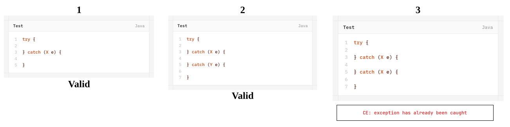
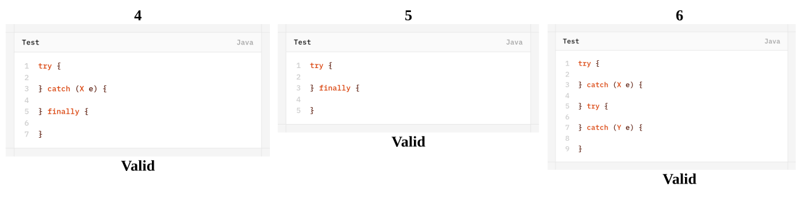
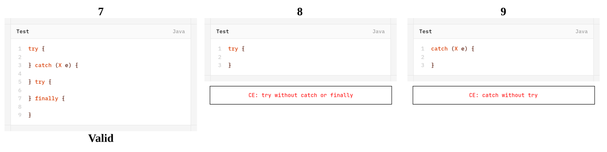
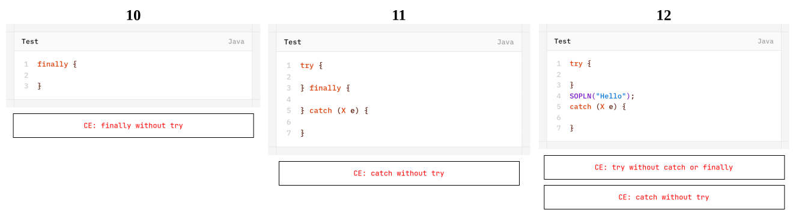
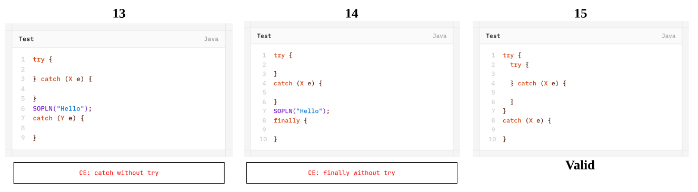
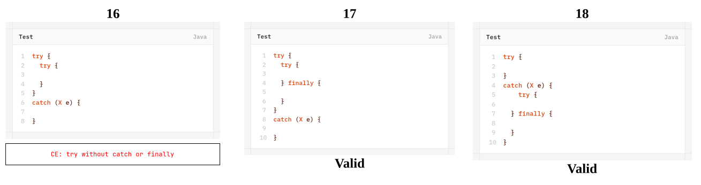
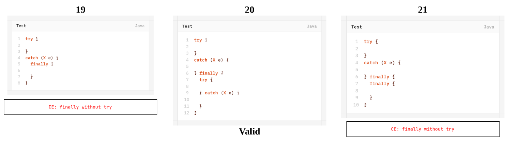
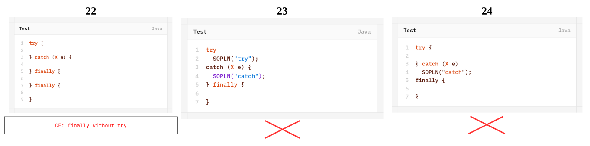
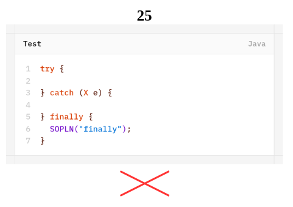

# Final, Finally and Finalize
## `final`
- `final` is a modifier applicable for classes, methods & variables.
- If a class declared as `final`, we can't extend that class i.e. we can't create child class for that class i.e. inheritance is not possible for `final` class.
- If a method is `final` then we can't override that method in child class.
- If a variable declared as `final` we can't perform re-assignment for that variable.
## `finally`
- `finally` is a block always associated with `try-catch` to maintain clean-up code.
	```java
	try {
		Risky Code
	} catch (Exception e) {
		Handling Code
	} finally {
		Clean-up Code
	}
	```
- The speciality of `finally` block is- it will be executed always irrespective of whether exception is raised or not raised and whether handled or not handled.
## `finalize()`
- `finalize()` is a method, always invoked by grabage collector just before destroying an object to perform cleanup-activities.
- Once `finalize()` method completes immediately grabage collector destroys that object.

>[!NOTE]
>- `finally` block is responsible to perform clean-up activities related to `try` block i.e. whatever resources we opened at the part of `try` block will be closed inside `finally` block.
>- Whereas `finalize()` is responsible to perform clean-up activities related to object i.e. whatever resources related to object will be de-allocated before destroying an object by using `finalize()` method.
## Various Possible combinations of `try-catch-finally`










- `try-catch-finally` order is important.
- Whenever we are writing `try` compulsory we should write either `catch` or `finally` otherwise we will get compile-time error i.e. `try` without `catch` or `finally` is invalid.
- Whenever we are writing `catch` block compulsory `try` block must be required i.e. `catch` without `try` is invalid.
- Whenever we are writing `finally` block compulsory we should write `try` block i.e. `finally` without `try` is invalid.
- Inside `try-catch-finally`  we can decalre `try-catch-finally` blocks i.e. nesting of `try-catch-finally` is allowed.
- For `try-catch-finally` blocks curly-braces are mandatory.