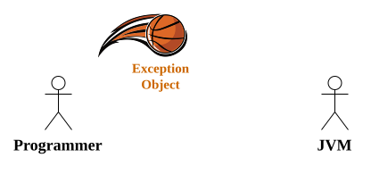
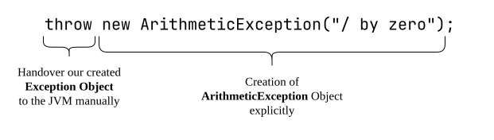
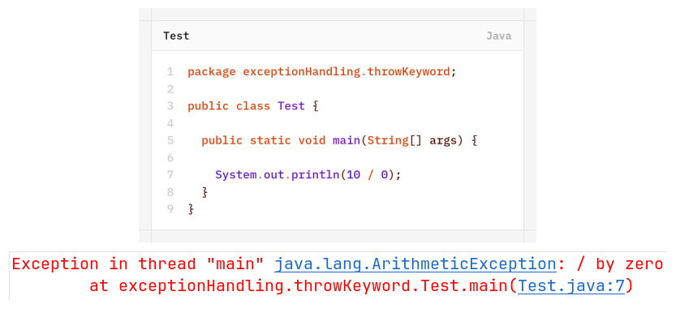
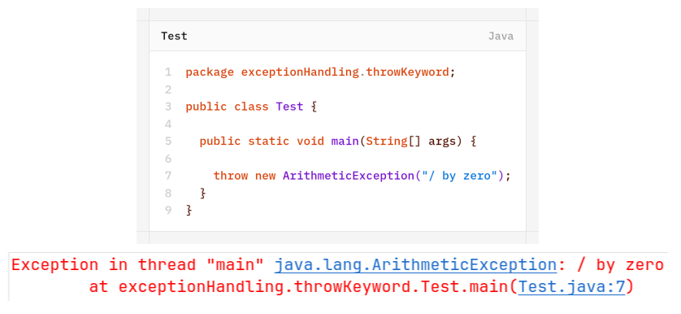
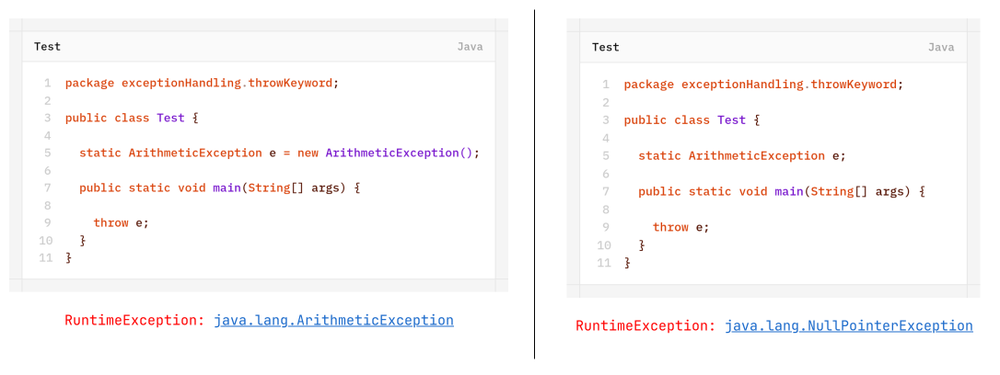
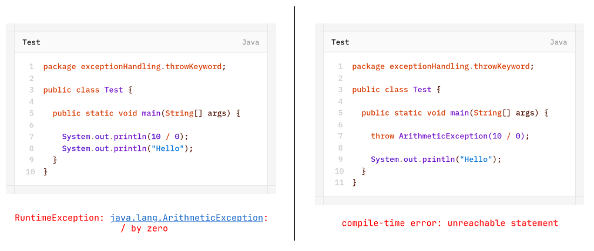
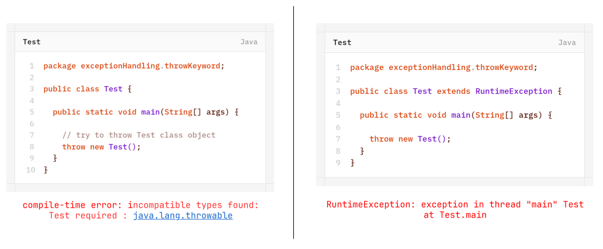

# `throw` Keyword

Sometimes we can create exception object explicitly. we can hand-over to JVM manually. for this we have to use **`throw`** keyword.

Hence the main objective of `throw` keyword is to handover our created exception object to JVM manually.
The result of the following two program is exactly same.

| Without `throw`                                                                             | With `throw`                                                                                   |
| ------------------------------------------------------------------------------------------- | ---------------------------------------------------------------------------------------------- |
|                                               |                                   |
| In this case, `main()` method is responsible to create exception object and handover to JVM | In this case, programmer is creating exception object explicitly and handover to JVM manually. |
Best use of `throw` keyword is for user-defined exceptions or customized exceptions.

**Case-1**: `throw e` if `e` refers null then we will get `NullPointerException`.

**Case-2**: After `throw` statement we are not allowed to write any statement directly otherwise we will get compile-time error saying- "Unreachable statement".

**Case-3**: We can use `throw` keyword only for throwable types. if we are trying to use for normal java objects, we will get compile-time error saying- "Incompatible type".

