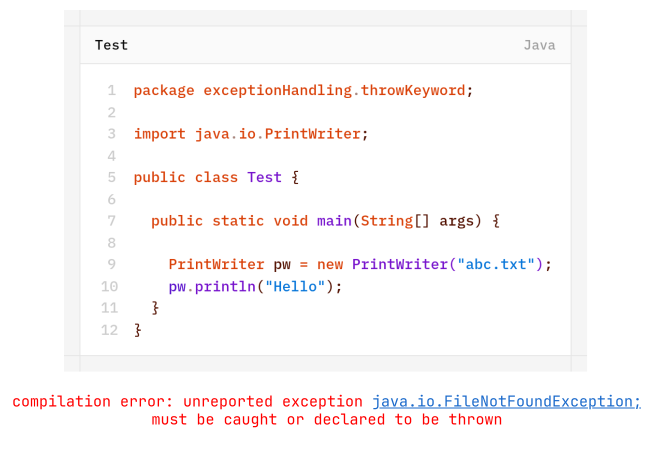
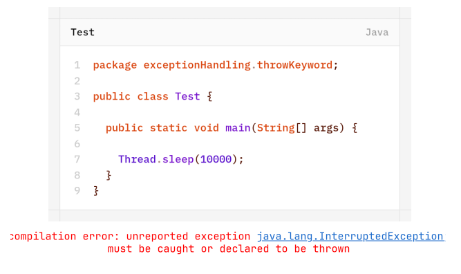
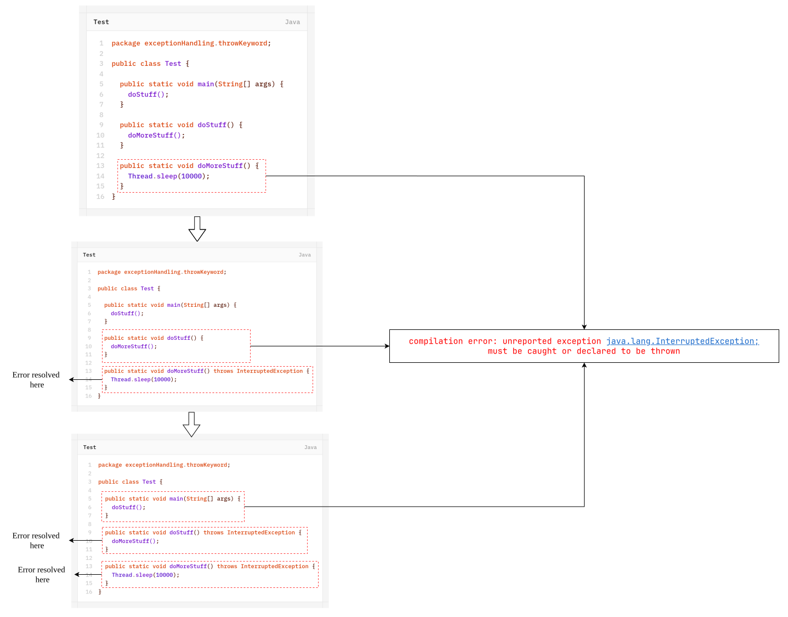
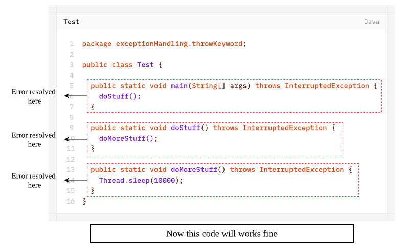
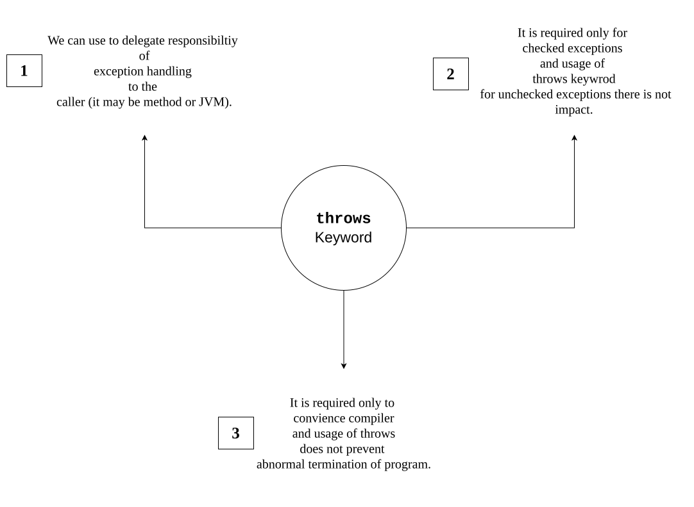
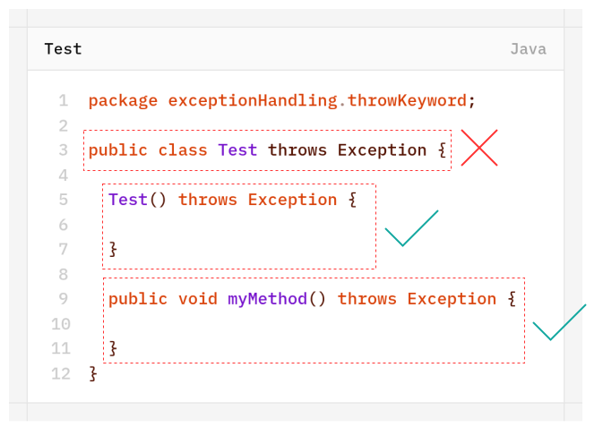
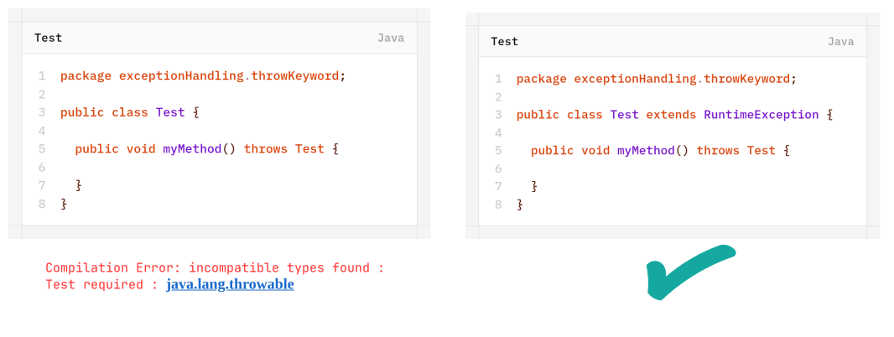
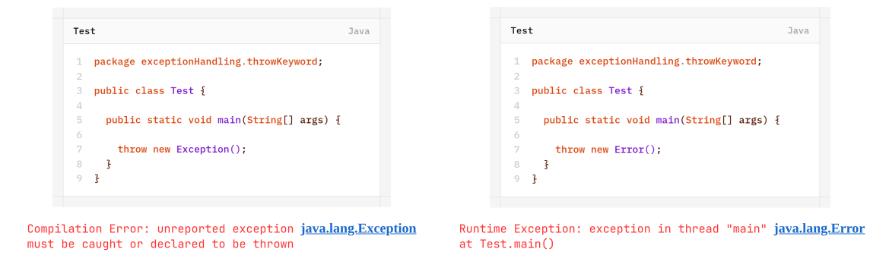
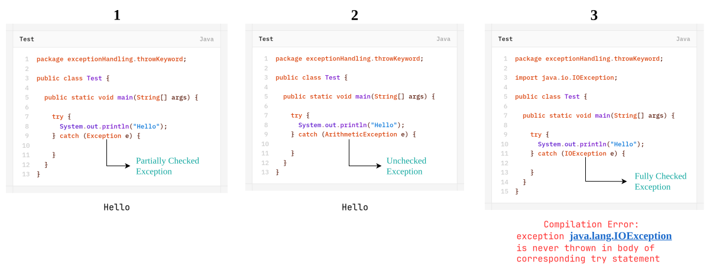
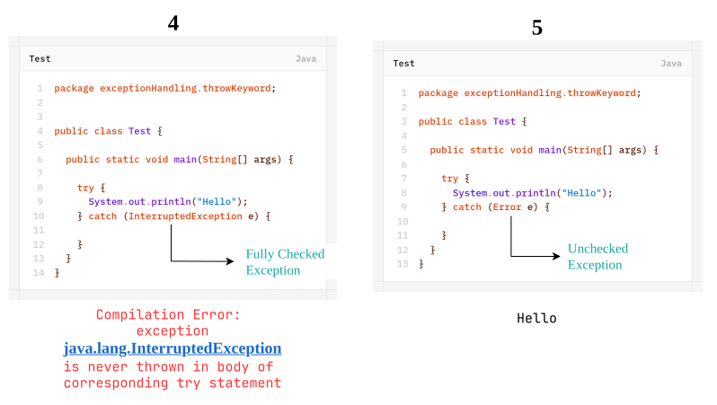

# `throws` Keyword
In our program if there is a possibility of rising checked-exception then compulsory we should handle that checked exception otherwise we will get compile-time error saying-
**"unreported exception XXX; must be caught or declared to be thrown"**.
Example-1:


Example-2:



We can handle this compile-time error by using the following two ways: 
1. by using `try-catch`
2. by using `throws` keyword
### 1. By Using `try-catch`
```java
package exceptionHandling.throwKeyword;

public class Test {

	public static void main(String[] args) {
		
		try {
			Thread.sleep(10000);
		} catch (InterruptedException e) {
			
		}
	}
}
```
### 2. By Using `throws` Keyword
we can use `throws` keyword to delegate the responsibility of exception handling to caller (it may be another method or JVM) then caller method is responsible to handle that exception.
```java
package exceptionHandling.throwKeyword;

public class Test {

	public static void main(String[] args) throws InterruptedException {
		
		Thread.sleep(10000);
	}
}
```

- `Throws` keyword requires only for checked exceptions. and usage of `throws` keyword for uncheked exceptions, there is no use or impact.
- `throws` keyword requires only to convence compiler and usage of `throws` keyword doesn't prevent abnormal termination of the program.
	

	**Solution:**
	

- In the above program if we remove atleast one `throws` statement the code won't compile.
#### Conclusion


>[!NOTE]
>It is recommended to use `try-catch` over `throws` keyword.

**Case-1**: 
We can use `throws` keyword for methods and constructors but not for classes.


**Case-2**:
We can `throws` keyword only for throwable types. if we are trying to use for normal java classes then we will get compile-time error saying- incompatible types.


**Case-3**:


**Case-4**:
Within `try` block if there is no chance of raising an exception then w can't write `catch` block for that exception otherwise we will get compile-time error saying- "Exception XXX is never thrown in body of corresponding `try` statement".
But this rule is applicable only for fully checked exceptions.

