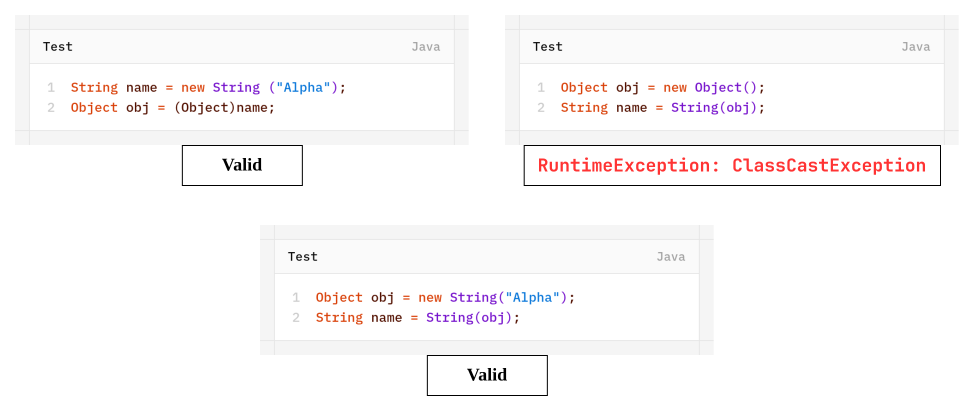
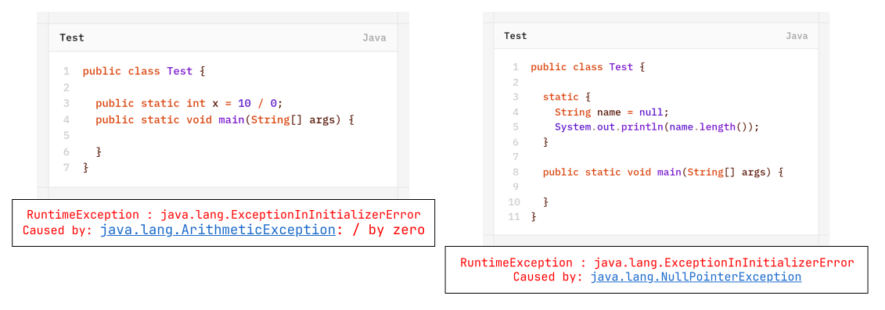
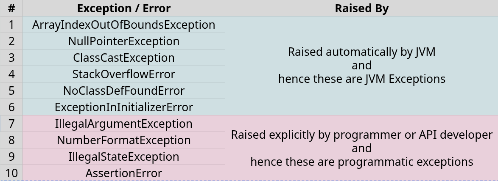

Based on the person who is raising an exception, all exceptions are divided into two categories:
1. JVM Exceptions
2. Programmatic Exceptions
## 1. JVM Exceptions
The exceptions which are raised automatically by JVM whenever a particular event occurs are called JVM Exceptions.
Example: `ArithmeticException`, `NullPointerException` etc.
## 2. Programmatic Exceptions
The exceptions which are raised explicitly either by programmer or by API developer to indicate that something goes wrong are called Programmatic Exceptions.
Example: `TooOldException`, 'IllegalArgumentException' etc.

# Top-10 Exceptions
## 1. `ArrayIndexOutOfBoundsException`
- It is child class of `RuntimeException` and hance it is unchecked.
- Raised automatic by JVM whenever we are trying to access array element with  out-of-range index.
Example:
```java
// creating an array
int[] arr = new int[4];

// trying to access different indexes
SOPLN("arr[0]"); // 0
SOPLN("arr[10]"); // RuntimeException: ArrayIndexOutOfBoundsException
SOPLN("arr[-10]"); // RuntimeException: ArrayIndexOutOfBoundsException
```
## 2. `NullPointerException`
- It is child class of `RuntimeException` and hence it is unchecked.
- Raised automatically by JVM whenever we are trying to perform any operation on **null**.
Example:
```java
String name = null;

SOPLN("name.length()"); // RuntimeException: NullPointerException
```
## 3. `ClassCastException`
- It is child class of `RuntimeException` and hence it is unchecked.
- Raised automatically by JVM whenever we are trying to type cast parent object to child type.
Example:

## 4. `StackOverflowError`
- It is child class of `Error` and hence it is unchecked.
- Raised automatically by JVM whenever we are trying to perform **recursive** method call.
Example:
```java
public class Test
{
    public static void method1() {
        method2();
    }
    public static void method2() {
        method1();
    }
	public static void main(String[] args) {
		method1();
	}
}
```
## 5. `NoClassDefFoundError`
- It is child class of `Error` and hence it is unchecked.
- Raised automatically by JVM whenever JVM unable to find required `.class` file.
Example:
```bash
java Test
```
if `Test.class` file is not available then we will get `RuntimeException` saying- `NoClassDefFoundError : Test`
## 6. `ExceptionInInitializerError`
- It is child class of `Error` and hence it is unchecked.
- Raised automatically by JVM whenever if any exception occurs while executing static variable assignments or static blocks.
Example:

## 7. `IllegalArgumentException`
- It is child class of `RuntimeException` and hence it is unchecked.
- Raised explicitly either by programmer or by API developer to indicate that a method has been invoked with illegal argument.
Example:
The valid range of Thread priority is 1 to 10. if we are trying to set the priority with any other value then we will get `RuntimeException` saying- `IllegalArgumentException`
```java
public class Test {

	public static void main(String[] args) {
		
		Thread t = new Thread();
		
		t.setPriority(7); // valid
		t.setPriority(15); // RuntimeException : IllegalArgumentException
	}
}
```
## 8. `NumberFormatException`
- It is direct child class of `IllegalArgumentException` which is the child class of `RuntimeException` and hence it is unchecked.
- Raised explicitly either by programmer or by API developer to indicate that we are trying to convert string to number and string is not properly formatted.
Example:
```java
public class Test {

	public static void main(String[] args) {
		
		int number1 = Integer.parseInt("10"); // valid
		
		int number2 = Integer.parseInt("ten"); // RuntimeException : NumberFormatException
	}
}
```
## 9. `IllegalStateException`
- It is child class of `RuntimeException` and hence it is unchecked.
- Raised explicitly either by programmer or by API developer to indicate that a method has been invoked at wrong time.
Example:
```java
public class Test {

	public static void main(String[] args) {
		
		Thread t = new Thread();
		
		t.start(); // valid
		
		t.start(); // RuntimeException : IllegalThreadStateException
	}
}
```
After starting of a thread we are  not allowed restart the same thread once again otherwise we will get `RuntimeException` saying- `IllegalThreadStateException`.
## 10. `AssertionError`
- It is child class of `Error` and hence it is unchecked.
- Raised explicitly by the programmer or by API developer to indicate that assert statement fails.
Example: `assert(x > 10);`➔ if x is not greater than 10 then we will get `RuntimeException` saying `AssertingError`.

## Summary



