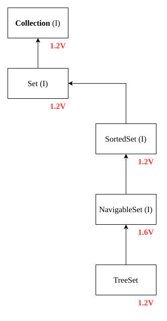
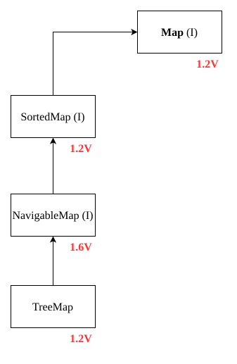
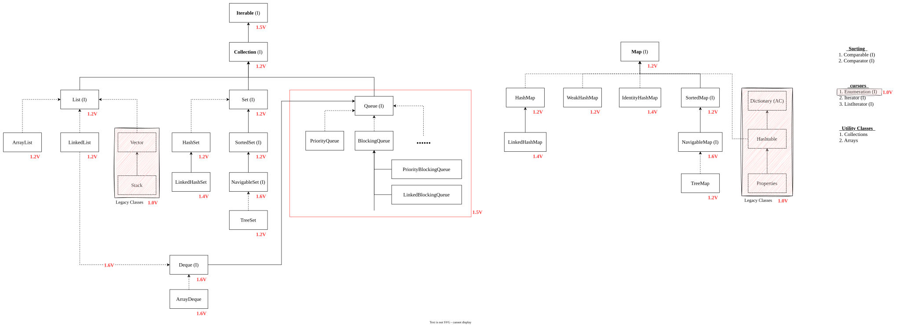

# 9 Keys Interfaces of Collection Framework
1. `Collection`
2. `List`
3. `Set`
4. `SortedSet`
5. `NavigableSet`
6. `Queue`
7. `Map`
8. `SortedMap`
9. `NavigableMap`
## 1. `Collection` (I)
1. If we want to represent a group of individual object as a single entity then we should go for **`Collection`**.
2. Collection interface defines the most common methods which are applicable for any collection object.
3. In general collection interface is considered as root interface of Collection Framework.
4. There is no concrete class which implement collection interface directly.
### Difference `Collection` & `Collections`

| #   | `Collection`                                                                                                                                       | `Collections`                                                                                                                                                 |
| --- | -------------------------------------------------------------------------------------------------------------------------------------------------- | ------------------------------------------------------------------------------------------------------------------------------------------------------------- |
| 1   | **`Collection`** is an interface. If we want to represent a group of individual object as a single entity then we should go for **Collection**. | **`Collections`** is an utility class present in `java.util` package to define several utility methods for Collection objects (Like- Sorting, Searching etc.) |
## 2. `List` (I)
- It is the child interface of `Collection`.
- If we want to represent a group of individual objects as a single entity where duplicates are allowed and insertion order must be preserved then we should go for **`List`**.
	

>[!NOTE]
>In Java-1.2 version **`Vector`** & **`Stack`** class are re-engineered to implement `List` interface.
## 3. `Set` (I)
- It is the child interface of `Collection`.
- If we want to represent a group of individual objects as a single entity where duplicates are not allowed and insertion order not required then we should go for `Set`.

	
## 4. `SortedSet` (I)
- It is the child interface of `Set`.
- If we want to represent a group of individual object as a single entity where duplicates are not allowed and object should be inserted according to some sorting order then we should for `SortedSet`.
## 5. `NavigableSet` (I)
- It is the child interface of `SortedSet`.
- It contains several methods for navigation purposes.
	
### Differences between `List` and `Set`

| #   | `List`                     | `Set`                          |
| --- | -------------------------- | ------------------------------ |
| 1   | Duplicates are allowed.    | Duplicates are not allowed.    |
| 2   | Insertion order preserved. | Insertion order not preserved. |
## 6. `Queue` (I)
- It is the child interface of `Collection`.
- If we want to represent a group of individual objects **prior to processing** then we should go for `Queue`.
- Usually `Queue` follows first-in-first-out order but based on our requirement we can implement our own priority order also.

	Example: Before sending a mail all mail-IDs we have to store in some data-structure.
	In which order we added main-IDs in the same order only mail should be deliver. for this requirement `Queue` is best choice.
	

>[!NOTE]
>All the above interfaces (`Collection`, `List`, `SortedSet`, `NavigableSet` and `Queue`) meant for representing a group of individual objects.
>If we want to represent a group of objects as key-value pair then we should go for `Map`

## 7. `Map` (I)
- `Map` is **not** child interface of `Collection`.
- If we want to represent a group of objects as **key-value** pairs then we should go for `Map`.
	Eaxmple:
	
- Both keys and values are objects only.
- Duplicates keys are not allowed but values can be duplicated.
	
## 8. `SortedMap` (I)
- It is child interface of `Map`.
- If we want to represent a group of key-value pairs according to some **sorting order of keys** then we should go for `SortedMap`.
- In `SortedMap` the sorting should be based on keys but not based on values.
## 9. `NavigableMap` (I)
- It is child interface of `SortedMap`.
- It defines several methods for navigation purposes.

	

>[!NOTE]
>The following are legacy charaters present in Collection-Framework:
>1. `Enumeration` (I)
>2. `Dictionary` (AC)
>3. `Vector` (C)
>4. `Stack` (C)
>5. `Hashtable` (C)
>6. `Properties` (C)

