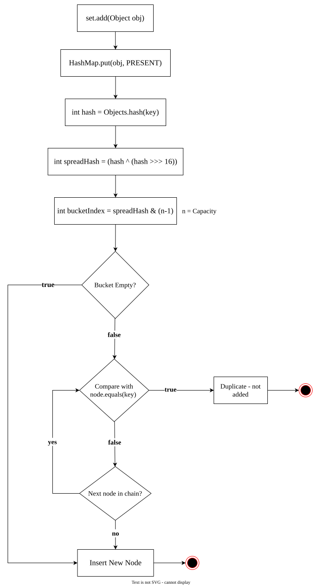

 # `HashSet`
1. The underlying data structure is 'HashMap' where:
	- Each HashSet Object is stored as a `HashMap` key.
	- Intern, a dummy object (`PRESENT`) is used as `HashMap` value.
2. Duplicate objects are not allowed.
3. Insertion order is not preserved and it is based on hashcode of objects.
4. `null` insertion is possible (only once).
5. Heterogeneous objects are allowed.
6. Implements `Serializable`, `Cloneable` but not `RandomAccess` interface.
7. `HashSet` is the best choice if our frequent operation is search operation.
>[!IMPORTANT]
>In `HashSet` duplicates are not allowed. if we are trying to insert duplicates then we won't get any compile-time or runtime error and `add()` method simply returns false.
```java
HashSet set = new HashSet();
SOPLN(set.add("A")); // true
SOPLN(set.add("A")); // false
```
## Constructors

| #   | Syntax                                                             | Explanation                                                                                                                               |
| --- | ------------------------------------------------------------------ | ----------------------------------------------------------------------------------------------------------------------------------------- |
| 1   | `HashSet set = new HashSet();`                                     | Creates an empty `HashSet` objects with default initial capacity 16 and default Fill Ratio (or Load factor) is 0.75.                      |
| 2   | `HashSet set = new HashSet(int initialCapacity);`                  | Creates an empty `HashSet` object with specified initial capacity and default Fill Ratio is 0.75.                                         |
| 3   | `HashSet set = new HashSet(int initialCapacity, float fillRatio);` |                                                                                                                                           |
| 4   | `HashSet set = new HashSet(Collection c);`                         | Creates an equivalent `HashSet` for the given `Collection` .<br>This constructor meant for inter-conversion between `Collection` objects. |

### Fill Ratio / Load Factor
- After filling how much ratio a new `HashSet` object will be created, this ratio is called **Fill Ratio** or **Load Factor**.
	**Example:** Fill ratio 0.75 means after filling 75% ratio a new `HashSet` object will be created.
**Example**:
```java
package collection.set.hashSet;

import java.util.HashSet;

public class HashSetDemo {

	public static void main(String[] args) {
		
//		create a HashSet
		HashSet set = new HashSet();
		
		set.add("B");  // add a string
		set.add("C");  // add a string
		set.add("D");  // add a string
		set.add("Z");  // add a string
		set.add(null); // add null
		set.add(10);   // add an integer
		
		System.out.println(set.add("Z")); // false
		System.out.println(set); // output -> insertion order will not preserved
	}

}
```
## Internal Mechanism of a `HashSet`?
Questions:
1. How does a `HashSet` work internally?
2. what is the internal mechanism of **add()** method inside a `HashSet`?
3. How does **add()** method works internally?

`HashSet`  internally uses a `HashMap`. When we add an object inside `HashSet`, internally object store as key of the `HashMap` and its respective value is a dummy object which is **PRESENT**.
Inside a `HashSet` or `HashMap` there is a contract between **hashcode()** and **equals()** method
>1. If two objects are equal then their `hashCode` must be same.
>2. If two objects are returning same `hashCode` those may or may not be equal.

When we add an object to a `HashSet`, the first operation is calculating its hash code. hash code is an integer value that is generated by hashcode() method and which is available inside `Object` class and is overridden in our custom class.

After generating hash code, `HashMap` has its own internal `hash()` method which spreads this hash code further. it helps to find the bucket index where the object should be stored. 

Once the bucket is found, `HashSet` checks whether the bucket is empty or something is already present.

> **Case-1: if the bucket is empty**
The object will be stored in that bucket as a form of **`LinkedList` node**.
>
**Case-2: if the bucket is not empty**
If the bucket is not empty and it has one or more singly `LinkedList` node then here equals() method is used to find whether the new object is meaningfully equal to the existing object present inside nodes.

- If `equals()` method returns **true** for any node means the new object is meaningfully equal then the object is considered as duplicate and it is not added to `HashSet`.
- if `equals()` method returns **false** for a node means the new object is not meaningfully equal and it checks again and again till it reaches to end of the `LinkedList` and find no duplicates then the new object is added as a new node and linked to the last node. This scenario is called as **Hash-Collision**.

