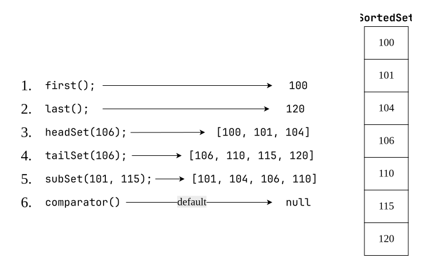

# `SortedSet` (I)
1. `SortedSet` is the child interface of `Set`.
2. If we want to represent a group of individual objects according to some sorting order without duplicates then we should go for `SortedSet`.
3. `SortedSet` interface defines the following specific methods:
	

| #   | Syntax                                        | Explanation                                                                                                                                           |
| --- | --------------------------------------------- | ----------------------------------------------------------------------------------------------------------------------------------------------------- |
| 1   | `Object first();`                             | returns first element of the `SortedSet`.                                                                                                             |
| 2   | `Object last();`                              | returns last element of the `SortedSet`.                                                                                                              |
| 3   | `SortedSet headSet(Object obj);`              | returns `SortedSet` whose elements are less than obj.                                                                                                 |
| 4   | `SortedSet tailSet(Object obj);`              | returns `SortedSet` whose elements are >= obj.                                                                                                        |
| 5   | `SortedSet subSet(Object obj1, Object obj2);` | returns `SortedSet` whose elements are >= obj1 and < obj2                                                                                             |
| 6   | `Comparator comparator();`                    | reutrns `Comparator` object that describes underlying sorting technique. If we are using **default** natural sorting order then we will get **null**. |
>[!NOTE]
>The default natural sorting order for :
>- **Numbers** = Ascending Order
>- **String** = Alphabetical Order

