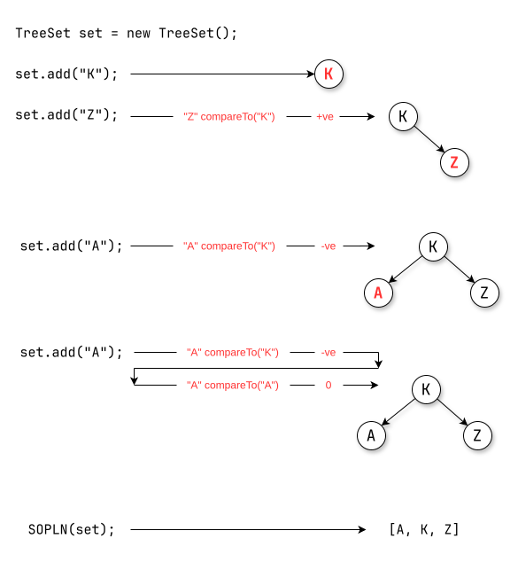

# `TreeSet`
1. The underlying data structure is Balanced Tree.
2. Duplicate objects are not allowed.
3. Insertion order not preserved.
4. Heterogeneous objects are not allowed otherwise we will get `RuntimeException` saying- `ClassCastException`
5. `null` insertion is possible (only once).
6. `TreeSet` implements , `Cloneable` but not `RandomAccess` interfaces.
7. All objects will be inserted based on some sorting order. it may be default-natural sorting order or customized sorting order.
## Constructors

| #   | Syntax                                     | Explanation                                                                                                                                   |
| --- | ------------------------------------------ | --------------------------------------------------------------------------------------------------------------------------------------------- |
| 1   | `TreeSet set = new TreeSet();`             | Creates an empty `TreeSet` object where the elements will be inserted according to default natural sorting order.                             |
| 2   | `TreeSet set = new TreeSet(Comparator c);` | Creates an empty `TreeSet` object where the elements will be inserted according to customized sorting order specified by `Comparator` object. |
| 3   | `TreeSet set = new TreeSet(Collection c);` |                                                                                                                                               |
| 4   | `TreeSet set = new TreeSet(SortedSet s);`  |                                                                                                                                               |
**Example-1**:
```java
package collection.set.treeSet;

import java.util.TreeSet;

public class TreeSetDemo {

	public static void main(String[] args) {
		
//		create a TreeSet
		TreeSet set = new TreeSet();
		
//		add string values
		set.add("A");
		set.add("a");
		set.add("B");
		set.add("Z");
		set.add("L");
		
//		add Heterogeneous Object
//		set.add(new Integer(10)); // ClassCastException
		
//		add null object
//		set.add(null); // NullPointerException
		
		System.out.println(set); // [A, B, L, Z, a]	

	}

}
```
## `null` Acceptance
- for non-empty `TreeSet` if we are trying to insert `null` then we will get `NullPointerException`.
- for empty `TreeSet` as the first element `null` is allowed but after inserting that `null`, if we are trying any other than we will get `RuntimeException` saying- `NullPointerException`.
>[!WARNING]
>- Untill Java-1.6v `null` is allowed at the first element to empty `TreeSet` but from Java-1.6v onwards `null` is not allowed even as the first element i.e., `null` such type of story is not applicable for `TreeSet` from Java-1.7v onwards.

**Example-2**:
```java
package collection.set.treeSet;

import java.util.TreeSet;

public class TreeSetDemo1 {

	public static void main(String[] args) {
		
		TreeSet set = new TreeSet();

		set.add(new StringBuffer("A"));
		set.add(new StringBuffer("Z"));
		set.add(new StringBuffer("L"));
		set.add(new StringBuffer("B"));
		
		System.out.println(set);
		
		// RuntimeException : ClassCastException
	}
}
```
- if we are depending on default natural sorting order compulsory the object should be homogeneous and comparable otherwise we will get `RuntimeException` saying `ClassCastException`.
- An object is said to be comparable if-and-only-if corresponding class implements `Compararble` interface.
- `String` class and all wrapper classes already implement `Comparable` but `StringBuffer` class doesn't implement `Comparable` interface hence we got `ClassCastException` in the above example.
- If we are depending on default natural sorting order then while adding objects into the `TreeSet` JVM will call `compareTo()` method.
	

>[!IMPORTANT]  
**Java 11 change:** `StringBuffer` implements `Comparable<StringBuffer>` from Java 11 onwards. Therefore, `StringBuffer` objects can be stored in a `TreeSet` using natural ordering from Java 11 onwards. Before Java 11, using `StringBuffer` objects with a `TreeSet` that depends on natural ordering results in `ClassCastException`.
