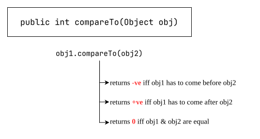
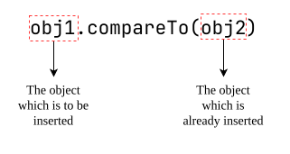

# `Comparable` (I)
1. It is present in `java.lang` package and it contains only one method `compareTo()`.
	
```java
public static void main(String[] args) {
		
	System.out.println("A".compareTo("Z"));  // -ve
	System.out.println("Z".compareTo("K"));  // +ve
	System.out.println("A".compareTo("A"));  // 0
	System.out.println("A".compareTo(null)); // RE: NPE

}
```


- If default natural sorting order not available or if we are not satisfied with default natural order then we can go for customize-sorting by using `Comparator`.

| `Comparable` meant for **default natural sorting order**. | `Comparator` meant for **customized sorting order**. |
| --------------------------------------------------------- | ---------------------------------------------------- |
## `equals()` vs `compare()` or `compareTo()`
| #   | `equals(Object obj)`                                                                  | `compare(Object obj1, Object obj2)` / `compareTo(Object obj)`                                                                                                                                                                                                                                  |
| --- | ------------------------------------------------------------------------------------- | ---------------------------------------------------------------------------------------------------------------------------------------------------------------------------------------------------------------------------------------------------------------------------------------------- |
| 1   | **`equals()`** method is used to check whether objects are meaningfully equal or not. | **`compare()`** or **`compareTo()`** is used to sort objects either in ascending or descending order.                                                                                                                                                                                          |
| 2   | equals() method returns boolean value, either- true or false.                         | compare() or compareTo() method returns `int` value.<br>- if it returns **positive**, it means newObject is greater than existingObject.<br>- if it returns negative, it means newObject is smaller than existingObject.<br>- if it returns 0, it means newObject is equals to existingObject. |
| 3   | present in `java.lang` package.                                                       | - `compareTo()` method comes from implementing Comparable.<br>- compare() method comes from implementing Comparator.                                                                                                                                                                           |

- Collections utility class implements Comparable and inside this class there is a static method sort() which uses compareTo() method.
### **Example-1:** Sort by `productId`
**Example-1:**
>Write a program to add `Product` objects (having two fields — `productId` (`int`) and `productName` (`String`)) to an `ArrayList` and sort the products according to `productId` in ascending order.

Product.java
```java
package collection.comparable;

public class Product implements Comparable<Product> {
	
	private int productId;
	private String productName;
	
	public Product (
			int productId,
			String productName
	) {
		super();
		this.productId = productId;
		this.productName = productName;
	}
	
	public int getProductid() {
		return productId;
	}
	
	public String getProductName() {
		return productName;
	}
	
	@Override
	public int compareTo(Product p) {
		int result = Integer.compare(this.productId, p.productId);
		return result;
	}
	
	
}
```
Driver.java
```java
package collection.comparable;

import java.util.ArrayList;
import java.util.Collections;
import java.util.List;

public class Driver {

	public static void main(String[] args) {
		
		Product product1 = new Product(1001, "iPhone17");
		Product product2 = new Product(100, "samsung20");
		Product product3 = new Product(1201, "LG34");
		
		Product product4 = new Product(99, "Godrej4");
		Product product5 = new Product(1030, "RealMe6G01");
		Product product6 = new Product(1030, "RealMe5G01");
		
		
		List<Product> list = new ArrayList<>();
		
		list.add(product1);
		list.add(product2);
		list.add(product3);
		list.add(product4);
		list.add(product5);
		list.add(product6);
		
		
		Collections.sort(list);
		
		list.forEach((p) -> {
			System.out.print(
				"Product ID: " + p.getProductid() +
				" -> Product Name: " + p.getProductName() +
				"\n"
			);
		});
		
	}

}
```

Output:
```text
Product ID: 99 -> Product Name: Godrej4
Product ID: 100 -> Product Name: samsung20
Product ID: 1001 -> Product Name: iPhone17
Product ID: 1030 -> Product Name: RealMe6G01
Product ID: 1030 -> Product Name: RealMe5G01
Product ID: 1201 -> Product Name: LG34
```
### **Example 2:** — Sort by `productName`
Write a program to add `Product` objects (having two fields — `productId` (`int`) and `productName` (`String`)) to an `ArrayList` and sort the products according to `productName` in alphabetical order.

just change in **compareTo()** method implementation, rest will remain same.
```java
@Override
public int compareTo(Product p) {
	int result = this.productName.compareTo(p.productName);
	return result;
}
```

output:
```text
Product ID: 99 -> Product Name: Godrej4
Product ID: 1201 -> Product Name: LG34
Product ID: 1030 -> Product Name: RealMe5G01
Product ID: 1030 -> Product Name: RealMe6G01
Product ID: 1001 -> Product Name: iPhone17
Product ID: 100 -> Product Name: samsung20
```
### **Example 3:** — Sort by `productName`
Write a program to add `Product` objects (having two fields — `productId` (`int`) and `productName` (`String`)) to an `ArrayList` and sort the products according to `productId` in ascending order. If two products have the same `productId`, sort them according to `productName` in alphabetical order.

Product.java
```java
package collection.comparable;

public class Product implements Comparable<Product> {
	
	private int productId;
	private String productName;
	
	public Product (
			int productId,
			String productName
	) {
		super();
		this.productId = productId;
		this.productName = productName;
	}
	
	public int getProductid() {
		return productId;
	}
	
	public String getProductName() {
		return productName;
	}
	
	@Override
	public int compareTo(Product p) {
		int result = Integer.compare(this.productId, p.productId);
		
		if (result == 0) {
			result = this.productName.compareTo(p.productName);
			return result;
		}
		
		return result;
	}
}
```

Driver.java
```java
package collection.comparable;

import java.util.ArrayList;
import java.util.Collections;
import java.util.List;

public class Driver {

	public static void main(String[] args) {
		
		Product product1 = new Product(1001, "iPhone17");
		Product product2 = new Product(100, "samsung20");
		Product product3 = new Product(1201, "LG34");
		
		Product product4 = new Product(99, "Godrej4");
		Product product5 = new Product(1030, "RealMe6G01");
		Product product6 = new Product(1030, "RealMe5G01");
		
		
		List<Product> list = new ArrayList<>();
		
		list.add(product1);
		list.add(product2);
		list.add(product3);
		list.add(product4);
		list.add(product5);
		list.add(product6);
		
		
		Collections.sort(list);
		list.forEach((p) -> {
			System.out.print(
				"Product ID: " + p.getProductid() +
				" -> Product Name: " + p.getProductName() +
				"\n"
			);
		});
		
	}

}
```

output
```text
Product ID: 99 -> Product Name: Godrej4
Product ID: 100 -> Product Name: samsung20
Product ID: 1001 -> Product Name: iPhone17
Product ID: 1030 -> Product Name: RealMe5G01
Product ID: 1030 -> Product Name: RealMe6G01
Product ID: 1201 -> Product Name: LG34
```