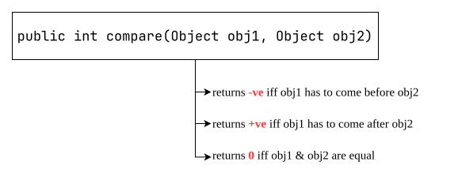
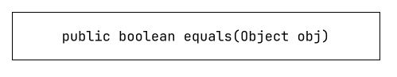
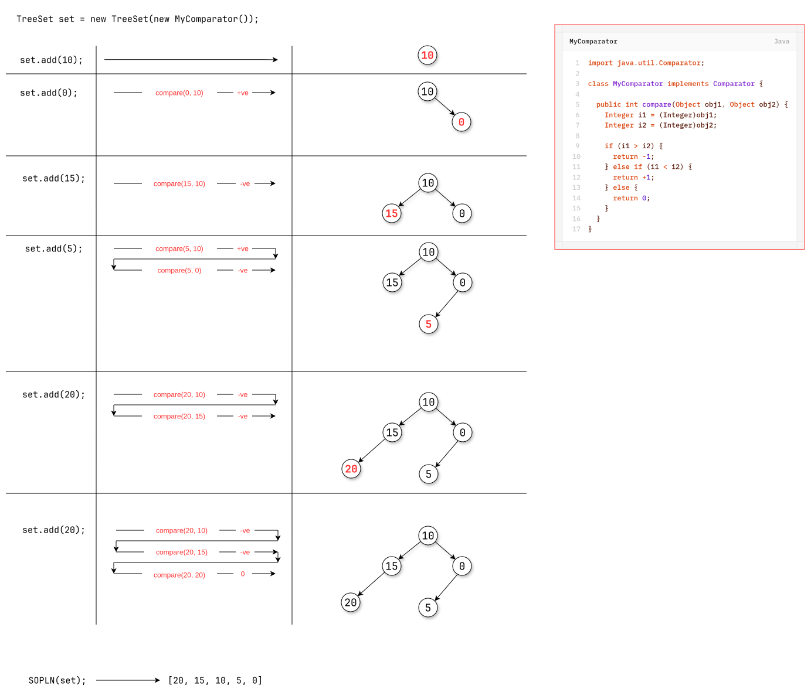
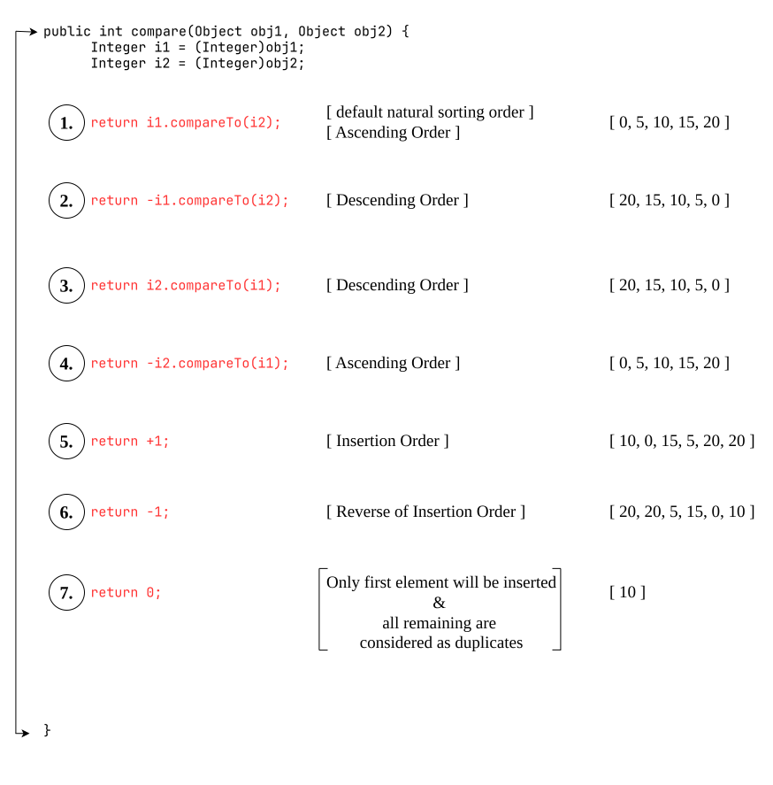
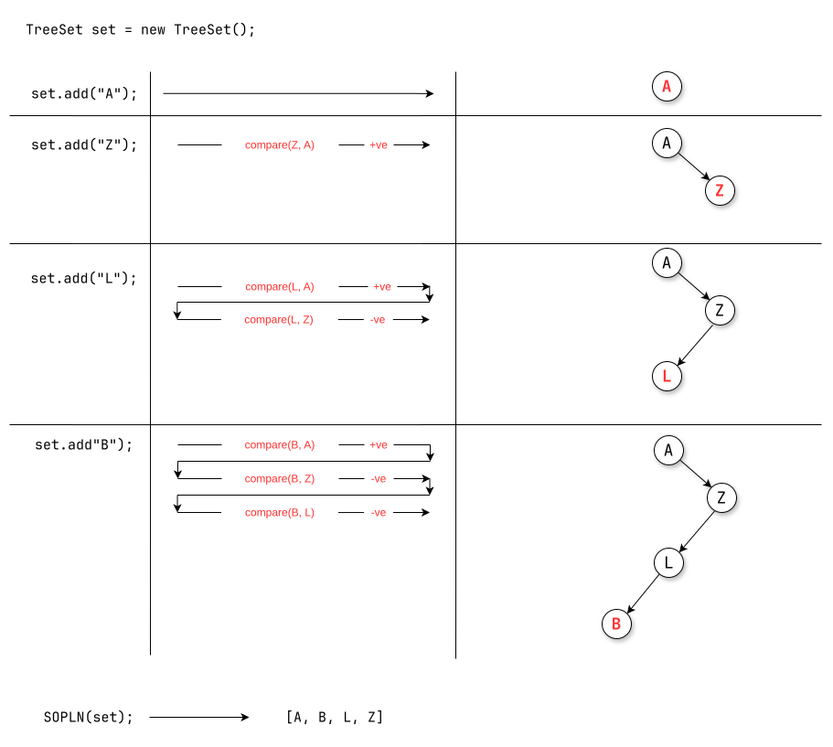

# `Comparator`
- `Comparator` presents in `java.util` package and it defines two methods:
	1. `compare()`
	2. `equals()`
## 1. `compare()`

## 2. `equals()`


- Whenever we are implementing `Comparator` interface compulsory we should provide implementation only for `compare()` method and we are not required to provide implementation for `equals()` method because it is already available to our class from `Object` class through inheritance.
**Question-1**:
Write a program to insert integer objects into `TreeSet` where the sorting order is descending order.
```java
package collection.comparator;

import java.util.TreeSet;
import java.util.Comparator;

class MyComparator implements Comparator {
	
	public int compare(Object obj1, Object obj2) {
		Integer i1 = (Integer)obj1;
		Integer i2 = (Integer)obj2;
		
		if (i1 > i2) {
			return -1;
		} else if (i1 < i2) {
			return +1;
		} else {
			return 0;
		}
	}
}

public class TreeSetDemo {

	public static void main(String[] args) {
		
		TreeSet set = new TreeSet(new MyComparator()); // ------> Line-1
		
		set.add(10);
		set.add(0);
		set.add(5);
		set.add(15);
		set.add(20);
		set.add(20);
		
		System.out.println(set); // [20, 15, 10, 5, 0]
	}
}
```


- At line-1 (See the comment in the code), if we are not passing `Comparator` object then internally JVM will call `compareTo()` method which is meant for default natural sorting order. In this case, the output is [0, 5, 10, 15, 20].
- At line-1, if we are passing `Comparator` object then JVM will call `compare()` method which is meant for customize sorting. In this case the output is [20, 15, 10, 5, 0].
## Various Possible implementations of `compare()` Method


**Question-2**:
Write a program to insert string object into the `TreeSet` where all elements should be inserted according to reverse of alphabetical order.
```java
package collection.comparator;

import java.util.Comparator;
import java.util.TreeSet;

class MyComparator implements Comparator {
	
	public int compare(Object obj1, Object obj2) {
		String s1 = (String)obj1;    // one way of conversion
		String s2 = obj2.toString(); // second way of conversion
		
		return -s1.compareTo(s2);
//		return s2.compareTo(s1);
	}
}

public class TreeSetDemo2 {

	public static void main(String[] args) {
			
		TreeSet set = new TreeSet(new MyComparator());
		
		set.add("Gamma");
		set.add("Zeta");
		set.add("Charlie");
		set.add("Tango");
		set.add("Victor");
		
		System.out.println(set); // [Zeta, Victor, Tango, Gamma, Charlie]
	}
	
}
```
**Question-3**:
Write a program to insert `StringBuffer` object into the `TreeSet` where sorting order is alphabetical order.
```java
public class TreeSetDemo1 {

	public static void main(String[] args) {
		
		TreeSet set = new TreeSet();

		set.add(new StringBuffer("A"));
		set.add(new StringBuffer("Z"));
		set.add(new StringBuffer("L"));
		set.add(new StringBuffer("B"));
		
		System.out.println(set); // [A, B, L, Z]
	}
}
```

**Question-4**:
Write a program to insert `StringBuffer` object into the `TreeSet` where sorting order is reverse of alphabetical order.
```java
/**
 * Write a program to insert `StringBuffer` object into the `TreeSet` where
 * sorting order is alphabetical order.
 */

package collection.set.treeSet;

import java.util.Comparator;
import java.util.TreeSet;

class MyComparator implements Comparator {
	
	public int compare (Object obj1, Object obj2) {
		String str1 = obj1.toString();
		String str2 = obj2.toString();
		
		return str2.compareTo(str1);
	}
}

public class TreeSetDemo1 {

	public static void main(String[] args) {
		
		TreeSet set = new TreeSet(new MyComparator());

		set.add(new StringBuffer("A"));
		set.add(new StringBuffer("Z"));
		set.add(new StringBuffer("L"));
		set.add(new StringBuffer("B"));
		
		
		System.out.println(set); // [Z, L, B, A]
	}
}
```

>[!NOTE]
>- If we are depending on default natural sorting order, compulsory object should be homogeneous & comparable otherwise we will get `RuntimeException` saying `ClassCastException`.
>- If we are defining our own sorting by `Comparator` then objects need not be comparable & homogeneous i.e., we can add heterogeneous non-comparable objects also.

**Question-5**:
Write a program to insert  `String` and `StringBuffer` object into the `TreeSet` where sorting order is increasing length order. if two objects having same length then consider their alphabetical order.
```java
package collection.set.treeSet;

import java.util.Comparator;
import java.util.TreeSet;

class MyComparator implements Comparator {
	
	public int compare(Object obj1, Object obj2) {
		String s1 = obj1.toString();
		String s2 = obj2.toString();
		
		int length1 = s1.length();
		int length2 = s2.length();
		
		if (length1 < length2) {
			return -1;
		} else if (length1 > length2) {
			return +1;
		} else {
			return s1.compareTo(s2);
		}
	}
}
public class TreeSetDemo2 {

	public static void main(String[] args) {
		
		TreeSet set = new TreeSet(new MyComparator());
		
		set.add("A");
		set.add(new StringBuffer("ABC"));
		set.add(new StringBuffer("AA"));
		set.add("XX");
		set.add("ABCD");
		set.add("A");
		
		System.out.println(set); // [A, AA, XX, ABC, ABCD]

	}

}
```

## Customer Example
### **Example-1:** — Sort Customer by `customerId`
Write a program to add `Customer` objects (having two fields — `customerId` (`int`) and `customerName` (`String`)) to an `ArrayList` and sort the products according to `customerId` in ascending order.

`Customer.java`
```java
package collection.comparator;

public class Customer {
	private int customerId;
	private String customerName;
	
	public Customer (
		int customerId,
		String customerName
	) {
		this.customerId = customerId;
		this.customerName = customerName;
	}
	
	public int getCustomerId() {
		return customerId;
	}
	
	public String getCustomerName() {
		return customerName;
	}
}
```
`CustomerByIdComparator.java`
```java
package collection.comparator;

import java.util.Comparator;

public class CustomerByIdComparator implements Comparator<Customer> {

	@Override
	public int compare(Customer c1, Customer c2) {
		int result = Integer.compare(c1.getCustomerId(), c2.getCustomerId());
		return result;
	}
}
```
`Driver.java`
```java
package collection.comparator;

import java.util.ArrayList;
import java.util.Collections;
import java.util.List;

public class Driver {

	public static void main(String[] args) {
		
		Customer c1 = new Customer(20, "Charlie");
		Customer c2 = new Customer(06, "Tango");
		Customer c3 = new Customer(01, "Gama");
		
		Customer c4 = new Customer(90, "Alpha");
		Customer c5 = new Customer(02, "Zeta");
		Customer c6 = new Customer(68, "Lambda");
		
		List<Customer> customers = new ArrayList<>();

		customers.add(c1);
		customers.add(c2);
		customers.add(c3);
		customers.add(c4);
		customers.add(c5);
		customers.add(c6);
		
		Collections.sort(customers, new CustomerByIdComparator());
		
		customers.forEach((c) -> {
			System.out.println(
				"ID: " + c.getCustomerId() +
				" -> Name: " + c.getCustomerName()
			);
		});
	}

}
```
output:
```text
ID: 1 -> Name: Gama
ID: 2 -> Name: Zeta
ID: 6 -> Name: Tango
ID: 20 -> Name: Charlie
ID: 68 -> Name: Lambda
ID: 90 -> Name: Alpha
```
### **Example 2:** — Sort Customer by `customerName`
Write a program to add `Customer` objects (having two fields — `customerId` (`int`) and `customerName` (`String`)) to an `ArrayList` and sort the products according to `customerName` in alphabetical order.

`CustomerByNameComparator.java`
```java
package collection.comparator;

import java.util.Comparator;

public class CustomerByNameComparator implements Comparator<Customer> {

	@Override
	public int compare(Customer c1, Customer c2) {
		int result = c1.getCustomerName().compareTo(c2.getCustomerName());
		return result;
	}

}
```
in the `Driver.java`, modify this line only
```java
Collections.sort(customers, new CustomerByNameComparator());
```

Output
```text
ID: 90 -> Name: Alpha
ID: 20 -> Name: Charlie
ID: 1 -> Name: Gama
ID: 68 -> Name: Lambda
ID: 6 -> Name: Tango
ID: 2 -> Name: Zeta
```
### **Example 3:** — Sort by `customerId`, then `customerName`
Write a program to add `Customer` objects (having two fields — `customerId` (`int`) and `customerName` (`String`)) to an `ArrayList` and sort the customers according to `customerId` in ascending order. if two customers have the same customerId, sort them according to `customerName` in alphabetical order.

`CustomerByIdThenNameComparator.java`
```java
package collection.comparator;

import java.util.Comparator;

public class CustomerByIdThenNameComparator implements Comparator<Customer> {

	@Override
	public int compare(Customer c1, Customer c2) {
		int result = Integer.compare(c1.getCustomerId(), c2.getCustomerId());
		
		if (result == 0) {
			result = c1.getCustomerName().compareTo(c2.getCustomerName());
			return result;
		}
		
		return result;
	}
}
```
in the `Driver.java`, modify this line only
Collections.sort(customers, new CustomerByIdThenNameComparator());
Output
```text
ID: 1 -> Name: Gama
ID: 1 -> Name: Victor
ID: 2 -> Name: Mike
ID: 2 -> Name: Zeta
ID: 6 -> Name: Tango
ID: 20 -> Name: Charlie
ID: 68 -> Name: Lambda
ID: 90 -> Name: Alpha
```
