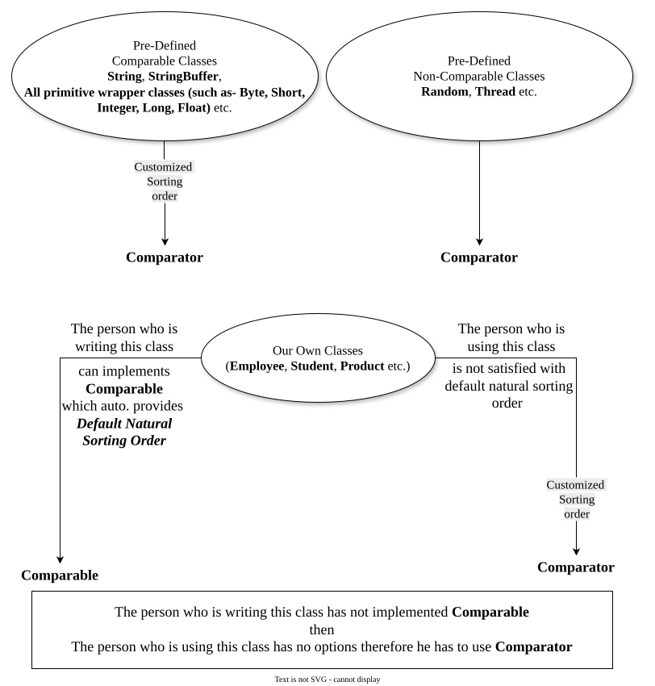

# `Comparable` vs `Comparator`

| #   | `Comparable` (I)                                                                                                                                                           | `Comparator`(I)                                                                                                                                                                                                                                                                                                      |
| --- | -------------------------------------------------------------------------------------------------------------------------------------------------------------------------- | -------------------------------------------------------------------------------------------------------------------------------------------------------------------------------------------------------------------------------------------------------------------------------------------------------------------- |
| 1   | For predefined comparable classes (like- `String`, `StringBuffer` etc.) default natural sorting order already available.                                                   | - if we are not satisfied with that default natural sorting order then we can define our own sorting by using `Comparator`.<br><br>- For predefined non-comparable classes (like- `Thread`, `Random` etc.) default natural sorting order not already available. we can define our own sorting by using `Comparator`. |
| 2   | For our own classes (like- `Employee`), the person who is writing the class is responsible to define default natural sorting order by implementing `Comparable` interface. | The person who is using our class, he is not satisfied with default natural sorting order then he can define his own sorting by using `Comparator` interface.                                                                                                                                                        |



**Question-1**: 
Write a program to insert `Employee` objects (having two fields- name : String & eId : int) into a `TreeSet` where employees are sorted according to eId in ascending order.
```java
package collection.set.treeSet;

import java.util.TreeSet;

class Employee implements Comparable {
	String name;
	int eId;
	
	public Employee(String name, int eId) {
		super();
		this.name = name;
		this.eId = eId;
	}

	public String toString() {
		return "Name: " + name + "-> ID: " + eId;
	}
	
	@Override
	public int compareTo(Object obj) {
		int eId1 = this.eId;
		Employee e = (Employee)obj;
		int eId2 = e.eId;
		if (eId1 < eId2) {
			return -1;
		} else if (eId1 > eId2) {
			return +1;
		} else {
			return 0;
		}
	}
	
}

public class Driver {

	public static void main(String[] args) {
		
		TreeSet set = new TreeSet();
		
		set.add(new Employee("Charlie", 100));
		set.add(new Employee("Beta", 200));
		set.add(new Employee("Alpha", 150));
		set.add(new Employee("Annie", 50));
		set.add(new Employee("Charlie", 100));

		System.out.println(set); // [Name: Annie-> ID: 50, Name: Charlie-> ID: 100, Name: Alpha-> ID: 150, Name: Beta-> ID: 200]
	}

}
```
**Question-2**:
Write a program to insert `Employee` objects (having two fields- name : String & eId : int) into a `TreeSet` where employees are sorted according to name in ascending order.
```java
package collection.set.treeSet;

import java.util.Comparator;
import java.util.TreeSet;

class Employee implements Comparable {
	String name;
	int eId;
	
	public Employee(String name, int eId) {
		super();
		this.name = name;
		this.eId = eId;
	}

	public String toString() {
		return "Name: " + name + "-> ID: " + eId;
	}

	@Override
	public int compareTo(Object o) {
		// TODO Auto-generated method stub
		return 0;
	}
	
}

class MyComparator implements Comparator {
	
	public int compare(Object obj1, Object obj2) {
		Employee e1 = (Employee)obj1;
		Employee e2 = (Employee)obj2;
		
		String s1 = e1.name;
		String s2 = e2.name;
		
		return s1.compareTo(s2);
	}
}

public class Driver {

	public static void main(String[] args) {
		
		TreeSet set = new TreeSet(new MyComparator());
		
		set.add(new Employee("Charlie", 100));
		set.add(new Employee("Beta", 200));
		set.add(new Employee("Alpha", 150));
		set.add(new Employee("Annie", 50));
		set.add(new Employee("Charlie", 100));

		System.out.println(set); // [Name: Alpha-> ID: 150, Name: Annie-> ID: 50, Name: Beta-> ID: 200, Name: Charlie-> ID: 100]
	}

}
```
## Comparison of `Comparable` and `Comparator`

| #   | `Comparable`                                                                | `Comparator`                                                                         |
| --- | --------------------------------------------------------------------------- | ------------------------------------------------------------------------------------ |
| 1   | It is meant for **Default Natural Sorting Order**.                          | It is meant for **Customized Sorting Order**.                                        |
| 2   | Present in **`java.lang`** package.                                         | Present in **`java.util`** package.                                                  |
| 3   | It defines only **one** method- **`compareTo()`**.                          | It defines **two** method- **`compare()`** & **`equals()`**.                         |
| 4   | `String` and all primitve wrapper Classes implement `Comparable` interface. | The only implemented classes of `Comparator` are `Collator` and `RuleBasedCollator`. |

# When to use `Comparable` and when to use `Comparator`?
### `Comparable`
1. Use `Comparable` when — the class **belongs to us** and we have permission to modify the class, and we want to define a **default natural sorting order** for its objects.
### `Comparator`
There are mainly three situations:
1. If the class is provided by some third party and we cannot modify its source code, we cannot add `Comparable` implementation inside that class.
   In this situation, we can use a separate `Comparator` to define the required sorting logic without modifying the original class.
 2. Sometimes the same type of objects need to be sorted in **different ways** depending on the requirement.
    For example, the same objects may need to be sorted by ID in one situation and by name in another situation.
    With `Comparator`, we can define these different sorting orders separately, without changing the class's default structure.
 3. Sometimes the class is already created and we simply need a customized sorting based on our own requirement.
    Instead of modifying the existing class, we can keep the class unchanged and define the required sorting logic separately using `Comparator`.