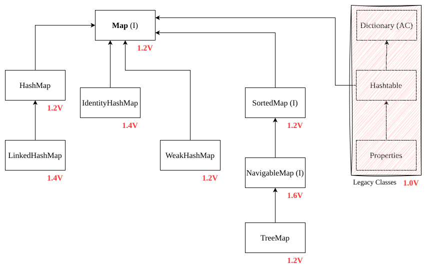
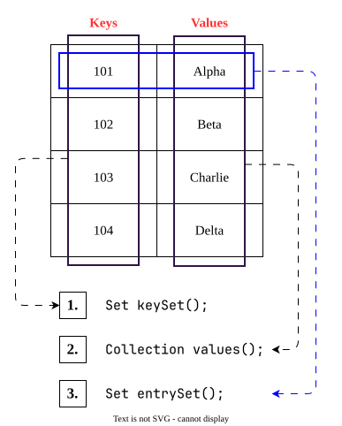

# Map

- `Map` is **not** child interface of `Collection`.
- If we want to represent a group of objects as key-value pair then we should go for `Map`.
	
- Both keys & values are objects only.
- Duplicate keys are not allowed but values can be duplicated.
- Each key-value pair is called **Entry** hence `Map` is consider as a collection of **entry-objects**.
## `Map` interface Methods
1. `Object put(Object key, Object value);`
	- To add one key-value pair to the `Map`. 
	- If the `key` is already present then old value will be replaced with new value and returns old value.
	-method.drawio.svg)
2. `void putAll(Map m);`
3. `Object get(Object key);`
	returns the value associated with specified key.
4. `Object remove(Object key);`
	removes the entry associated with specified key.
5. `boolean containsKey(Object key);`
6. `boolean containsValue(Object value);`
7. `boolean isEmpty();`
8. `int size();`
9. `void clear();`
### Collection Views of Map:

1. `Set keySet();`
2. `Collection values();`
3. `Set entrySet();`
## `Entry` (I)
- A `Map` is a group of key-value pairs and each key-value pair is called an **Entry** hence `Map` is consider as a collection of **Entry** object.
- Without existing `Map` object there is no chance of existing `Entry` object hence `Entry` interface is define inside `Map` interface.
	