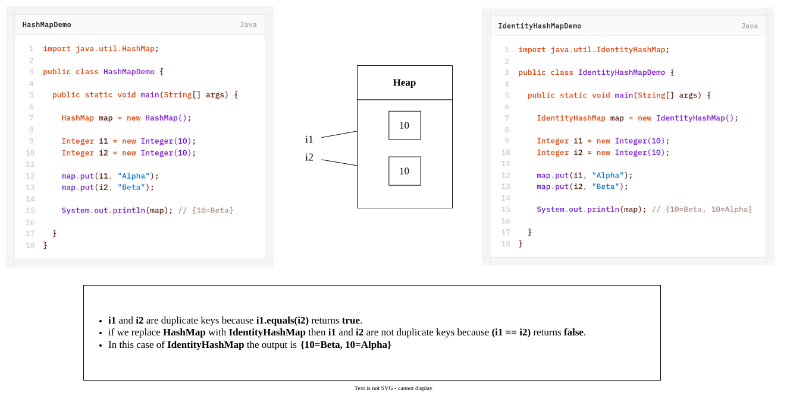

# `IdentityHashMap`
- It is exactly same as `HashMap` (including methods and constructors) except the following difference:
	1. In the case of normal `HashMap` JVM will use `.equals()` method to identify duplicate keys which is meant for content comparison.
	2. But in the case of `IdentityHashMap` JVM will use `==` operator to identify duplicate keys which is meant for reference comparison (address comparison).
