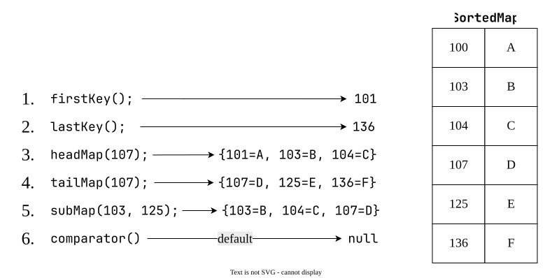

# `SortedMap` (I)
1. it is child interface of `Map`.
2. If we want to represent a group of key-value pair according to some sorting order of keys then we should go for `SortedMap`.
3. Sorting is based on keys but not based on value.
4. `SortedMap` defines the following specific methods:

| #   | Syntax                                        | Explanation                                                                                                                                           |
| --- | --------------------------------------------- | ----------------------------------------------------------------------------------------------------------------------------------------------------- |
| 1   | `Object firstKey();`                          | returns first key of the `SortedMap`.                                                                                                                 |
| 2   | `Object lastKey();`                           | returns last key of the `SortedMap`.                                                                                                                  |
| 3   | `SortedMap headMap(Object key);`              | returns `SortedMap` whose keys are less than obj.                                                                                                     |
| 4   | `SortedMap tailMap(Object key);`              | returns `SortedMap` whose keys are >= obj.                                                                                                            |
| 5   | `SortedMap subMap(Object key1, Object key2);` | returns `SortedMap` whose elements are >= obj1 and < obj2                                                                                             |
| 6   | `Comparator comparator();`                    | reutrns `Comparator` object that describes underlying sorting technique. If we are using **default** natural sorting order then we will get **null**. |
