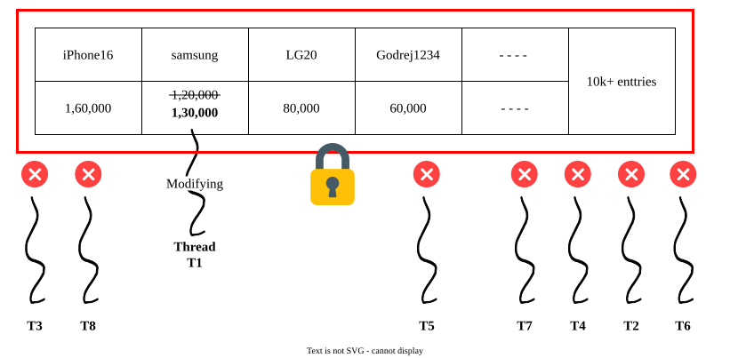
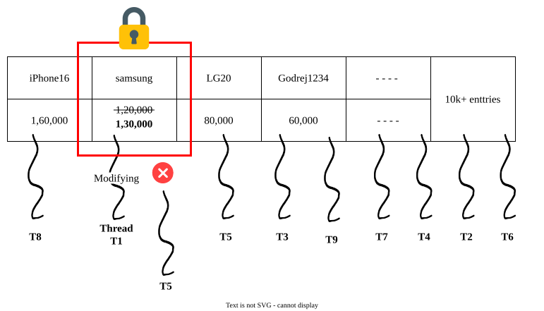
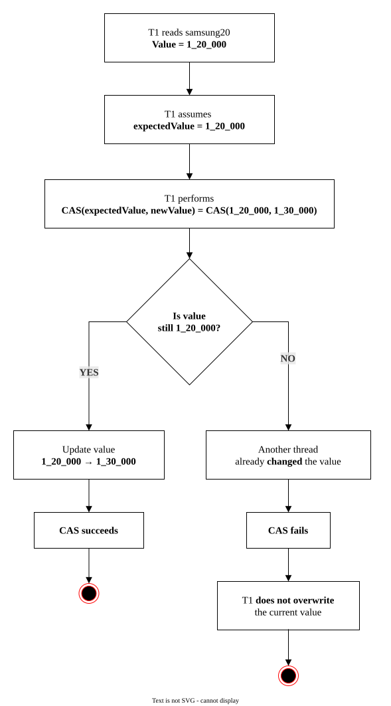

## Why HashMap Becomes a Problem in Multithreading
We have a `HashMap` which stores **`productName`** (String) as key and **`productPrice`** (int) as value.
```java
Map<String, Integer> productPrice = new HashMap<>();

productPrice.put("iPhone16", 1_60_000);
productPrice.put("samsung20", 1_20_000);
productPrice.put("LG20", 80_000);
productPrice.put("Godrej1234", 60_000);
// 10K+ products are there
```
Now suppose multiple threads are accessing this `HashMap`.
For example, Thread T1 wants to update the price of `samsung20` **from 1_20_000 to 1_30_000**. and at the same time Thread T2 is reading the price.
If T1 and T2 is accessing a shared data concurrently without proper synchronization then it may be possible that the price which T2 gets is old.
This is called a race condition because multiple threads are accessing and modifying the same data at the same time, and the result can become unpredictable.
The reason is simple `HashMap` does not provide thread-safety for concurrent-access and modification.
#### Solution-1: **`Collections.synchronizedMap();`**
In order to make `HashMap` thread-safe we have to make `HashMap` synchronize by using **`synchronizedMap()`** utility method from **Collections** utility class.
```java
Map<String, Integer> productPrice = Collections.synchronizedMap(new HashMap<>());
```
The working mechanism of **`Collections.synchronizedMap()`** is —
when one thread is modifying one entry, entire `HashMap` gets locked.
Suppose the time when T1 is trying to modify the price, other threads are not allowed to read operation because entire map gets locked.

The problem of using **`Collections.synchronizedMap()`** is- just to modify one entry, all other threads are in the **waiting-state** which generates slowness.
#### Solution-2 — **`ConcurrentHashMap`**
To achieve thread-safety with no waiting-state, Java provides- **`ConcurrentHashMap`**
##### `ConcurrentHashMap` Before Java 8 — Segment Locking
The working mechanism of `ConcurrentHashMap` is- instead of locking the entire `Map`, just lock on segment level.

Suppose T1 is trying to modify the price of a particular bucket then `ConcurrentHashMap` apply the lock on that particular segment only and rest segments are free which means other threads are allowed to read data of other buckets.

In this mechanism since lock is applied on segment level therefore it is called as **Segment Locking**.
##### **`ConcurrentHashMap`** in Java 8 — Redesigned
In Java 8, `ConcurrentHashMap` was redesigned from using segment Locking to CAS mechanism.

**CAS** — Compare and Swap
CAS is an atomic operation used to achieve synchronization without **Segment Locking** (or) **Bucket-Index Locking**.
The working mechanism of CAS is — suppose the current value of **samsung20** is **1_20_000** and T1 wants to change it to **1_30_000**.

First, T1 reads the value of samsung20:
T1 sees → 1_20_000
now T1 starts to change the value and comes up with
**`CAS(expectedValue, newValue)`** → CAS(1_20_000, 1_30_000)

CAS atomically checks: Is the current value still 1_20_000?
	- if **YES:** 1_20_000 → 1_30_000 CAS successful.
	- If **NO:** The value was changed by another thread → CAS fail. T1 does not overwrite the new value.
