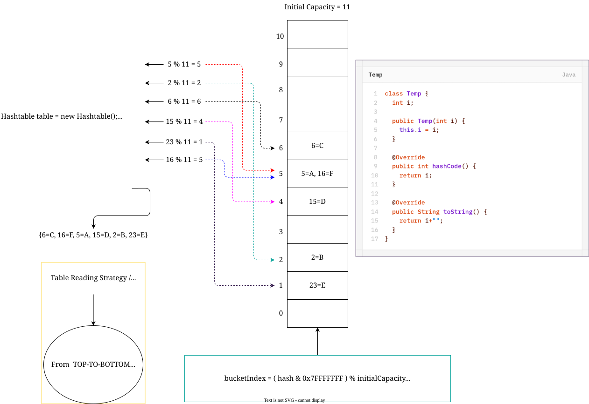
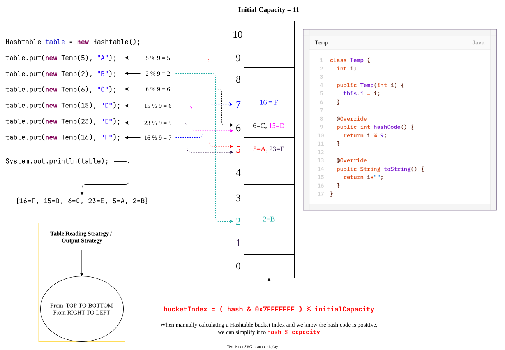
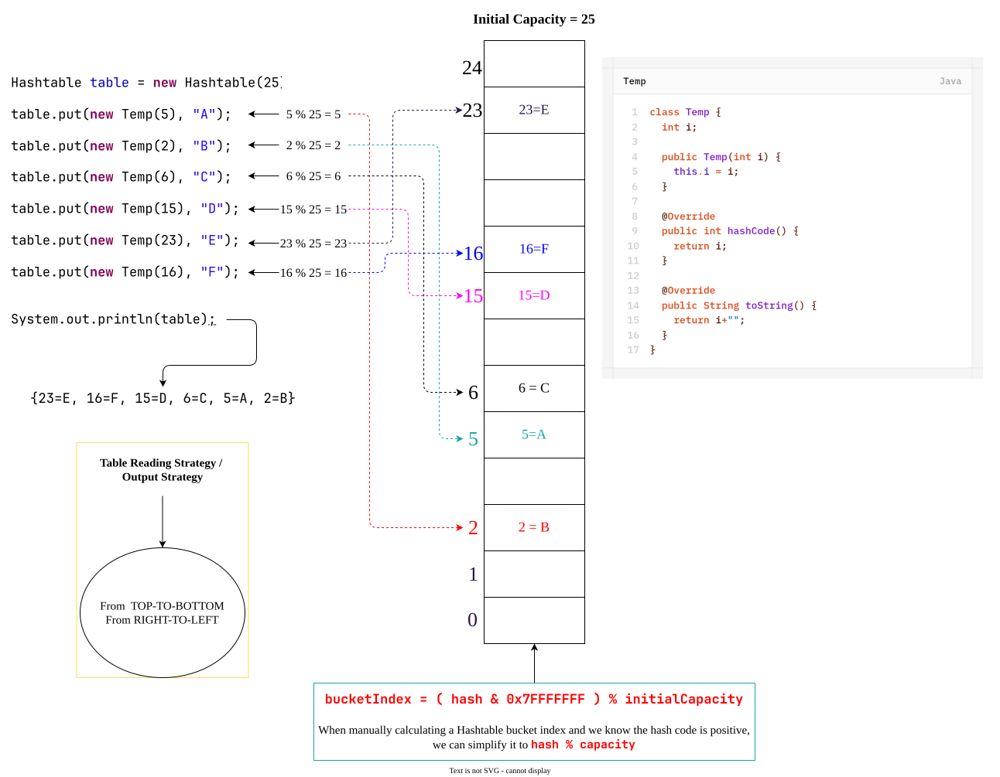

# `Hashtable`
1. The underlying data-structure for `Hashtable` is `Hashtable`.
2. Insertion order is not preserved and it is based on hashcode of keys.
3. Duplicate keys are not allowed and values can be duplicated.
4. Heterogeneous objects are allowed for both keys and values.
5. `null` is not allowed for both key and value otherwise we will get `RuntimeException` saying `NullPointerException`.
6. It implements `Serializable` and `Cloneable` interfaces but not `RandomAccess` interface.
7. Every method present in `Hashtable` is synchronized and hence `Hashtable` is thread-safe.
8. `Hashtable` is the best choice if our frequent operation is search operation.
## Constructors
| #   | Syntax                                                                   | Explanation                                                                                                                   |
| --- | ------------------------------------------------------------------------ | ----------------------------------------------------------------------------------------------------------------------------- |
| 1   | `Hashtable table = new Hashtable();`                                     | Creates an empty `Hashtable` object with:<br>- default initial capacity 11.<br>- default Fill Ratio (or Load factor) 0.75.    |
| 2   | `Hashtable table = new Hashtable(int initialCapacity);`                  | Creates an empty `Hashtable` object with:<br>- specified initial capacity.<br>- default Fill Ratio 0.75.                      |
| 3   | `Hashtable table = new Hashtable(int initialCapacity, float fillRatio);` | Creates an empty `Hashtable` object with:<br>- specified initial capacity.<br>- specified Fill Ratio.                         |
| 4   | `Hashtable table = new Hashtable(Map m);`                                | Creates an equivalent `Hashtable` for the given `Map` .<br>This constructor meant for inter-conversion between `Map` objects. |

**Example-1:**
```java
package collection.hashtable;

import java.util.Hashtable;

class Temp {
	int i;
	
	public Temp(int i) {
		this.i = i;
	}
	
	@Override
	public int hashCode() {
		return i;
	}
	
	@Override
	public String toString() {
		return i+"";
	}
}

public class HashtableDemo {

	public static void main(String[] args) {
		
		Hashtable table = new Hashtable();
		table.put(new Temp(5), "A");
		table.put(new Temp(2), "B");
		table.put(new Temp(6), "C");
		table.put(new Temp(15), "D");
		table.put(new Temp(23), "E");
		table.put(new Temp(16), "F");
//		table.put("Alpha", null); // NullPointerException
		
		System.out.println(table); // {6=C, 16=F, 5=A, 15=D, 2=B, 23=E}
	}

}
```
**Example-2:** 
If we change `hashCode()` method of `Temp` class as:
```java
@Override
public int hashCode() {
	return i % 9;
}
```

```Java
public class HashtableDemo {

	public static void main(String[] args) {
		
		Hashtable table = new Hashtable();
		table.put(new Temp(5), "A");
		table.put(new Temp(2), "B");
		table.put(new Temp(6), "C");
		table.put(new Temp(15), "D");
		table.put(new Temp(23), "E");
		table.put(new Temp(16), "F");
		
		System.out.println(table); // {16=F, 15=D, 6=C, 23=E, 5=A, 2=B}
	}

}
```
**Example-3:** we configure initialCapacity=25 i.e. → `Hashtable table = new Hashtable(25);`

```java
package collection.hashtable;

import java.util.Hashtable;

class Temp {
	int i;
	
	public Temp(int i) {
		this.i = i;
	}
	
	@Override
	public int hashCode() {
		return i;
	}
	
	@Override
	public String toString() {
		return i+"";
	}
}

public class HashtableDemo {

	public static void main(String[] args) {
		
		Hashtable table = new Hashtable(25);
		table.put(new Temp(5), "A");
		table.put(new Temp(2), "B");
		table.put(new Temp(6), "C");
		table.put(new Temp(15), "D");
		table.put(new Temp(23), "E");
		table.put(new Temp(16), "F");
		
		System.out.println(table); // {23=E, 16=F, 15=D, 6=C, 5=A, 2=B}
	}
}
```
