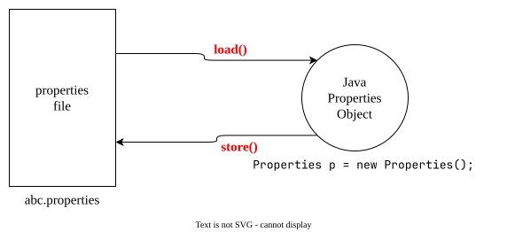

# Properties
In our program if anything which changes frequently (like- username, password, mailId, mobileNo. etc) are not recommended to hardcode in java program because if there is any change, to reflect that change recompilation, rebuild, and redeploy application are required. even sometimes server restart also required which creates a big business impact to clients.

We can overcome this problem by using properties file. Such type of variable things we have to configure in the properties file.
From that properties file we have to read into java program and we can use those properties. The main advantage of this approach is- if there is a change in properties file, to reflect that change just redeployment is enough which won't create any business impact to clients.

We can use java `Properties` object to hold properties which are coming from properties file.

- In normal `Map` (like- `HashMap`, `Hashtable`, `TreeMap`) key and value can be any type but in the case of `Properties` key and value should be `String` type.
## Constructor
1. `Properties p = new Properties();`
## `Properties` Specific Methods

| #   | Method                                            | Explanation                                                                                                                                 |
| --- | ------------------------------------------------- | ------------------------------------------------------------------------------------------------------------------------------------------- |
| 1   | `String setProperty(String pName, String pValue)` | To set a new Property.<br>If the specified property already available then old value will be replaced with new value and returns old value. |
| 2   | `String getProperty(String pName);`               | To get value associated with the specified property.<br>If the specified property is not available then this method returns `null`.         |
| 3   | `Enumeration propertyNames();`                    | returns all property names present in `properties` objects.                                                                                 |
| 4   | `void load(InputStream is);`                      | To load properties from properties file into java `properties` object.                                                                      |
| 5   | `void store(OutputStream s, String comment);`     | To store properties from java `properties` object into properties file.                                                                     |

**Example:**
**abc.properties** (before)
```text
username=alpha@1234
password=MyPwd@9876
mobileNo=9876543210
emailId=alpha1234@email.com
```

```java
package collection.properties;

import java.io.FileInputStream;
import java.io.FileOutputStream;
import java.io.IOException;
import java.util.Properties;

public class PropertiesDemo {

	public static void main(String[] args) throws IOException {
		
		Properties p = new Properties();
		
		FileInputStream fis = new FileInputStream("/home/writeFullPath/src/collection/properties/abc.properties");
		
		p.load(fis);
		
		System.out.println(p); // {pName=pValue...}
		
		
		
		String s = p.getProperty("emailId");
		System.out.println(s); // alpha1234@email.com
		
		p.setProperty("settingProperty", "settingValue");
		
		FileOutputStream fos = new FileOutputStream("/home/writeFullPath/src/collection/properties/abc.properties");
		p.store(fos, "Updated by Alpha");

	}

}

```
**abc.properties** (after)
```text
#Updated by Alpha
#Sun Aug 23 16:58:29 IST 2026
emailId=alpha1234@email.com
mobileNo=9876543210
password=MyPwd@9876
settingProperty=settingValue
username=alpha@1234
```
**Example-2:**
```java
package collection.properties;

import java.io.FileInputStream;
import java.io.FileNotFoundException;
import java.io.IOException;
import java.sql.Connection;
import java.sql.DriverManager;
import java.sql.SQLException;
import java.util.Properties;

public class PropertiesDemo2 {

	public static void main(String[] args) throws FileNotFoundException, IOException, SQLException {
		
		Properties p = new Properties();
		
		FileInputStream fis = new FileInputStream("db.properties");
		p.load(fis);
		
		String url = p.getProperty("url");
		String user = p.getProperty("username");
		String pwd = p.getProperty("pwd");
		
		Connection con = DriverManager.getConnection(url, user, pwd);
		
	}
}
```