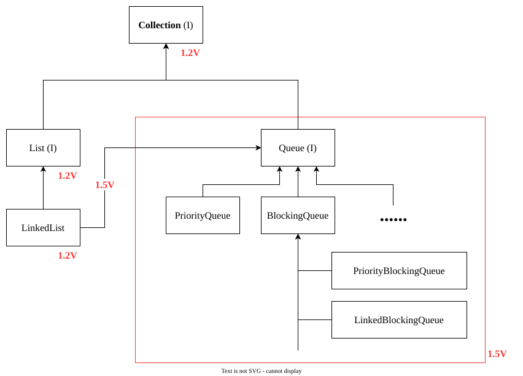

# `Queue` (I) (Java-1.5 enhancements)

- It is the child interface of `Collection`.
- If we want to represent a group of individual objects prior to processing then we should go for `Queue`.
	**Example:** Before sending SMS all mobile numbers we have to store in some data-structure. In which order we added mobile nos., in the same order only message should be delivered. For this FIRST-IN-FIRST-OUT requirement `Queue` is the best choice.
- Usually `Queue` follows FIRST-IN-FIRST-OUT order but based on our requirement we can implement our own priority order also (`PriorityQueue`).
- From Java-1.5 onwards `LinkedList` class also implements `Queue` interface.
- `LinkedList` based implementation of `Queue` always follows FIRST-IN-FIRST-OUT order.
## `Queue` (I) Specific Methods

| #   | Methods                      | Explanation                                                                                                                                 |
| --- | ---------------------------- | ------------------------------------------------------------------------------------------------------------------------------------------- |
| 1   | `boolean offer(Object obj);` | To add an object into the queue.                                                                                                            |
| 2   | `Object peek()`;             | To return head element if the queue. If queue is empty then this method returns `null`.                                                  |
| 3   | `Object element();`          | To return head element of the queue. If queue is empty then this method raises `RuntimeException`: `NoSuchElementException`.             |
| 4   | `Object poll();`             | To remove and return head element of the queue. If queue is empty then this method returns `null`.                                       |
| 5   | `Object remove();`           | To remove and return head element of the queue. If queue is empty then this method raises `RuntimeException` : `NoSuchElementException`. |
