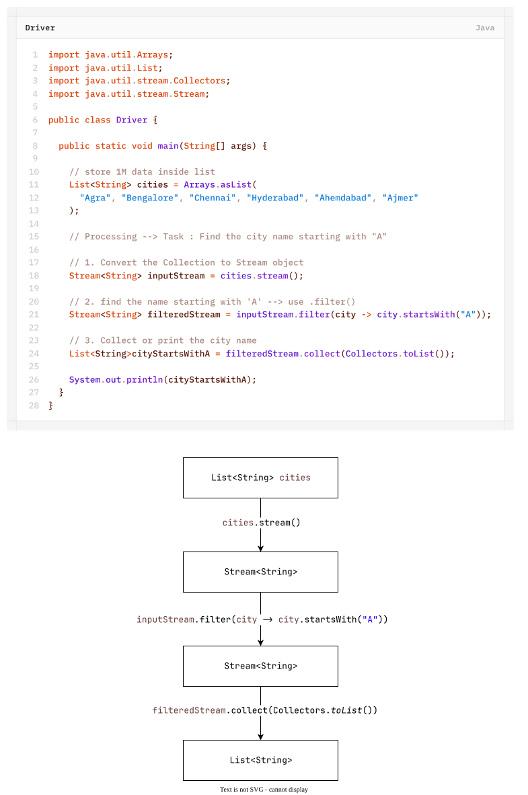
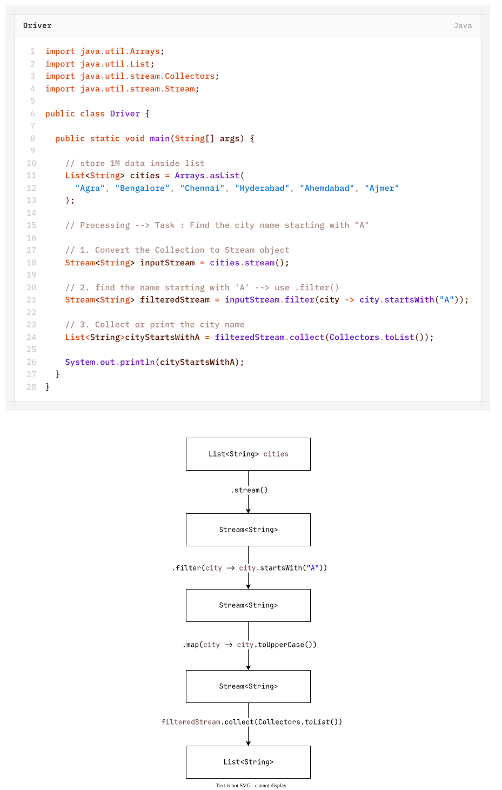

# Stream (Java 8)
> if we want to process a group of objects from the collection then we should go for streams.

- A Stream helps us to process data in a functional way, so that programmers do not have to write repetitive code for data processing.
- A Stream closely work with **`Collection`**.
- A Stream **does not store data**.
- A Stream **does not modify the original collection** by itself.
- We can create as Stream object to the collection by using **`stream()`** method of Collection interface.
## Difference Between `Collection` and `Stream`

| if we want to represent a group of individual objects as a single entity then we should go for **Collection**. | if we want to process a group of objects from the collection then we should go for **Streams**. |
| -------------------------------------------------------------------------------------------------------------- | ----------------------------------------------------------------------------------------------- |

Example:
`Stream s = c.stream();`

```java
// consider there are 1 Million data stored inside List
List<String> cities = Arrays.asList(
"Agra", "Bengalore", "Chennai", "Hyderabad", "Ahemdabad", "Ajmer");

// 1. convert the collection to stream object
Stream<String> inputStream = cities.stream();
```
Stream is an interface present in `java.util.stream`.
Once we got the stream, by using that we can process objects of that collection.
Example 1:


Code:
```java
package streamApi;

import java.util.Arrays;
import java.util.List;
import java.util.stream.Collectors;
import java.util.stream.Stream;

public class Driver {

	public static void main(String[] args) {
		
		// store 1M data inside list
		List<String> cities = Arrays.asList(
			"Agra", "Bengalore", "Chennai", "Hyderabad", "Ahemdabad", "Ajmer"
		);
		
		// Processing --> Task : Find the city name starting with "A"
		
		// 1. Convert the Collection to Stream object
		Stream<String> inputStream = cities.stream();
		
		// 2. find the name starting with 'A' --> use .filter()
		Stream<String> filteredStream = 
			inputStream.filter(city -> city.startsWith("A"));
		
		// 3. Collect or print the city name
		List<String>cityStartsWithA =
			filteredStream.collect(Collectors.toList());
		
		System.out.println(cityStartsWithA);
	}

}
```
The above code which helps in processing data can be written in one line also-
```java
List<String> cityStartsWithA = 
		cities.stream()
		.filter(city -> city.startsWith("A"))
		.collect(Collectors.toList());
```
Example 2:


Code