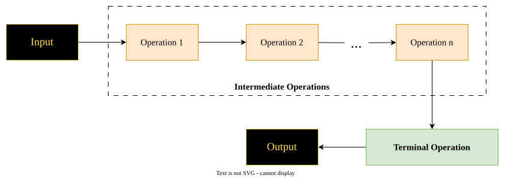

# Types of Operations in Stream
There are two types of operations in Stream:
1. Intermediate Operation
2. Terminal Operation

## 1. Intermediate Operation
Operation which is taking stream as an input, process them and return another stream as an output is called **Intermediate Operation**.
- Intermediate Operations generate chains of operations means it can be called multiple times. (Stream 1 -> filter -> Stream 2 -> map -> Stream 3)
- Intermediate Operations are lazy in nature means they cannot be executed until a terminal operation is called.
- Some of the important Intermediate Operations are:
	1. `filter()`
	2. `map()`
	3. `sorted()`
	4. `distinct()`
	5. `flatMap()`
		etc.
- In Intermediate Operations:
	- if input = n
	- then output <= n
## 2. Terminal Operation
- Operation which takes stream as an input, process them and return output in form either number, Optional or Collection is called **Terminal Operation**.
- Terminal Operations are responsible for triggering the executi