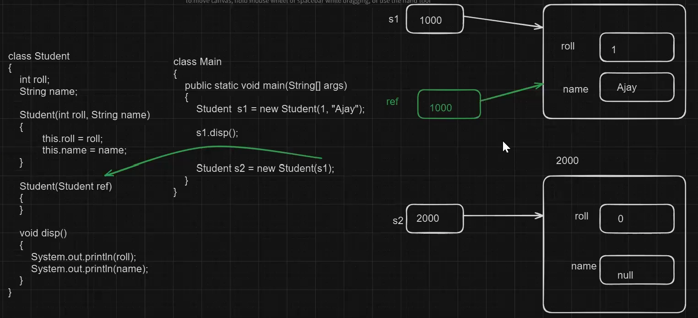
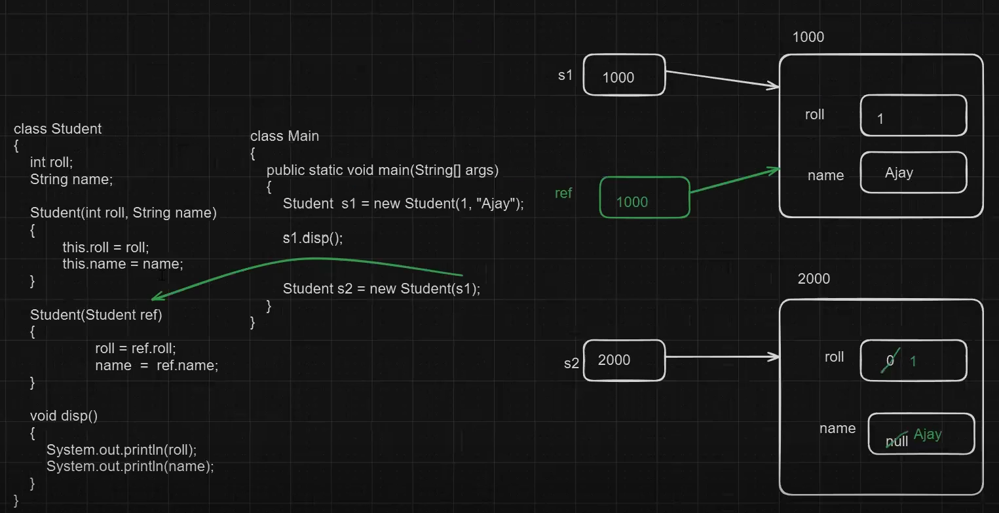

# Copy Constructor
> A constructor that **takes another object of the same class** as an argument and **copies all its data** into the new object.


```java
class Student {
	int roll;
	String name;
	
	// Parameterized constructor
	Student(int roll, String name) {
		this.roll = roll;
		this.name = name;
	}
	
	// Copy constructor
	Student(Student ref) {
		roll = ref.roll;
		name = ref.name;
	}
	
	void display() {
		System.out.println("Roll: " + roll);
		System.out.println("Name: " + name);
		System.out.println("-----------------");
	}
}
```

```java
class Main {
	public static void main(String[] args) {
		// creating first object using parameterized constructor
		Student s1 = new Student(101, "Ajay");
		s1.display();

		// creating second object by copying data of s1
		Student s2 = new Student(s1);
		s2.display();
	}
}
```

#### Output:
```output
Roll: 101
Name: Ajay
-----------------
Roll: 101
Name: Ajay
-----------------
```

#### Explanation
1. When control reaches
    ```java
    Student s1 = new Student(101, "Ajay");
    ```
    
    → the **parameterized constructor** runs.  
    It initializes `s1.roll = 101` and `s1.name = "Aaditya"`.  
    So now `s1` is a valid object with data.
    
2. Next, control goes to
    ```java
    Student s2 = new Student(s1);
    ```
    
    Here, we are passing `s1` (which is an object reference) as an argument.
    
3. The constructor that takes a `Student` type parameter is called —  
    that’s our **copy constructor**:
    ```java
    Student(Student ref) {
         roll = ref.roll;
          name = ref.name; 
    }
    ````
    
    
4. Inside this constructor:
    
    - `ref` refers to the **same object** as `s1`.
        
    - So `ref.roll` means → take the roll value from `s1`.
        
    - `ref.name` means → take the name from `s1`.
        
    - Then we assign these values to the **new object (`s2`)**.
        

So now both objects `s1` and `s2` have **the same data**, but they are **stored at different memory locations**.

## Important Points
|Concept|Explanation|
|---|---|
|Purpose|To create a new object as a **copy of an existing object**.|
|Parameters|It takes another object of the **same class** as its parameter.|
|Memory|Both objects have **separate memory**, but same data.|
|Change effect|If we change data in one object, it doesn’t affect the other.|
|Benefit|Useful when you want to **clone or duplicate** an object easily.|
#### Example — Proving Different Memory
```java
System.out.println(s1);
System.out.println(s2);
```
#### Output
```output
Student@372f7a8d
Student@2f92e0f4
```
This shows `s1` and `s2` are **different objects** in heap memory,  
but both contain the **same data** because of the copy constructor.