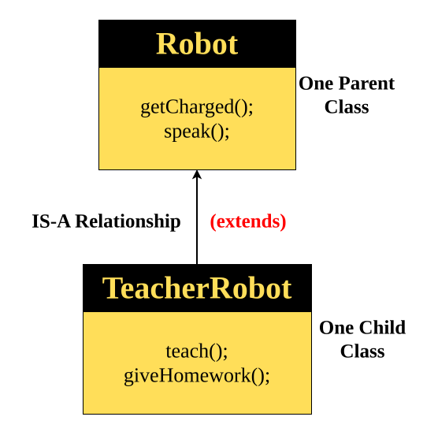

# Single Inheritance
> Single Inheritance is a type of inheritance in which **a class** (*subclass* or *child class*) **inherits the properties and behaviors** (fields and methods) **of one parent class** (*super class*).




#### Parent Class
```java
class Robot {
	String name = "Robo-X";
	int batteryLevel = 100;

	void getCharged() {
		System.out.println(name + " is getting charged...");
		batteryLevel = 100;
	}

	void speak() {
		System.out.println(name + " says: Hello, I am a Robot!");
	}
}
```
#### Child Class
```java
// Single Inheritance
class TeacherRobot extends Robot {
	String subject = "Mathematics";

	void teach() {
		System.out.println(name + " is teaching " + subject);
	}

	void giveHomework() {
		System.out.println(name + " is giving homework to students");
	}
}
```
#### Main Class
```java
public class Main {
    public static void main(String[] args) {
        TeacherRobot t = new TeacherRobot();
        
        // inherited variables
        System.out.println("Robot Name: " + t.name);
        System.out.println("Battery Level: " + t.batteryLevel + "%");

        // inherited methods
        t.getCharged();
        t.speak();

        // own variables & methods
        System.out.println("Subject: " + t.subject);
        t.giveHomework();
        t.teach();
    }
}
```

#### Output:
```output
Robot Name: Robo-X
Battery Level: 100%
Robo-X is getting charged...
Robo-X says: Hello, I am a Robot!
Subject: Mathematics
Robo-X is giving homework to students
Robo-X is teaching Mathematics
```