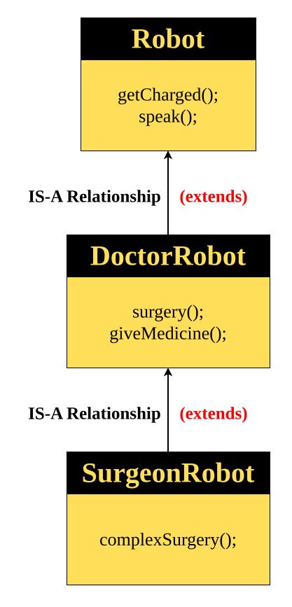

# Multi-Level Inheritance
> Multi-Level Inheritance is a type of inheritance in which a **child class** inherits from a **parent class**, and that parent class **itself inherits from another class**.


#### Parent Class
```java
class Robot {
	String name = "Robo-Base";
	int batteryLevel = 80;

	void getCharged() {
		System.out.println(name + " is charging...");
		batteryLevel = 100;
	}

	void displayStatus() {
		System.out.println(name + " battery level: " + batteryLevel + "%");
	}
}
```
#### Child Class (Level 2)
```java
class DoctorRobot extends Robot {
	String specialization = "General Surgeon";

	void surgery() {
		System.out.println(name + " is performing a " + specialization + " operation");
		batteryLevel -= 20;
	}
}
```
#### Grandchild Class (Level 3)
```java
class SurgeonRobot extends DoctorRobot {
	int surgeryCount = 0;

	void complexSurgery() {
		surgeryCount++;
		System.out.println(name + " performed a complex surgery! Total surgeries: " + surgeryCount);
		batteryLevel -= 30;
	}
}
```
#### Main Class
```java
public class Main {
    public static void main(String[] args) {
        SurgeonRobot s = new SurgeonRobot();
        
        // inherited variables
        System.out.println("Robot Name: " + s.name);
        System.out.println("Specialization: " + s.specialization);
        System.out.println("Initial Battery Level: " + s.batteryLevel + "%");

        // inherited and own methods
        s.getCharged();
        s.surgery();
        s.complexSurgery();
        s.displayStatus();
    }
}
```
#### Output
```output
Robot Name: Robo-Base
Specialization: General Surgeon
Initial Battery Level: 80%
Robo-Base is charging...
Robo-Base is performing a General Surgeon operation
Robo-Base performed a complex surgery! Total surgeries: 1
Robo-Base battery level: 50%
```