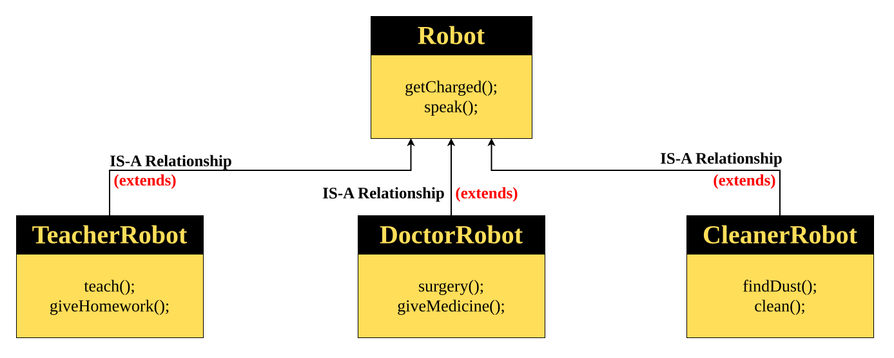

# Hierarchical Inheritance
>Hierarchical Inheritance is a type of inheritance in which **multiple child classes inherit from the same parent class**.


#### Parent Class
```java
class Robot {
	String name;
	int batteryLevel = 100;

	void getCharged() {
		System.out.println(name + " is getting charged...");
		batteryLevel = 100;
	}

	void speak() {
		System.out.println(name + " says: Beep Boop! I am ready to work!");
	}
}
```
#### Child Class 1
```java
class TeacherRobot extends Robot {
	String subject = "Science";

	void teach() {
		System.out.println(name + " is teaching " + subject);
	}

	void giveHomework() {
		System.out.println(name + " is giving homework to students");
	}
}
```
#### Child Class 2
```java
class DoctorRobot extends Robot {
	String specialization = "Orthopedic";

	void surgery() {
		System.out.println(name + " is performing a " + specialization + " surgery");
	}

	void giveMedicine() {
		System.out.println(name + " is prescribing medicines");
	}
}
```
#### Child Class 3
```java
class CleanerRobot extends Robot {
	String cleaningTool = "Vacuum";

	void clean() {
		System.out.println(name + " is cleaning the floor using " + cleaningTool);
	}

	void findDust() {
		System.out.println(name + " is scanning for dust particles");
	}
}
```
#### Main Class
```java
public class Main {
    public static void main(String[] args) {
        // Teacher Robot
        TeacherRobot t = new TeacherRobot();
        t.name = "TeachBot";
        t.speak();
        t.teach();
        t.giveHomework();
        System.out.println();

        // Doctor Robot
        DoctorRobot d = new DoctorRobot();
        d.name = "DocBot";
        d.speak();
        d.surgery();
        d.giveMedicine();
        System.out.println();

        // Cleaner Robot
        CleanerRobot c = new CleanerRobot();
        c.name = "CleanBot";
        c.speak();
        c.findDust();
        c.clean();
    }
}
```
#### Output
```java
TeachBot says: Beep Boop! I am ready to work!
TeachBot is teaching Science
TeachBot is giving homework to students

DocBot says: Beep Boop! I am ready to work!
DocBot is performing a Orthopedic surgery
DocBot is prescribing medicines

CleanBot says: Beep Boop! I am ready to work!
CleanBot is scanning for dust particles
CleanBot is cleaning the floor using Vacuum
```