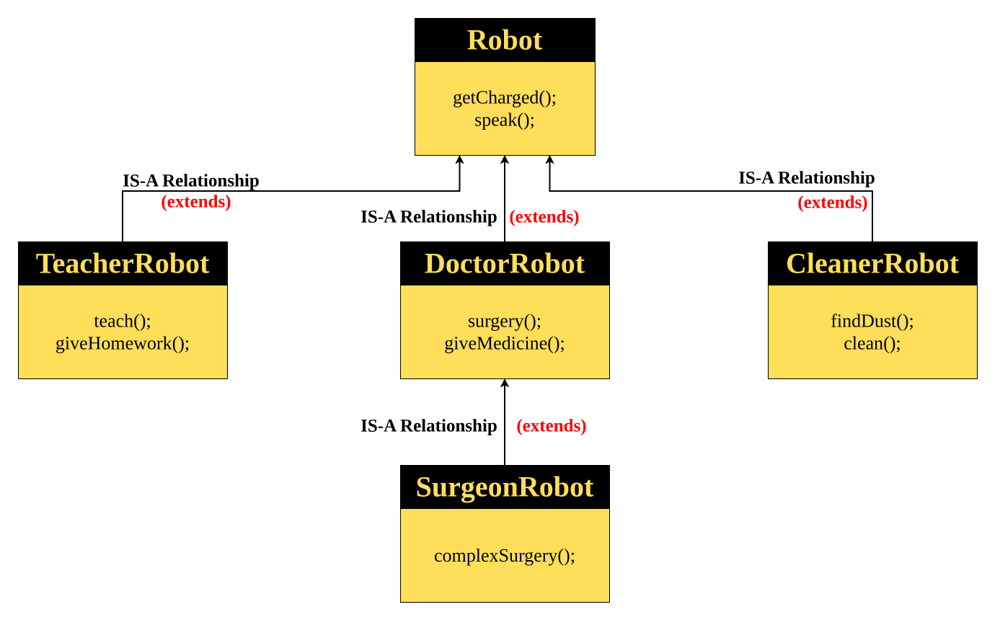

# Hybrid Inheritance
> **Hybrid Inheritance** is a type of inheritance that is formed by **combining two or more types of inheritance** (like _single_, _multilevel_, or _hierarchical_).


#### Parent Class
```java
class Robot {
	String name;
	int batteryLevel = 100;

	void getCharged() {
		System.out.println(name + " is charging...");
		batteryLevel = 100;
	}

	void speak() {
		System.out.println(name + " says: Beep Boop! System online.");
	}
}
```
#### Child Class 1 (Level 1)
```java
class DoctorRobot extends Robot {
	String specialization = "Neurosurgeon";

	void surgery() {
		System.out.println(name + " is performing a " + specialization + " surgery.");
		batteryLevel -= 20;
	}
}
```
#### Child Class 2 (Level 1)
```java
class TeacherRobot extends Robot {
	String subject = "Mathematics";

	void teach() {
		System.out.println(name + " is teaching " + subject);
		batteryLevel -= 10;
	}
}
```
#### Grandchild Class (Level 2 — Multilevel Part)
```java
class SurgeonRobot extends DoctorRobot {
	int surgeriesDone = 0;

	void complexSurgery() {
		surgeriesDone++;
		System.out.println(name + " successfully completed complex surgery #" + surgeriesDone);
		batteryLevel -= 30;
	}
}
```
#### Main Class
```java
public class Main {
    public static void main(String[] args) {
        // DoctorRobot (Level 1)
        DoctorRobot d = new DoctorRobot();
        d.name = "DocBot";
        d.speak();
        d.surgery();
        d.getCharged();
        System.out.println();

        // TeacherRobot (Level 1)
        TeacherRobot t = new TeacherRobot();
        t.name = "TeachBot";
        t.speak();
        t.teach();
        t.getCharged();
        System.out.println();

        // SurgeonRobot (Level 2 - Multilevel)
        SurgeonRobot s = new SurgeonRobot();
        s.name = "SurgiBot";
        s.speak();
        s.surgery();         // inherited from DoctorRobot
        s.complexSurgery();  // own method
        s.getCharged();
    }
}
```
#### Output
```output
DocBot says: Beep Boop! System online.
DocBot is performing a Neurosurgeon surgery.
DocBot is charging...

TeachBot says: Beep Boop! System online.
TeachBot is teaching Mathematics
TeachBot is charging...

SurgiBot says: Beep Boop! System online.
SurgiBot is performing a Neurosurgeon surgery.
SurgiBot successfully completed complex surgery #1
SurgiBot is charging...
```