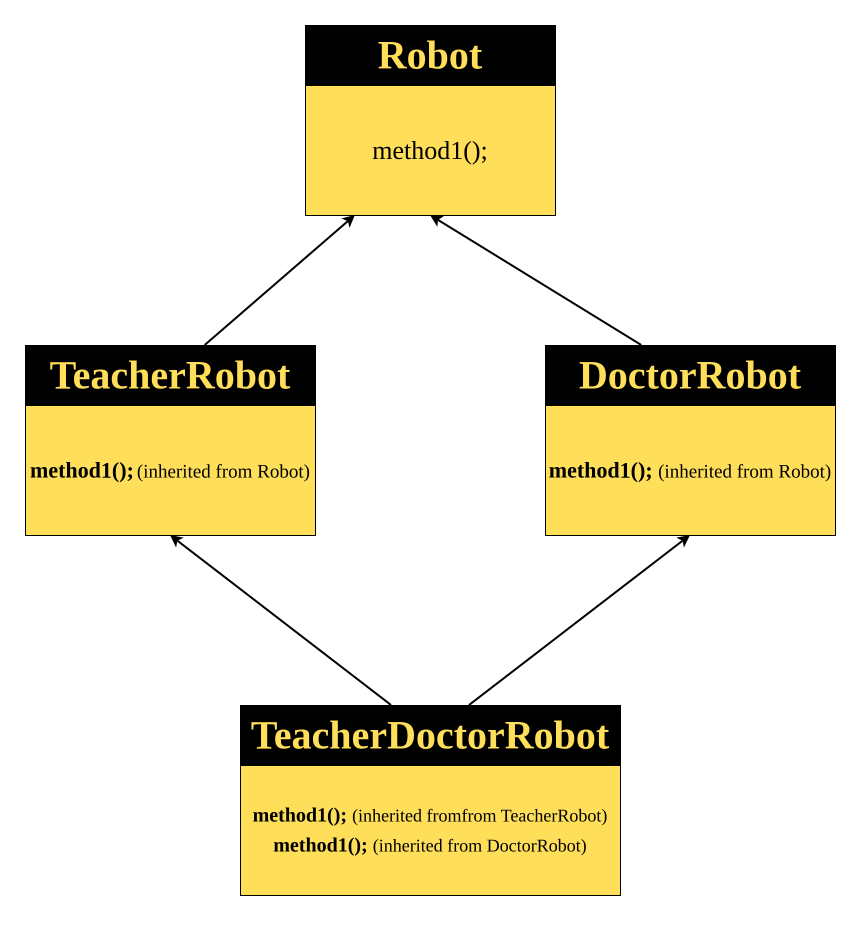

# Multiple Inheritance
> **Multiple Inheritance** is a type of inheritance in which **a single child class inherits from more than one parent class**.


#### Robot Class
```java
class Robot {
	void method1() {
		System.out.println("Robot class function");
	}
}
```
#### Teacher Robot Class
```java
class TeacherRobot extends Robot{
	// method1 method will automatically inherited from the parent class
}
```
#### Doctor Robot Class
```java
class DoctorRobot extends Robot {
	// method1 method will automatically inherited from the parent class
}
```
#### TeacherDoctor Robot Class
```java
class TeacherDoctorRobot extends TeacherRobot, DoctorRobot {
	// error: Multiple inheritance not allowed
}
```
### Explanation:
In the given example:
- The **`Robot`** class has one method → `method1()`.
- Both **`TeacherRobot`** and **`DoctorRobot`** **inherit** from `Robot`.
    > So, both of them automatically get a copy of `method1()` from the `Robot` class.
- Now, when we try to create **`TeacherDoctorRobot`**, which inherits from both `TeacherRobot` and `DoctorRobot`:
```java
class TeacherDoctorRobot extends TeacherRobot, DoctorRobot {
    // ❌ Error: Multiple inheritance not allowed
}
```
Here, the problem occurs because:
- `TeacherRobot` already has `method1()` (inherited from `Robot`)
- `DoctorRobot` also has `method1()` (inherited from `Robot`)

So, if `TeacherDoctorRobot` tries to inherit from both of them,  
it will indirectly get **two versions of the same method — `method1()`**.
### Why Java does not allow this ?
This situation creates **ambiguity** — Java cannot decide which `method1()` to keep:
- The one coming from `TeacherRobot`
- Or the one coming from `DoctorRobot`

> This confusion is called an **ambiguous situation**,  
> and the structure it forms is known as the **Diamond Problem**.


### Diamond Problem
>The **Diamond Problem** occurs when a class inherits from two classes that both extend a **common parent class**.  
If both parent classes **override the same method** from the grandparent class,  
then the child class becomes **confused about which version of the method to use**.
>
>This confusion is called **ambiguity**, and to avoid it, **Java does not allow multiple inheritance through classes**.