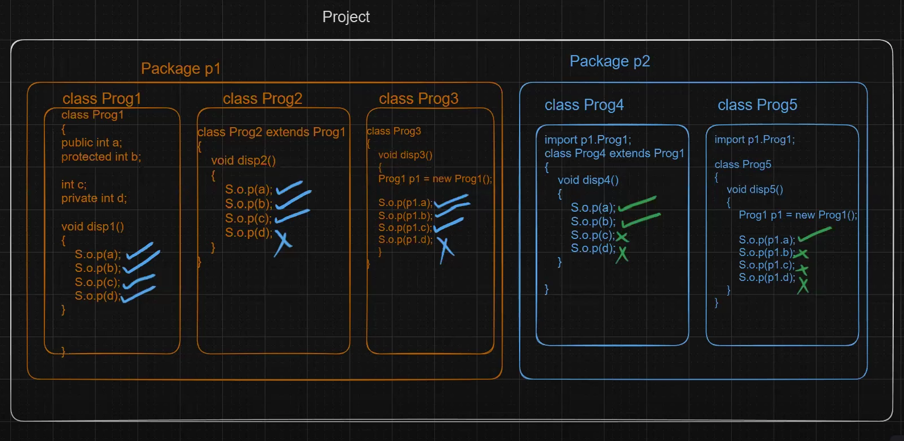

# Access Specifier
>Also called **Access Modifiers**.
>
> In Java, **Access Specifier** are keywords used to define the accessibility of code members (like methods and variables) across different classes and packages.

## In Java there are four types of Access Specifier-
| #   | **Access Specifier**      | **Accessibility (Where It Can Be Accessed)**                                       |
| --- | ------------------------- | ---------------------------------------------------------------------------------- |
| 1.  | `public`                  | Accessible **everywhere** in the project.                                          |
| 2.  | `protected`               | Accessible **within the same package** and **in child classes of other packages**. |
| 3.  | _(default)_ (no modifier) | Accessible **only within the same package**.                                       |
| 4.  | `private`                 | Accessible **only inside the same class** where it is declared.                    |

## 1. public
> When a member (variable, method, class, or constructor) is declared as **public**,  
it can be accessed **from anywhere** — within the same class, same package, or same project.
## 2. protected
> When a member is declared as **protected**,  
it is accessible **inside the same package** and also **in subclasses (child classes)** of other packages (through inheritance).
## 3. default ()
> If we do not write any access specifier before a class member,  
then Java treats it as **default** (also known as **package-private**).
## 4. private
> When a member is declared as **private**,  
it can be accessed **only inside the same class** where it is declared.  
It is not accessible in subclasses, same package, or any other class.