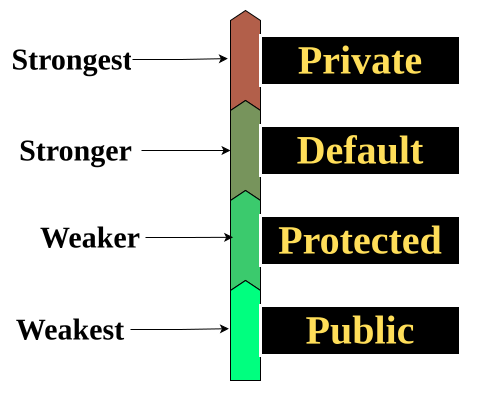

# Method Overriding with Access Modifiers


> So we can say —  
`private` is the **strongest** (most tightly locked),  
and `public` is the **weakest** (most open).
>
Because as we go from `private → public`,  
the **restriction becomes weaker**,  
and the **accessibility becomes stronger** (more open).

---
> When a **child class** defines a **method with the same name, parameters, and return type** as in the **parent class**,  
then the child class **overrides** the parent’s method.
>
This is called **Method Overriding**.

But — while overriding, there are **rules** for what access modifier we can use.  
we cannot randomly make it more private or less accessible.
## Concept Based on Access Levels


## Example 1 — Invalid (Error)

#### Parent Class
```java
public class Parent {
	void display() {   // default access
		System.out.println("Parent Method");
	}
}
```
#### Child Class
```java
public class Child extends Parent {
	@Override
	private void display() {  // ❌ Not allowed (more restrictive)
		System.out.println("Child Method");
	}
}
```
#### Main Class
```java
public class Main {
	public static void main(String[] args) {
		Child c = new Child();
		c.display();
	}
}
```
will return error.
#### Explanation
Here, the parent’s method has **default** access and  
the child’s method is **private**, which is **more restrictive**.  
So Java gives an error — because the child cannot **reduce** accessibility.

---
## Example 2 — Valid (Access Level Increased)
#### Parent Class
```java
public class Parent {
	protected void show() {
		System.out.println("Parent show()");
	}
}
```
#### Child Class
```java
public class Child extends Parent {
	@Override
	public void show() {
		System.out.println("Child show()");
	}
}
```
#### Main Class
```java
public class Main {
	public static void main(String[] args) {
		Child c = new Child();
		c.show();
	}
}
```
#### Output
```markdown
Child show()
```
#### Explanation
The parent’s method is **protected**,  
and the child’s method is **public** — meaning accessibility is **increased** (less restricted).  
That’s why the compiler allows it.
