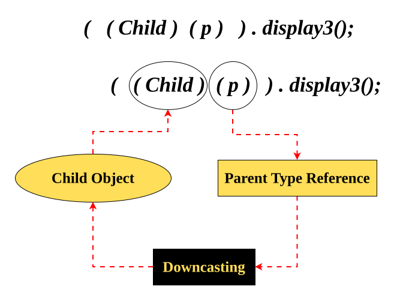

# Limitation of Parent Reference
When we give a **child object** to a **parent type reference**, we can call only those methods that exist in the **parent class**.

Parent reference can access:
- ✔ Inherited methods
- ✔ Overridden methods
- ✘ **Specialized (child-only) methods** → **NOT accessible**

This is the main limitation of a parent reference.

---
### Example to show the limitation
#### Parent.java
```java
class Parent {
    void display1() {
        System.out.println("Inside the parent-display1 method");
    }

    void display2() {
        System.out.println("Inside the parent-display2 method");
    }
}
```
#### Child.java
```java
class Child extends Parent {

    @Override
    void display2() {
        System.out.println("Inside the child-display2 method");
    }

    void display3() {
        System.out.println("Inside the child-display3 method");
    }

    /*
     Child class has:
     1. display1() -> Inherited
     2. display2() -> Overridden
     3. display3() -> Specialized (Child-only)
    */
}
```
#### Main.java
```java
public class Main {

    public static void main(String[] args) {

        // Child reference
        Child c1 = new Child();
        c1.display1();   // inherited
        c1.display2();   // overridden
        c1.display3();   // specialized

        System.out.println("---------------------------------------");

        // Parent reference
        Parent p = new Child();
        p.display1();    // inherited OK
        p.display2();    // overridden OK
        // p.display3(); // ERROR - cannot access specialized method
    }
}
```
#### Output
```markdown
Inside the parent-display1 method
Inside the child-display2 method
Inside the child-display3 method
---------------------------------------
Inside the parent-display1 method
Inside the child-display2 method
```
# ## Why does Parent Reference fail?
Because at **compile-time**, Java checks reference type (Parent).  
Since `Parent` does **not** have `display3()`, the call is **not allowed**, even though the actual object is a Child.

This is the limitation:  
**Parent reference can never call child-only methods.**

---
## Alternative Way → Downcasting
>To access child-only (specialized) methods using a parent reference,  
we must **convert the parent reference back to the child type**.
>
This is called **Downcasting**.



### Downcasting Example
```java
Parent p = new Child();   // Upcasting

// p.display3();  // error

((Child)p).display3();    // Downcasting → now allowed
```

#### Main.java with Downcasting
```java
public class Main {

    public static void main(String[] args) {

        Child c1 = new Child();
        c1.display1();
        c1.display2();
        c1.display3();

        System.out.println("---------------------------------------");

        Parent p = new Child();
        p.display1();
        p.display2();

        // Accessing specialized method through downcasting
        ((Child)p).display3();
    }
}
```
#### Output.java
```markdown
Inside the parent-display1 method
Inside the child-display2 method
Inside the child-display3 method
---------------------------------------
Inside the parent-display1 method
Inside the child-display2 method
Inside the child-display3 method
```
