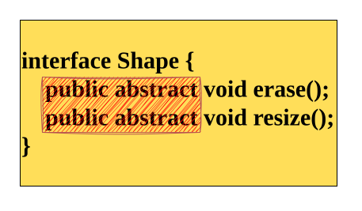
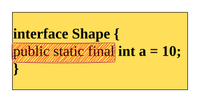
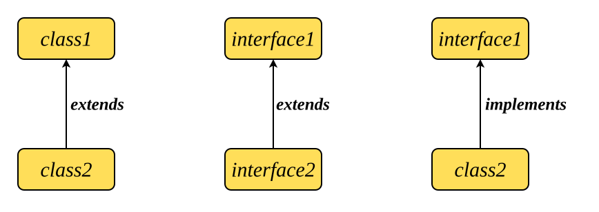

# 1. Why Interface Was Introduced
When we work with abstract classes, we can mix abstract methods and concrete methods. 

This works fine for small designs. But when a class has **too many abstract methods**, the child class becomes difficult to manage.

Imagine a parent abstract class with 105 methods, where:
- 1 method is concrete
- 104 methods are abstract
```java
abstract class Shape {
	// concrete method
    void draw() {
	    System.out.println("Drawing shape...");
    }
    // abstract methods
    abstract void erase();
    abstract void resize();
    abstract void rotate();
    abstract void fillColor();
    // ... imagine 100 more abstract methods here
}
```
#### **When we extend this parent:**
###### We only know how to implement 2 methods (Overridden Methods)
```java
class Square extends Shape {

    @Override
    void erase() { 
	    System.out.println("Erasing Square");
	}
    
    @Override
    void resize() {
	    System.out.println("Resizing...");
	}

    // But we don't know the logic for the rest 100 methods!
}
```

###### For the remaining 102 methods, we have two bad choices:
**❌ Option 1:**
	Implement all remaining methods even if we don’t know the logic.  
	  → **Time-consuming, and confusing.**
	
**❌ Option 2:**
	  Re-declare all remaining methods as abstract in Square class and make Square also abstract.
	  → **The problem continues; no progress.**
###### This shows the limitation:

> _Abstract class becomes very heavy when it contains too many abstract methods._

We need something lighter.

---
# Where Interface Fits Perfectly

An interface allows us to write **only abstract methods** — no body, no concrete logic.

An interface removes unnecessary weight.  It gives us a structure where:
- **Every method is abstract by default**
- **No concrete methods exist**
- **Child classes only implement the methods they know**
- **No re-declaration, no confusion**

Example:
##### Shape.java
```java
interface Shape {
    void erase();
    void resize();
    void rotate();
    void fillColor();
    // ... 100 more abstract methods
}
```
##### Square.java
```java
class Square implements Shape {

    public void erase() {
        System.out.println("Erasing Square");
    }

    public void resize() {
        System.out.println("Resizing...");
    }

    // The rest of the methods we must implement,
    // but here we write only the logic we know.
}
```
---

# 2. Definition of Inheritance:
> An **interface** is a **blueprint of a class**.  
It contains only the _rules_ (method names), not the _implementation_ (method bodies).

| Interface = collection of abstract methods + public static final variables. |
| --------------------------------------------------------------------------- |
An interface provides **100% abstraction** because all methods are abstract by default.

# 3. Syntax of Interface
#### Basic Syntax
```java
interface InterfaceName {
    // abstract methods (no body)
    returnType methodName();

    // variables (public static final)
    dataType variableName = value;
}
```
- Methods inside an interface **do not have a body**.
- All methods are **public abstract** by default.
  
- All variables are **public static final** by default, and must be initialized.
  
#### Example
```java
interface Shape {
    void draw();       // public abstract void draw();
    void erase();      // public abstract void erase();

    int SIDES = 4;     // public static final int SIDES = 4;
}
```
 >
| Interface = collection of abstract methods + public static final variables. |
| --------------------------------------------------------------------------- |

# 4. How to Implement an Interface
There are **three valid combinations** when it comes to inheritance with classes and interfaces.  
Just remember:
> Class **extends** class  
Interface **extends** Interface  
Class **implements** Interface



---
### 4.1 Class → Class (extends)
#### Example:
```java
class Parent {
    void show() { System.out.println("Parent show"); }
}

class Child extends Parent {
}
```
- ✔ Child inherits all non-private members of Parent.  
- ✔ Normal inheritance.

---
### 4.2. Interface → Interface (extends)
#### Example:
```java
interface Shape {
    void draw();
}

interface Color extends Shape {
    void fillColor();
}
```
- ✔ Interface extending interface uses **extends**.  
- ✔ Multiple inheritance is allowed here.
---
### 4.3. Class → Interface (implements)
#### Example:
```java
interface Shape {
    void draw();
    void erase();
}

class Square implements Shape {
    public void draw() {
	    System.out.println("Drawing Square");
	}
    public void erase() {
	    System.out.println("Erasing Square");
	}
}
```
- ✔ Must use **implements** 
- ✔ Must implement all methods if class is concrete.
---
## 5) Rules of Interface

| #   | Rules                                                                             |
| --- | --------------------------------------------------------------------------------- |
| 1.  | **An interface cannot have method bodies.**                                       |
| 2.  | **All methods inside an interface are public and abstract by default.**           |
| 3.  | **A class must implement all interface methods unless the class is abstract.**    |
| 4.  | **A class uses `implements` keyword to inherit an interface.**                    |
| 5.  | **An interface uses `extends` keyword to inherit another interface.**             |
| 6.  | **An interface can extend multiple interfaces (multiple inheritance).**           |
| 7.  | **A class cannot extend an interface.**                                           |
| 8.  | **An interface cannot extend a class.**                                           |
| 9.  | **All variables inside an interface are public, static, and final by default.**   |
| 10. | **Variables inside an interface must be initialized at the time of declaration.** |
| 11. | **Interfaces cannot have constructors.**                                          |
| 12. | **All implementing methods in the class must be declared ‘public’.**              |
| 13. | **Interfaces cannot create objects, but interface references are allowed.**       |
| 14. | **Upcasting is possible: Interface reference = new ImplementingClass();**         |

---
# 6. Example – Simple Interface Implementation
##### Shape.java
```java
interface Shape {
    void draw();   // abstract method
    void erase();  // abstract method
}
```
##### Square.java
```java
class Square implements Shape {

    @Override
    public void draw() {
        System.out.println("Drawing Square");
    }

    @Override
    public void erase() {
        System.out.println("Erasing Square");
    }
}
```
##### Main.java
```java
class Main {
    public static void main(String[] args) {
        Square sq = new Square();
        sq.draw();
        sq.erase();
    }
}
```
##### Output
```java
Drawing Square
Erasing Square
```

### Key Points From This Example
- `Shape` defines **what** must be done.
- `Square` defines **how** it will be done.
- Every method in the interface is implemented inside the class.
- Implemented methods must be **public**.
---
# 7. Access Specifier Rule (Method Must Be Public)

Inside an interface, every method is:

> **public abstract** — even if you don’t write it.

So this interface:
```java
interface Shape {
    void draw(); 
}
```
Is internally treated as:
```java
public abstract void draw();
```
Because the interface method is **public**, the implementing class must also use **public**.

> **When overriding a method, visibility can stay same or increase — but never decrease.**

### If we don’t use `public` in the class → Error
Example:
##### ❌ Wrong Implementation
```java
class Square implements Shape {
    void draw() {   // ERROR: attempting to reduce visibility
        System.out.println("Drawing Square");
    }
}
```
---
# 8. Upcasting with Interface (Polymorphism)
Just like abstract classes, interfaces also support **upcasting**.  
This means:

> **Interface reference can point to an object of the implementing class.**

This is one of the main strengths of interfaces — it enables **runtime polymorphism**.

#### Example
##### Shape.java
```java
interface Shape {
    void draw();
    void erase();
}
```
##### Square.java
```java
class Square implements Shape {
    public void draw() {
	    System.out.println("Drawing Square");
	}
    public void erase() {
	    System.out.println("Erasing Square");
	}
}
```
##### Main.java
```java
class Main {
    public static void main(String[] args) {
        Shape ref = new Square();   // upcasting
        ref.draw();
        ref.erase();
    }
}
```
##### Output
```markdown
Drawing Square
Erasing Square
```
Here:

- The reference is of **interface type** → `Shape`
- The object is of **implementing class** → `new Square()`
- Method calls go to the child’s implementation → **polymorphism**
---
# 9. Interface Inheritance (interface extends interface)
---
# 10. Pure vs Impure Abstraction
In Java, abstraction can be categorized into two types based on how much abstraction a class provides.
1. Pure Abstraction
2. Impure Abstraction
### 10.1. Pure Abstraction
> When a type contains only abstract methods and constants, it is called pure abstraction.

This is exactly what an **interface** provides.
- No method bodies (in basic interface concept)
- Only abstract methods
- Only public static final variables
- No concrete behavior

##### Example
```java
interface Shape {
    void draw();
    void erase();
}
```
- ✔ 100% abstraction  
- ✔ Only rules, no implementation
### 10.2. Impure Abstraction
> When a type contains both abstract and concrete methods, it is called impure abstraction.

This is what an **abstract class** provides.
- Some methods have a body → concrete methods
- Some methods have no body → abstract methods
- Can also have constructors, variables, blocks

##### Example
```java
abstract class Shape {
    abstract void draw();
    void display() {
        System.out.println("Inside display");
    }
}
```
- ✔ Partial abstraction  
- ✔ Mix of rules + implementation
---
# 11. Class vs Abstract Class vs Interface

| Feature                         | **Class**                                   | **Abstract Class**                 | **Interface**                                            |
| ------------------------------- | ------------------------------------------- | ---------------------------------- | -------------------------------------------------------- |
| **Object Creation**             | ✔ Can create objects                        | ❌ Cannot create objects            | ❌ Cannot create objects                                  |
| **Method Types**                | Only **concrete** methods                   | **Abstract + concrete** methods    | Only **abstract methods** (basic interface)              |
| **Method Bodies**               | All methods have bodies                     | Some may have no body              | No method bodies                                         |
| **Variables**                   | Normal variables                            | Normal variables                   | **public static final** only                             |
| **Constructors**                | ✔ Allowed                                   | ✔ Allowed                          | ❌ Not allowed                                            |
| **Inheritance Keyword**         | `extends`                                   | `extends`                          | `implements` (class) / `extends` (interface → interface) |
| **Multiple Inheritance**        | ❌ Not allowed                               | ❌ Not allowed                      | ✔ Allowed (interface extends multiple interfaces)        |
| **Access Modifier for Methods** | Any modifier                                | Any modifier                       | Always **public**                                        |
| **Goal**                        | Used for storing data + full implementation | Used for partial abstraction       | Used for **pure abstraction**                            |
| **Polymorphism**                | ✔ Supported                                 | ✔ Supported                        | ✔ Supported                                              |

