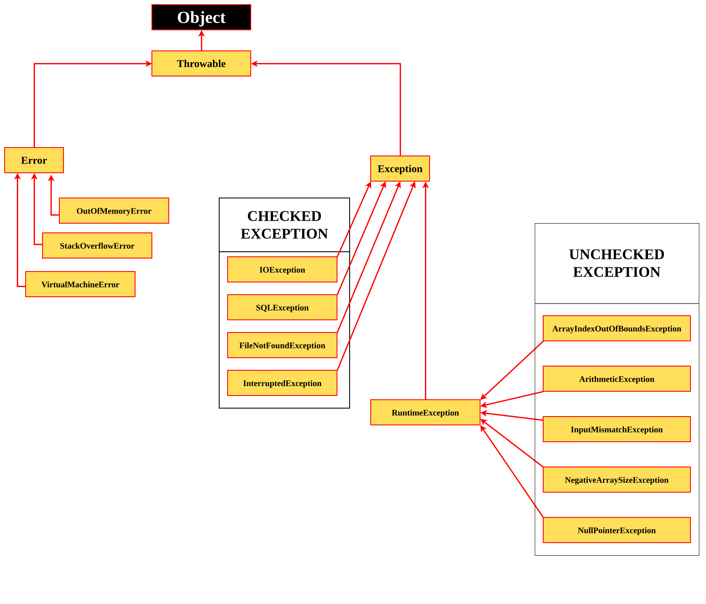

### 1. Error
- **OutOfMemoryError**
- **StackOverflowError**
- **VirtualMachineError**
##### Mnemonics
> **O**perating
> **S**ystem
> **V**anished

##### Mapping
- O → OutOfMemory
- S → StackOverflow
- V → VirtualMachine

### 2. Checked Exceptions
- **IOException**
- **SQLException**
- **FileNotFoundException**
- **InterruptedException**
##### Mnemonics
> **I**
> **S**tudy
> **F**iles
> **I**ntensively
##### Mapping
- I → IOException
- S → SQLException
- F → FileNotFoundException
- I → InterruptedException
### 3. Unhecked Exceptions
- **ArrayIndexOutOfBoundsException**
- **ArithmeticException**
- **InputMismatchException**
- **NegativeArraySizeException**
- **NullPointerException**
##### Mnemonics
> **A**
> **A**ngry
> **I**ntern
> **N**ever
> **N**otices

##### Mapping
- A → ArrayIndexOutOfBoundsException
- A → ArithmeticException
- I → InputMismatchException
- N → NegativeArraySizeException
- N → NullPointerException
**[PTO](./01-INTRODUCTION)**