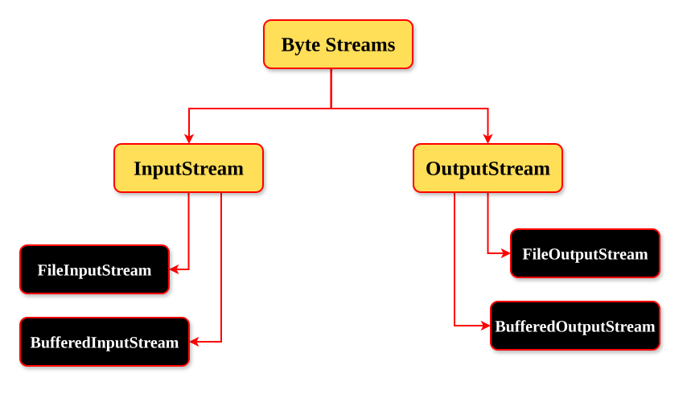

# Introduction To File Handling
> File handling is the process of managing files using a program — such as creating, reading, writing, updating, and deleting files — to store and retrieve data permanently.

## Why File Handling matters?
1. Permanent data storage
2. Data reading and writing
3. Log and report generation
4. Data sharing between programs
5. Backup and recovery support
## How a Program Works with Files (Basic Idea)
When a Java program works with a file, it usually performs one of these operations:
- **Create** a file
- **Read** data from a file
- **Write** data to a file
- **Update** file content
- **Delete** a file
### Important Concept: Files and Data Type
Not all files contain the same kind of data.
- Some files contain **human-readable text**
- Some files contain **raw data** (not meant to be read as text)

Because of this, Java uses **different approaches** to handle different types of files.

---
To perform these operations, Java provides **I/O (Input/Output) classes**.
**In Java, file handling is based on how data is read and written. It is commonly classified into two main types:**
1) Byte-based streams (for **raw data**) -> `InputStream`, `OutputStream`
	
2) Character-based streams (for **text data**) -> `Reader`, `Writer`
	
### 1) Byte-Based File Handling
Byte-based file handling means reading and writing file data **in the form of bytes (8-bit)**, mainly used for **binary files** like images, audio, video, PDFs, Executable or Software files etc.
### 2) Character-Based File Handling
Character-based file handling means reading and writing file data **in the form of characters**, mainly used for **text files** like `.log`, `.txt`, `.java`, `.csv`, etc.


| #   | Aspect               | Byte-Based                                                    | Character-Based                      |
| --- | -------------------- | ------------------------------------------------------------- | ------------------------------------ |
| 1.  | **Data Type**        | Bytes (0s and 1s)                                             | Characters (text)                    |
| 2.  | **Java Classes**     | `InputStream`, `OutputStream`                                 | `Reader`, `Writer`                   |
| 3.  | **Used For**         | images, audio, video, PDFs, Executable or Software files etc. | `.log`, `.txt`, `.java`, `.csv` etc. |
| 4.  | **Handles Encoding** | No                                                            | Yes                                  |
| 5.  | **Example Classes**  | `FileInputStream`, `FileOutputStream`                         | `FileReader`, `FileWriter`           |

#### 1) Example of Byte-Based File Handling in Java
```java
package advanced_java.fileHandling;

import java.io.FileInputStream;
import java.io.FileOutputStream;
import java.io.IOException;

public class FileCopy {

	public static void main(String[] args) throws IOException {
		String inputPath = "/home/mcclusky/fileHandling/input.txt";
		String outputPath = "/home/mcclusky/fileHandling/output.txt";
		
		FileInputStream reader = new FileInputStream(inputPath);
		FileOutputStream writer = new FileOutputStream(outputPath);
		
		int data;
		while ((data = reader.read()) != -1) {
			writer.write(data);
		}
		
		System.out.println("FILE BACKUP COMPLETED.");
		
		reader.close();
		writer.close();
	}

}
```