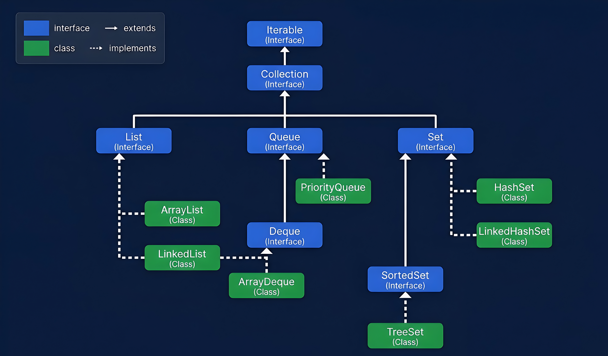

# Java Collection Framework (JCF)

### Hierarchy Table

|Branch|Element|Type|Definition|
|---|---|---|---|
|—|`Iterable`|Interface|Root of the whole hierarchy. Just one job — whatever implements it, can be iterated (looped through).|
|—|`Collection`|Interface|Main interface of the framework. Extends Iterable. Defines basic operations like `add()`, `remove()`, `size()` etc.|
|**List**|`List`|Interface|Allows duplicate elements. Maintains insertion order.|
||`ArrayList`|Class|Implements List. Internally uses a dynamic array.|
||`LinkedList`|Class|Implements List and Deque both. Internally uses a doubly linked list.|
|**Queue**|`Queue`|Interface|Follows FIFO — First In First Out.|
||`PriorityQueue`|Class|Implements Queue. Elements are ordered by priority, not insertion order.|
||`Deque`|Interface|Extends Queue. Double ended queue — can add/remove from both ends.|
||`ArrayDeque`|Class|Implements Deque. Internally uses a dynamic array.|
|**Set**|`Set`|Interface|Does not allow duplicate elements.|
||`HashSet`|Class|Implements Set. No order maintained.|
||`LinkedHashSet`|Class|Implements Set. Maintains insertion order.|
||`SortedSet`|Interface|Extends Set. Keeps elements in sorted (ascending) order.|
||`TreeSet`|Class|Implements SortedSet. Internally uses a tree structure.|

> 📌 **Remember:**
> 
> - **Interface → extends → Interface** (solid arrow in diagram)
> - **Class → implements → Interface** (dashed arrow in diagram)
